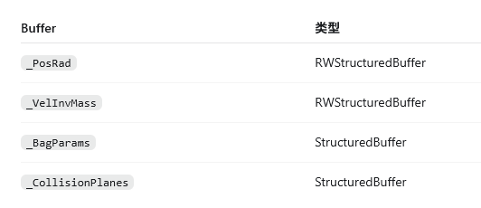

a啊啊啊啊啊啊啊

在解算物理的时候, 有一个非常神秘的问题: 使用并行jacobi的时候求解, 每个物体之间不能获得互相的碰撞体;  必须得进行串行求解才可以求解碰撞体. 并且这个问题仅仅在Exynos系列芯片上才有这个问题. 作为一个单子我选了个 exynos 1280芯片.  初步怀疑是mari系列无法支持sharedmemory的读写; 导致每个粒子都不能检查到其他物体的位置. 所以这里记录一下GS和jacobi求解的差异, 先讲一下修的地方最后再讲一下在物理解算中Jacobi和GS冲量计算之间的差异.

# 修复的改动总结

1. 球球约束从多线程 shared-memory Jacobi 改成线程 0 串行 Gauss–Seidel。

2. 质量倒数从 `sVelInvMass[].w` 独立为 `sInvMass[]`。

3. 避免对 groupshared `float4` 做 `.xyz` 分量写，统一整 `float4` 写回。

4. Compute 资源绑定与 Dispatch 全部录入同一个 CommandBuffer。


## Jacobi 和 Gauss–Seidel 的物理求解差异

球球非穿透约束可以写成 `Cij = |pi - pj| - (ri + rj) >= 0` 

当 `Cij < 0` 时，说明两个球发生穿透：

```
penetration = ri + rj - |pi - pj|
```

并且需要根据质量倒数 `wi`、`wj` 分配位置修正：

```
Δpi =  normal * penetration * wi / (wi + wj)
Δpj = -normal * penetration * wj / (wi + wj)
```

###  Jacobi 求解

在这个求解方式中  每个线程负责一个粒子：

```c++
float3 pi = sPosRad[tid].xyz;

for (int j = 0; j < n; j++)
{
    float3 pj = sPosRad[j].xyz;
    // 计算当前粒子相对 j 的修正
    delta += correction;
}

sBallDelta[tid] = delta / cnt;
```

在Jacobi中, 所有线程读取的是本轮开始时同一份 `sPosRad`：

```
粒子0读取旧位置，计算 Δp0
粒子1读取旧位置，计算 Δp1
粒子2读取旧位置，计算 Δp2
...

所有线程计算完毕后GroupMemoryBarrierWithGroupSync();

所有粒子同时应用各自 Δp
```

它的特点是：

- 并行度高, 可以直接起多线程来处理大量的球体的碰撞
- 同一轮内的约束互相看不到对方刚产生的修正
- 多球挤压时收敛较慢，需要更多 solver iteration;  在相同的Solver Interaction下,不如直接使用GS求解效果更佳
- 每个 pair 实际检查两次：`i → j` 和 `j → i`。

例如三个球 A、B、C 挤在一起时，Jacobi 中 B 对 A、C 的计算都基于同一个旧位置。即使 A-B 已经算出修正，B-C 仍看不到这个结果。


总结一下就是:

1. 各线程读取 sPosRad，写自己的 sBallDelta[tid]
2. GroupMemoryBarrierWithGroupSync
3. 各线程把 sBallDelta[tid] 加到自己的 sPosRad[tid]
4. GroupMemoryBarrierWithGroupSync.

### Gauss–Seidel

GS串行冲量将会由线程 0 顺序遍历唯一粒子对：

```c++
for (int i = 0; i < n; i++)
{
    for (int j = i + 1; j < n; j++)
    {
        float3 pi = sPosRad[i].xyz;
        float3 pj = sPosRad[j].xyz;

        ...

        sPosRad[i].xyz = pi + corr * (wi / wsum);
        sPosRad[j].xyz = pj - corr * (wj / wsum);
    }
}
```

顺序变成：

```
解 A-B，立即更新 A、B
解 A-C，读取更新后的 A
解 B-C，读取更新后的 B、C
```

所以当前实现是球球约束上的原地 Gauss–Seidel：

- 每解完一个 pair，立即写回位置。
- 后续 pair 使用最新结果。
- 同样迭代次数下，密集接触通常比 Jacobi 收敛更快。
- 不再对多个接触修正取平均，因此多球堆叠更“硬”。
- 每个 pair 只处理一次，质量加权修正同时作用于两端。
- 结果会受到 `i、j` 遍历顺序影响，这是串行 GS 的固有偏差。

严格来说，整个求解器不是全串行 GS：盒体、Mesh、安全边界仍然是“一线程一粒子”并行处理；只有最容易出现共享内存问题的球球约束改成了串行 GS。


当然还有一个可能就是打包的问题, 就是质量倒数被我拆掉了以后也正常了.

## `sInvMass[]` 很可能是“完全不碰撞”的核心修复

旧代码把速度和质量倒数打包在一起：

```
groupshared float4 sVelInvMass[16];
// xyz = velocity
// w   = inverse mass
```

但它多次只写 `.xyz`：

```
sVelInvMass[tid].xyz = vel;
```

然后球碰撞又从 `.w` 读取质量：

```
float wi = sVelInvMass[tid].w;
float wj = sVelInvMass[j].w;

float wsum = wi + wj;
if (wsum < 1e-8)
    continue;
```

按标准 HLSL 语义，写 `.xyz` 应当保留 `.w`。但是跨平台时，这会被 Unity 从 HLSL 转译成 GLSL ES，再由 Mali 驱动编译。如果某个编译器阶段把 shared `float4` 的分量写转成不正确的整向量覆盖，`.w` 就可能变成 0 或未定义值。

而 `w` 一旦被破坏：

```
wi = 0
wj = 0
wsum = 0
→ continue
→ 所有球球 pair 都不做位置修正
```

这与“其他模拟正常，但球球完全无法碰撞”的表现高度吻合。

现在的代码在加载阶段立即拆开：

```
float4 velInvMass = _VelInvMass[gIdx];
sVelInvMass[tid] = velInvMass;
sInvMass[tid] = velInvMass.w;
```

后续所有速度更新都整向量写：

```
sVelInvMass[tid] = float4(vel, sInvMass[tid]);
```

球碰撞只从独立标量数组读取质量：

```
float wi = sInvMass[i];
float wj = sInvMass[j];
```

最终写回也显式恢复 `w`：

```
_VelInvMass[gIdx] = float4(sVelInvMass[tid].xyz, sInvMass[tid]);
```

这样就消除了“分量写误伤质量数据”的可能性。

## 串行 GS 为什么进一步规避 Mali shared-memory 问题

旧 Jacobi 每个活动线程都会：

- 动态读取 `sPosRad[j]`。
- 动态读取 `sVelInvMass[j].w`。
- 写入自己的 `sBallDelta[tid]`。
- Barrier 后再写自己的 `sPosRad[tid].xyz`。

即 15 个线程同时执行带动态索引的 shared-memory 访问。

新版本中，球碰撞期间只有线程 0 工作：

```
if (tid == 0)
{
    for (int i = 0; i < n; i++)
    {
        for (int j = i + 1; j < n; j++)
        {
            ...
        }
    }
}
```

此时从线程 0 的角度看，球碰撞阶段的 shared-memory 访问等价于普通串行数组操作：

```
读取 pair
计算
写回 pair
读取下一个 pair
```

同一个 shader invocation 对自己此前写入的值拥有明确的程序顺序，不再依赖多个 invocation 之间复杂的 shared-memory 可见性。

这带来三层稳定性：

- 不再有多个线程同时动态访问球碰撞数组。
- 不需要 `sBallDelta[]` 这个跨线程临时数组。
- pair 修正由同一线程读取和写回，不需要原子操作或跨线程归并。

Khronos 规范明确说明：同一个 invocation 对自己写入的数据具有确定顺序；不确定性主要发生在不同 invocation 对 shared memory 的交叉读写上。[Khronos GLSL ES 规范](https://registry.khronos.org/OpenGL/specs/es/3.2/GLSL_ES_Specification_3.20.html)


---

# 最后的的GLES的提示

最后在GLES上面 如果要做compute shader确实是挺难的. 因为有有概率不会支持shared group, 还有就是 SSBO , 最多只可以绑定4个; 

GLES 3.1 同时只保证支持 4 个 ComputeBuffer；部分实际设备可能支持更多，但不能依赖.



而我这里刚好就是4个, 难绷;

`_PosRad`：许多粒子的 `xyz位置 + w半径`

`_VelInvMass`：许多粒子的 `xyz速度 + w逆质量`

`_BagParams`：一个大型结构体，包含矩阵、重力、加速度等

`_CollisionPlanes`：许多个 `float4`，每个碰撞面使用两个元素


此外, 如果shader需要向compute shader进行取值, 其他平台是可以直接在vertex里定义一个结构体从里边取数据的, **但是GLES不可以** . 为了得到最通用的读取办法, 要在compute计算结束之后手动增加一个tex纹理的申请和转换, 即:

```
Simulate Compute
    ↓
_PosRad / _Colors Buffer
    ↓ 两次 CopyBufferToTexture Dispatch
_PosRadTex / _ColorsTex
    ↓ Texture2D.Load
Vertex Shader 绘制实例
```


也就是说在每次Compute计算完毕之后需要及时更新纹理, 这样子才可以读取粒子小球的位置; 当然这种操作不会有CPU回读, 而是全程驻留在GPU中., 也就是说几乎都是片上内存处理, 实际开销没有想象的那么大(这种计算主要是储存延时, 计算量普遍不大, 所以能复用是最好的)

```c++
// 在compute中, 我们做一遍RT并将数据渲染过去
float4 data = _RenderSourceBuffer[index];
_RenderTargetTexture[coord] = data;
```

随后顶点着色器读取：

```c++
float4 posRad = _PosRadTex.Load(...);
// 读取以后直接进行解码, 并进行世界空间的坐标变换
```


