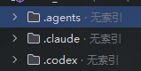

# 由来

在项目协作的时候发现项目里多了一堆skill. 如图所示.

claudecode等可以选择直接关闭项目内的skill, 但是codex的桌面端做不到啊! 里边的一堆玩意我其实都是用不到的; 所以我希望:

直接整成codex支持的 `.disabled` , 拒绝加载, 但是又不出现在git的正常索引中, 不会显示需要暂存, 推送, 在更新的时候也不会覆盖更新这些操作.

所以就有了skip-worktree+exclude这个神奇的操作, 指定git不要追踪这些文件, 同时不要显示为edit, 也不要接受到远端的更新.

# git的skip-worktree是什么操作?

`git update-index --skip-worktree <file>` 是告诉 Git：

> 这个已被追踪的文件，我本地可能会修改，但平时不要因为它变化就提示我，也尽量不要在更新工作区时覆盖它。

常用于本地配置文件，例如：

```bash
git update-index --skip-worktree config/local.yml
```

之后即使你修改 `config/local.yml`，`git status` 通常也不会显示它。

恢复正常追踪：

```bash
git update-index --no-skip-worktree config/local.yml
```

查看哪些文件被设置了 `skip-worktree`：

```bash
git ls-files -v | grep '^S'
```

同时配合 `git exclude` 的时候, 还可以达到为文件修改名字, 但是不显示edit, 远端也不会将原名字的文件拉过来的操作. (exclude和/gitignore基本相同, 但是区别是)

需要注意worktree skip：

- 只影响本地的 Git 索引，不会提交到仓库，也不会影响其他人。
- 不是正式的“忽略已追踪文件”机制; 正式的写作的忽略追踪文件, 应该写进 `gitignore` 中; 但是这个时候就会需要你显示gitignore被更改并要求你推送远端, 也就是说协作者都可以更新到gitignore并忽略对应的文件.
- 如果远端也修改了这个文件，执行 `pull`、`merge`、`checkout` 时仍可能报冲突，要求先处理本地修改.

它和 `assume-unchanged` 不完全一样：

```bash
git update-index --assume-unchanged <file>
```

- `assume-unchanged`：主要是性能提示，Git 假定文件没变。
- `skip-worktree`：主要用于告诉 Git，工作区版本应优先保留，更适合本地配置场景。

# 和Git Exclude, Git Ignore的区别

| 项目                      | `skip-worktree`                  | `.git/info/exclude`      | `.gitignore`                 |
| ------------------------- | -------------------------------- | ------------------------ | ---------------------------- |
| 作用对象                  | **已被 Git 跟踪的文件**          | **未被 Git 跟踪的文件**  | **未被 Git 跟踪的文件**      |
| 作用方式                  | 给索引中的指定文件设置状态标记   | 按路径模式忽略文件       | 按路径模式忽略文件           |
| 配置位置                  | Git 索引                         | `.git/info/exclude`      | 仓库中的 `.gitignore`        |
| 是否仅本机生效            | 是                               | 是                       | 否，提交后所有协作者生效     |
| 是否会提交到远端          | 否                               | 否                       | 通常会                       |
| 是否支持通配符            | 否，命令中指定具体路径           | 是                       | 是                           |
| 已跟踪文件是否有效        | 是                               | 否                       | 否                           |
| `git status` 是否显示修改 | 通常不显示                       | 对未跟踪文件不显示       | 对未跟踪文件不显示           |
| 远端修改该文件时          | 可能导致更新失败或需要处理冲突   | 不相关，文件未被仓库跟踪 | 不相关，文件未被仓库跟踪     |
| 适用场景                  | 临时隐藏已跟踪文件的本地改动     | 忽略仅自己本机产生的文件 | 为整个团队统一忽略规则       |
| 典型例子                  | 已提交的配置文件需要本地临时修改 | 个人 IDE 配置、调试文件  | 构建产物、依赖目录、日志文件 |

选择原则：

- 团队都不应提交：使用 `.gitignore`
- 只有自己不想看到：使用 `.git/info/exclude`
- 文件已经被跟踪，但需要暂时保留本地版本：使用 `skip-worktree`

# 具体操作

**修改名字 -> 为原文件和改名文件都设置为 `git exclude` -> 将原来被git跟踪的源文件都打上 git skip worktree标记**.

实际执行了以下三项会改变状态的操作

1. 将项目技能目录在磁盘上改名：

```powershell
$skillsPath = Join-Path (Get-Location) '.agents\skills'
Rename-Item -LiteralPath $skillsPath -NewName 'skills.disabled'
```

结果是：

```power
.agents\skills
→
.agents\skills.disabled
```

1. 修改了本机 Git 配置文件 `.git\info\exclude`，追加：

```powershell
/.agents/skills/
/.agents/skills.disabled/
```

这个文件只在你的电脑上有效，不会被提交。

1. 给原来被 Git 跟踪的 65 个 `.agents/skills` 文件加了 `skip-worktree` 标记：

```powershell
$trackedSkillFiles = @(git ls-files -- '.agents/skills/**')
foreach ($trackedSkillFile in $trackedSkillFiles) {
    git update-index --skip-worktree -- $trackedSkillFile
}
```

这一步只改 Git 的本机索引：让 Git 不再把“原目录已改名、文件不在原位置”显示成 65 个删除变更。

没有执行过：

```powershell
Remove-Item
git rm
git commit
git push
```

也就是说，文件仍完整保留在 `.agents\skills.disabled` 中，只是改名并在本机 Git 中被忽略。