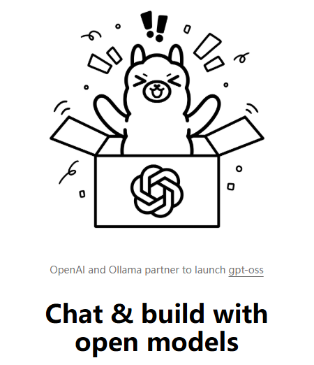

## 通识

### 什么是Ollama？

https://ollama.com/

Ollama 是一个在本地运行大语言模型（LLMs）的工具和平台。它的目标是让用户能够像调用 API 一样，直接在个人电脑(主要是 macOS)上运行和管理大语言模型，而不依赖云端。  简单来说，就是一个大模型的Docker。
以下是 Ollama 的一些核心特点：
简单来说，Ollama 就是一个 本地大语言模型的运行环境和管理器，能在自己的电脑上很方便地使用和调用开源 LLM。由于是在本地电脑上运行大模型，直接从根源上解决了代码安全问题。

### 传统部署流程和Ollama对比：

#### 传统部署流程

## 接入Cline进行代码编辑

## 用Modelfile自定义大模型进行Roleplay

## 用Python创建历史会话json实现不间断对话

## 调用本地输出api接入Unity后端
