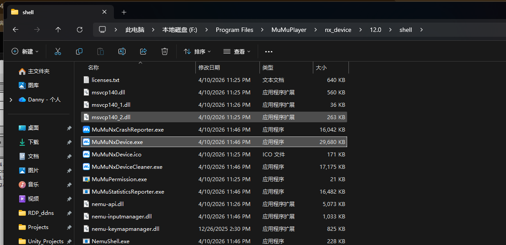
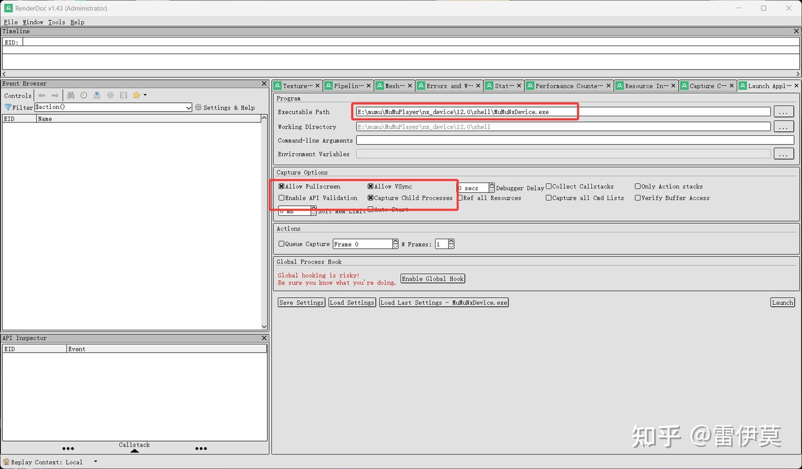

## 

使用RenderDoc截帧的时候, 要先确保整个mumu已经不运行(在任务管理器中杀掉所有的mumu实例);

默认直接启动就行, 记得给mumu设置为Vulkan的渲染API模式. 如果不行再看下面

## 如果不行

设置这样调整,enable child process也开一下. 然后如果不行可以参考

https://zhuanlan.zhihu.com/p/702990379 原po在这里.

# 为什么在截帧部分游戏的时候只能出现一个最终输出

是因为有的反作弊故意开了两个RenderTarget, 另一个隐藏起来了; 当然这是故意的.

所以只需要在RenderDoc上修改一下源码就好了, 下面的链接给了这个版本, 修改后的源码也在里边, 可以diff看看

https://drive.google.com/file/d/1jhKp6UPbi5i1bfaKZlIArCo71-GQ7Pbl/view?usp=drive_link

