> 用 Frame Graph 打造高效的多摄像机渲染管线.


## 摘要


本文旨在深入、系统地剖析现代图形渲染管线中的两大核心技术领域，并阐明 Frame Graph 如何成为连接二者的桥梁与优化中枢。
通过引入 Frame Graph 技术，我们能够在假定所有“永久性”资产（如模型、材质纹理）已加载完毕的前提下，对每一帧的渲染流程进行精密的编排，从而实现以下关键性能目标：

## 一、 核心概念辨析：资产加载 vs. 帧内调度


这两个概念经常被混淆，但它们处理的是渲染管线中完全不同阶段的问题。我们可以用一个“厨房备餐”的例子来理解：

| 维度 | 资产加载系统 (Asset Loading System) | Frame Graph (In-Frame Scheduler) |
| --- | --- | --- |
| 目标 | 将资源从磁盘/网络高效、异步地加载至显存，为渲染做好“备料”工作。 | 优化单帧画面内 GPU 的工作流与临时显存的管理，实现“高效烹饪”。 |
| 关注点 | I/O 吞吐量、文件解码/解压效率、CPU到GPU的上传策略（例如，使用专用的上传堆）。 | 显存复用（Aliasing）、同步屏障最小化、渲染任务的并行调度。 |
| 典型组件 | 异步I/O读取器、纹理/模型解码器、资源缓存策略（LRU等）、上传管理器（Uploader）。 | Pass图构建器、资源生命周期分析器、依赖解析器、物理资源分配器。 |
| 关键指标 | 资源加载耗时（Loading Time）、数据传输带宽利用率、卡顿（Stuttering）的避免。 | 显存峰值占用（VRAM Peak Usage）、帧时间（Frametime）、GPU利用率（GPU Utilization）。 |


> 重要关联：Frame Graph 并非完全不关心资产加载。它将“上传新资源”或“回读数据到CPU”这些操作，抽象为图中的一个特殊节点（Pass）。例如，一个“Upload Pass”没有GPU输入，但它会“凭空”产生一个GPU资源（纹理/缓冲区）。同样，“Readback Pass”会消耗一个GPU资源，并将其标记为需要拷贝回CPU。这样，整个数据流就统一在了Frame Graph的框架下进行管理和同步。


## 二、 Frame Graph 的核心要素


Frame Graph 的魔力源于其声明式的API和对渲染流程的抽象。

### 1. 资源生命周期管理：逻辑与物理的分离


这是 Frame Graph 最核心的思想。

### 2. Pass 依赖关系


依赖关系是 Frame Graph 构建图的基石。开发者在定义一个 Pass 时，必须明确声明它会读取哪些逻辑资源，写入或修改哪些逻辑资源。




这个图中，LightingPass 依赖 DepthPrePass 和 GBufferPass 的输出。Frame Graph 会自动推断出：

### 3. 外部资源接口


Frame Graph 管理的大多是“临时”资源，但它也需要与“持久”或外部资源交互。

## 三、 显存优化三原则


### 1. 峰值压缩策略 (通过资源别名)


这是 Frame Graph 最直观的优势。

```c
// 传统方式：为每个用途分配独立资源，显存峰值为四者之和ID3D12Resource* pDepthMain = AllocateResource(desc_depth_main);ID3D12Resource* pColorMain = AllocateResource(desc_color_main);ID3D12Resource* pDepthMini = AllocateResource(desc_depth_mini);ID3D12Resource* pColorMini = AllocateResource(desc_color_mini);// Peak VRAM = Size(DepthMain) + Size(ColorMain) + Size(DepthMini) + Size(ColorMini)// Frame Graph 优化：分析生命周期，进行复用// 1. 注册逻辑资源fg.create("DepthMain", desc_depth_main);fg.create("ColorMain", desc_color_main);fg.create("DepthMini", desc_depth_mini);fg.create("ColorMini", desc_color_mini);// ... 注册所有 Pass 和读写关系 ...// 2. 编译阶段，Frame Graph 发现 DepthMini 和 ColorMain 的生命周期不重叠//    且假设它们的资源描述兼容（例如，都属于某个大的内存池桶）// 3. 实际执行PhysicalResource* blockA = PhysicalPool.Allocate(max(size_main, size_mini));// Pass 1 (Minimap): 使用 blockA 作为 DepthMini// Pass 2 (MainCam): 使用 blockA 作为 DepthMain// 如此，两个逻辑资源共享了同一块物理内存，峰值显著下降。
```


Frame Graph 自动化的资源别名（Aliasing）能力，使得开发者无需手动管理复杂的内存复用逻辑，既安全又高效。

### 2. 屏障最小化


同步屏障是 GPU 管线中的“红绿灯”，滥用会导致严重的性能瓶颈（GPU 空闲等待）。

### 3. 并行执行优化 (Async Compute)


现代 GPU 不只有一个“执行引擎”。它们通常有专门的图形队列、计算队列和拷贝队列。

```python
def parallel_execute(pass_graph):    # 1. Frame Graph 分析依赖关系，发现两个独立的任务分支    #    例如：阴影图生成 和 环境光遮蔽计算    shadow_subgraph = pass_graph.extract_subgraph("Shadows")    ao_subgraph = pass_graph.extract_subgraph("AmbientOcclusion")    # 2. 将这些独立的子图提交到不同的硬件队列    submit_to_queue(shadow_subgraph, queue="Graphics")    submit_to_queue(ao_subgraph, queue="AsyncCompute")    # 3. 在需要合并结果的地方设置同步点（Fence/Semaphore）    #    例如，主光照 Pass 需要同时采样阴影图和 AO 贴图    synchronize_queues_at(pass="MainLighting")
```


Frame Graph 通过图的结构分析，可以自动识别出这些并行机会，并管理好多队列之间的复杂同步，将 GPU 的多任务处理能力压榨到极致。

## 四、 例：多摄像机场景


多摄像机是 Frame Graph 大放异彩的领域。

### 案例：主相机 + 小地图


这个场景的渲染逻辑通常是串行的：先渲染小地图，再渲染主场景。
收益：原本需要 (DepthMain + ColorMain) + (DepthMini + ColorMini) 的峰值显存，现在只需要 max(Size(Main), Size(Mini)) 组合，如果尺寸差异大，节约效果非常显著。

### 镜面反射/水面倒影场景


这个场景的特点是存在清晰的生产者-消费者依赖关系。

```c
// Frame Graph 声明式代码fg.add_pass("ReflectionPass",    // ...    .writes = { "ReflectionTex" });fg.add_pass("MainScenePass",    // ...    .reads = { "ReflectionTex" },    .writes = { "SwapChainBuffer" });
```


Frame Graph看到这个 writes -> reads 的依赖，会自动在 ReflectionPass 和 MainScenePass 之间插入一个屏障，确保 ReflectionTex 从“渲染目标”状态安全地转换为“纹理采样”状态。开发者无需关心底层的 VkImageMemoryBarrier 或 D3D12_RESOURCE_BARRIER 的复杂设置。

## 五、 跨平台实现要点


虽然 Frame Graph 的思想是统一的，但底层的物理资源管理机制在不同图形 API 中有所差异。

| 平台 | 显存管理机制 | 典型优化技巧与API |
| --- | --- | --- |
| D3D12 | 堆 (Heap) + 放置的资源 (Placed Resources)：先分配一大块内存（Heap），然后将多个资源（Resource）精确地放置在这块 Heap 的不同偏移上。这是实现资源别名的原生方式。 | 别名屏障 (Aliasing Barrier)：在复用同一块内存用于不同资源时，需要插入一个特殊的别名屏障来通知驱动。ID3D12GraphicsCommandList::ResourceBarrier 批量提交。 |
| Vulkan | VkDeviceMemory + vkBindImageMemory：与D3D12类似，先分配内存对象，再将图像/缓冲区对象绑定上去。通常使用 VMA (Vulkan Memory Allocator) 这样的库来简化子分配，实现高效的池化管理。 | 队列所有权转移 (Queue Family Ownership Transfer)：在跨队列（如图形/计算）使用资源时，需要通过屏障转移所有权。精确的访问掩码 (Access Masks) 和 管线阶段 (Pipeline Stages) 控制同步粒度。 |
| Metal | 堆 (MTLHeap) + 临时纹理 (makeTexture with descriptor)：Metal 同样支持从一个预分配的 MTLHeap 中创建纹理和缓冲区。临时纹理（storageMode = .private）是为帧内资源优化的。 | 加载/存储动作 (Load/Store Action)：在 MTLRenderPassDescriptor 中设置 loadAction 和 storeAction。loadAction = .dontCare 或 .clear 可以避免不必要的显存带宽消耗，这与 Frame Graph 的生命周期管理完美契合。 |


## 六、 常见误区澄清


| 误区 | 现实情况与深入解释 |
| --- | --- |
| Frame Graph 就是资源加载器 | 完全错误。Frame Graph 核心解决的是帧内 (intra-frame) 的 GPU 资源调度问题。它假设渲染所需的“永久”资产（模型、场景纹理）已经被资产加载系统加载到了显存。它自己不负责从磁盘读取文件。 |
| 资源复用会导致旧数据残留，引发渲染错误 | 不会，如果正确使用。Frame Graph 在调度一个 Pass 时，会参考其对资源的加载操作 (Load Operation)。如果一个 Pass 要写入一个被复用的纹理，它会将其 LoadOp 设置为 Clear 或 DontCare。Clear 会在 Pass 开始时用指定颜色清空纹理；DontCare 则直接丢弃旧内容，因为渲染会覆盖所有像素。这确保了每次使用都是从一个干净的状态开始。 |
| Frame Graph 只适用于单摄像机场景 | 恰恰相反，多摄像机场景是其优势最大的应用领域。如前所述，小地图、后视镜、安全摄像头等场景会产生大量生命周期短暂的临时渲染目标。Frame Graph 的自动复用机制能将这些场景的总显存占用降低 2-3 倍甚至更多，效果远超单摄像机场景。 |
| OpenGL/DirectX 11 等旧 API 不需要 Frame Graph | 仍然有价值，但收益点不同。虽然这些旧 API 没有原生的资源别名和精细的屏障控制，但 Frame Graph 仍然可以：
1. 优化内存使用：通过管理一个资源池，避免频繁的 glGenTextures/glDeleteTextures 调用，减少驱动开销和内存碎片。
2. 简化逻辑：提供一个统一、声明式的接口来描述渲染流程，使代码更清晰、更易维护。
3. 为未来迁移做准备：采用 Frame Graph 架构，未来迁移到现代图形 API 会平滑得多。 |


## 七、 实施路线图：从零到一


想在你的引擎中引入 Frame Graph？可以遵循以下步骤：

```cpp
// 这是一个内存池的配置示例MemoryPoolConfig config = {    // 将资源按大小分为不同的桶，减少碎片    .bucket_sizes = { 256*1024, 1024*1024, 4*1024*1024, 16*1024*1024 }, // 256KB, 1MB, 4MB, 16MB    // 硬件要求的对齐字节    .alignment = 256,    // 允许的最大浪费率，用于决定资源放入哪个桶    .max_waste_ratio = 0.2 // 允许20%的空间浪费以换取复用};
```


## 结语


Frame Graph 并非银弹，但它是现代图形引擎应对日益复杂的渲染流程所演化出的“智能调度中枢”。它通过将渲染流程抽象化和数据化，实现了三大核心突破：
在实践中，引入 Frame Graph 能够为多摄像机等复杂场景带来 40%-70% 的显存占用降低，并可能带来 10%-30% 的 GPU 利用率提升。对于追求极致性能的移动平台和主机游戏开发，Frame Graph 已从一个“加分项”演变为“必备技术栈”。

> 实践建议：不要试图一蹴而就。可以从一个简单的后处理链（如 Bloom -> Tonemapping -> FXAA）开始，为它构建一个迷你的 Frame Graph。成功后，再逐步将主摄像机的渲染、阴影系统等模块迁移进来。始终利用可视化工具来观察你的图和资源分配，这会让你事半功倍。



