## 1. **基本信息**
+ 截帧来源：RenderDocv1.29，使用开启开发者模式的酷比魔方mini2截帧。
+ 测试设备：MTK G99, Pixel Experience 安卓13，刷入termux/magisk-Hide config
+ 碧蓝航线互动宿舍

---

## 2. **总体资源与调用统计**
这里用的是能代的对话界面，基本信息如下：

```plain
Stats for azur3d.rdc.

File size: 281.55MB (444.54MB uncompressed, compression ratio 1.58:1)
Persistent Data (approx): 0.67MB, Frame-initial data (approx): 249.04MB

*** Summary ***

Draw calls: 256
Dispatch calls: 9
API calls: 3764
API:Draw/Dispatch call ratio: 14.2038

230 Textures - 186.32 MB (186.29 MB over 32x32), 16 RTs - 63.35 MB.
Avg. tex dimension: 634.794x620.949 (682.954x677.342 over 32x32)
249 Buffers - 11.08 MB total 0.48 MB IBs 3.72 MB VBs.
260.74 MB - Grand total GPU buffer + texture load.
```

256个Drawcall，看着还行？

9个compute shader调用，合计230纹理，16个RenderTarget，249个buffer，占用ram约260MB。

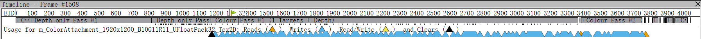

画面输出Backbuffer：R11G11B10,很经典的32位输出。

## 3. **渲染流程与Pass分析**
### 大致渲染顺序：
Depth渲染摄像机视角和光源视角-房间内景-房间外景-人物角色-后处理。AO遮蔽光采用烘培贴图的方式。

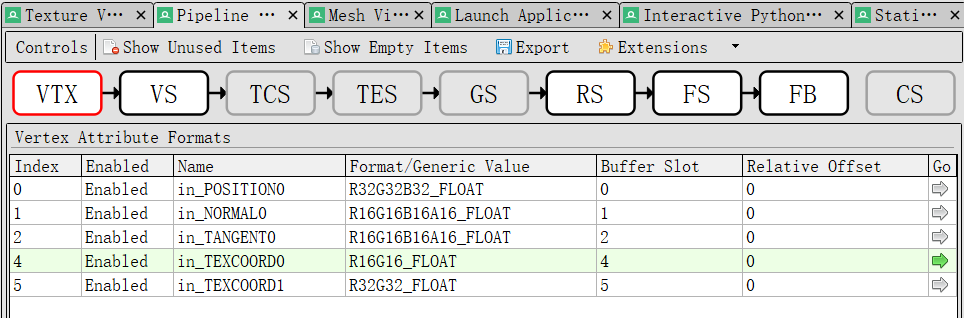

整个渲染过程没有激活细分着色器（TCS、TES），几何着色器（GS），计算着色器（CS）只用于提交顶点组。也就是说不用拆里面复杂的包了！当然也和移动端性能有点关系。

没有合批（Instancing/SRP batcher）


+ 每个Pass的Draw Call/资源消耗
+ 关键渲染阶段的调用结构（如：GBuffer Pass、Forward Pass、后处理Pass等）
+ 主要材质/Shader使用分布
+ 是否有合批（Instancing/SRP Batcher）

### Depth Pass：
深度测试的时候，会使用极其简单的Shader（通常只包含顶点变换，不输出颜色，只写深度）。不做光照、不做着色、不输出颜色缓冲，会将所有的物体遍历并且将每个物体深度值写到深度缓冲区。

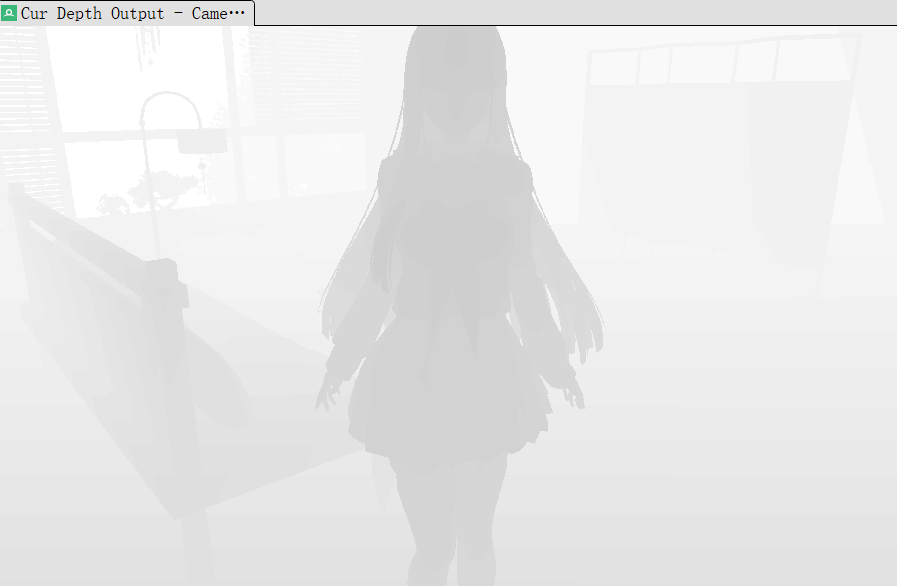

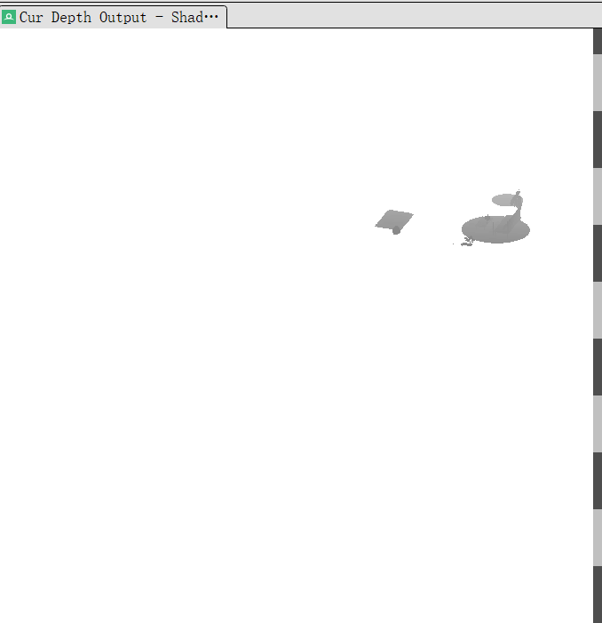

看完了深度测试就可以知道了，采用的是shadowmap形式。

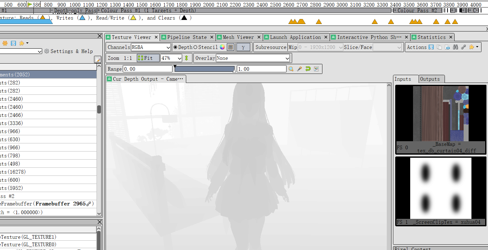

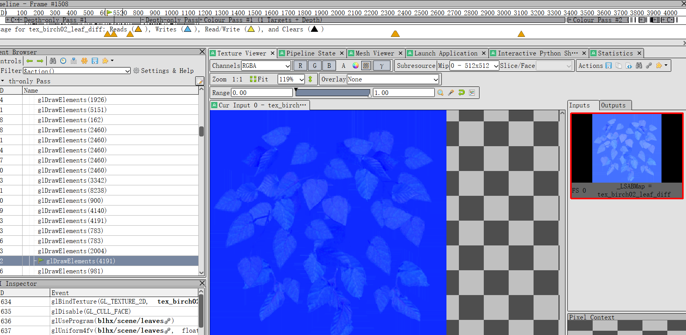

但是唯一有点疑问的是为什么要像depth pass的时候会输入basemap和法线贴图？有点奇怪。而且这个贴图在后续的pass不会出现第二次，大部分还是花盆/叶子这种微小部件。这个不是很理解。难道是为了减少后期colorpass的带宽压力？

### Color Pass
这里直接挑了一个比较明显的渲染衣服状态下的colorpass。第一个pass负责渲染整个场景的光照状态；第二个pass负责混合叠加渲染的场景AO图，和特殊形态的场景（水和树叶）。最后叠加后处理Pass（风格化LUTs+Bloom）

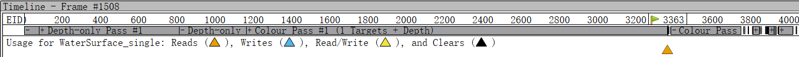

挑一个第二个pass末状态下的backbuffer看一下里边有什么：

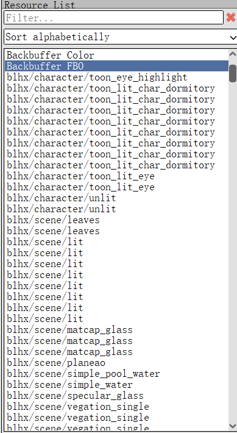

**大致分成三种类型：**

1. **通用型场景Shader**
2. **特异型场景Shader（水、树叶、玻璃）**
3. **人物shader**

通用型Shader就是一般的场景Shader，很大概率是Unity Lit。

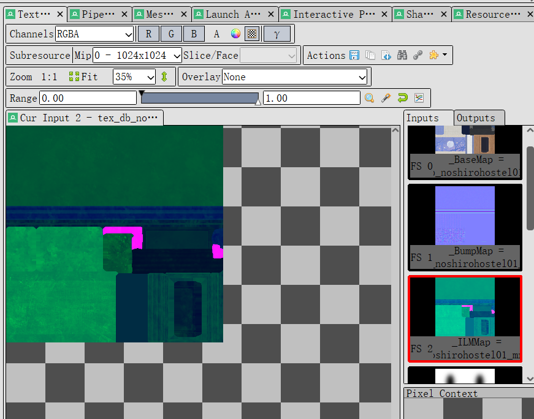

通用Shader输入：

+ BaseMap
+ BumpMap
+ ILMMap

很经典的Lit输入

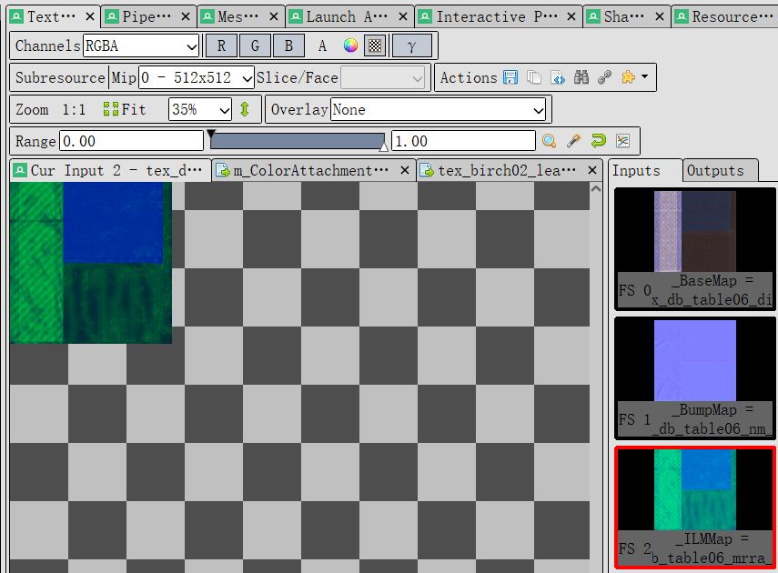

特异型场景Shader则会使用比较特殊的贴图，全部在二阶段才会渲染。

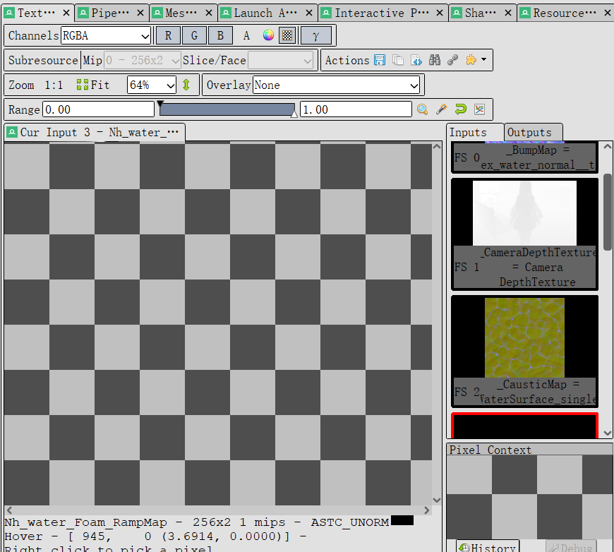

水面下的状态输入：

+ BumpMap(normal)
+ CausticMap（光学焦散）
+ DepthWaveHeightMap(黑白Ramp图）
+ NoiseMap
+ dayWater_RampMap(深度彩色Ramp）
+ WaterDepthSDFMap（SDF）

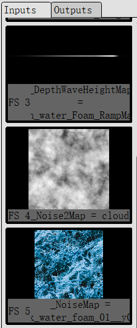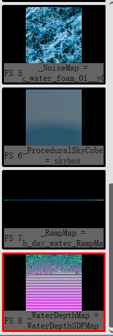

等一下，这个水的贴图是不是太多了，明明所有场景都没有海边的场景。能想到的估计就是蓝色星源那里调人来了？

云彩下的状态输入：

+ NoiseMap2Cloud

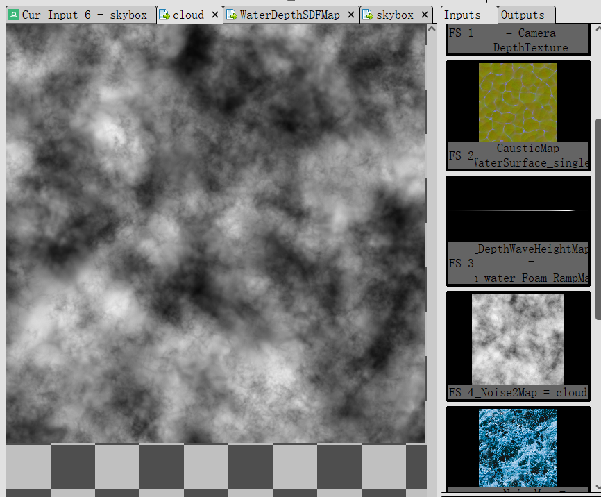

树叶的状态输入：

+  _LSABMap = birch02_leaf_diff  
 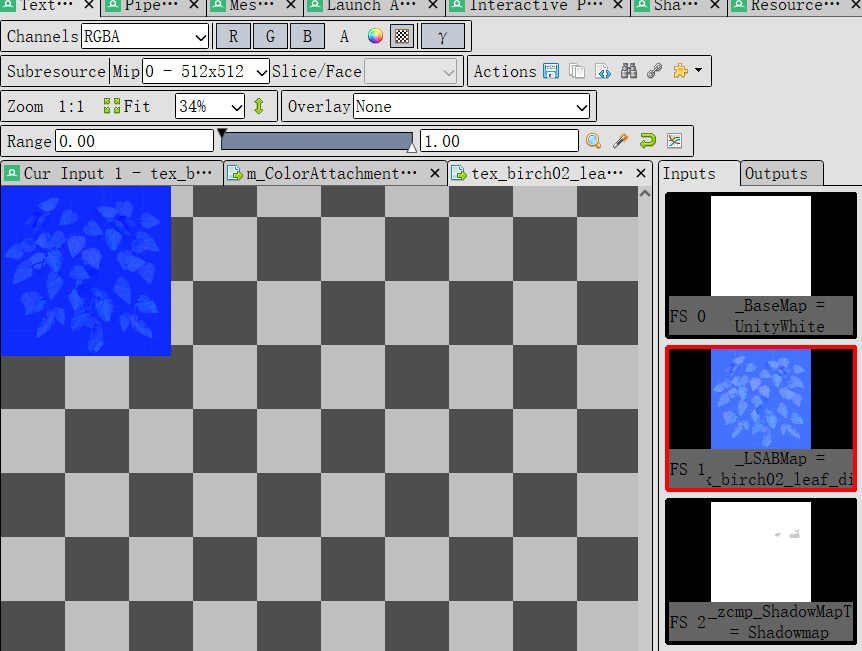

人物部分输入：

+ BaseMap
+ BumpMap
+ BodyMatcap(实际上这个Matcap和眼睛是一起用的）
+ ILMMap
+ RampMap（六行）
+ FaceShadingGradeMask（其实就是SDF）
+ FaceRampmap

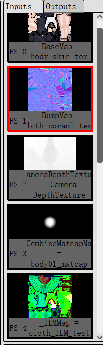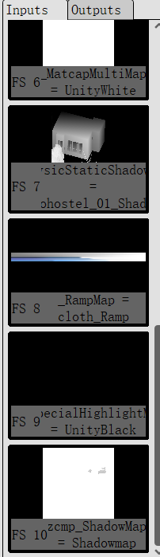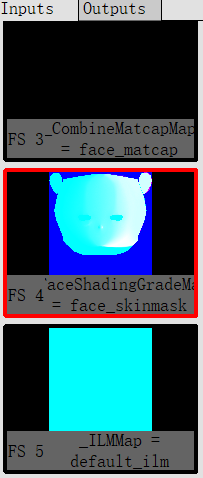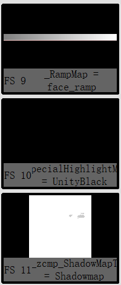

## 4. **资源细节分析**
### 纹理列表及格式、分辨率分布
纹理采用1024x1024，分为11个mip层级，可以根据视场角调整渲染的精度层级。没什么好说的

RenderTarget有：

RT 0: R8G8B8A8    (主颜色)

RT 1: R8G8_UNORM  (法线XY)

Depth: D16_UNORM  (16位深度)


## 5. **性能分析**
> 可能影响性能的热点（如大量小Draw Call、高频RT切换、大尺寸贴图）
>

```plain
*** Summary ***

Draw calls: 256
Dispatch calls: 9
API calls: 3764
API:Draw/Dispatch call ratio: 14.2038

230 Textures - 186.32 MB (186.29 MB over 32x32), 16 RTs - 63.35 MB.
Avg. tex dimension: 634.794x620.949 (682.954x677.342 over 32x32)
249 Buffers - 11.08 MB total 0.48 MB IBs 3.72 MB VBs.
260.74 MB - Grand total GPU buffer + texture load.
```

平均的顶点引用其实不是很多，角色设计部分对于顶点的优化还不错

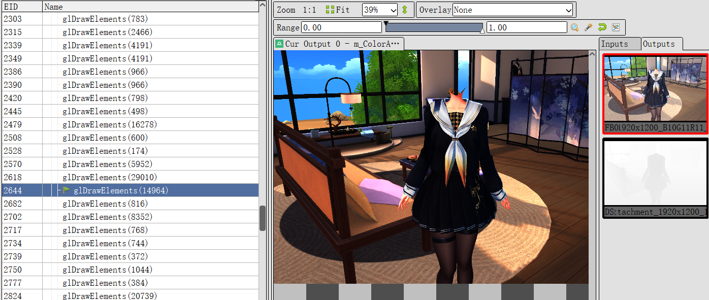

## 6. **特殊技术/优化点**
+ 没有动态合批/静态合批/Instancing。
+ 渲染队列和分组策略不错，甚至专门划了第二轮Pass给特殊物体（云、叶子、水）和AO混合补全。
+ 是一些小物件的贴图（比如花盆）在depthpass的时候就已经存进去了，怀疑这是一个小Trick，减少了对于ColorPass部分的带宽压力？
+ Mipmap有11级，还行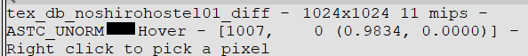


## 7. **Shader**
好吧说实话我看中的就是Shader，直接扒开角色渲染阶段的DXBC源码看一下里面的变量声明：

```cpp
UNITY_BINDING(0) uniform UnityPerMaterial {
	mediump float _Cutoff;
	mediump float _BaseSettingEnable;
	mediump vec4 _BaseColor;
	mediump vec4 _MainLightLuminanceRemap;
	mediump float _HeadSettingEnable;
	mediump float _BumpScale;
	mediump float _CombineMatcap;
	mediump float _MatcapMultiplyEnable;
	mediump vec4 _MatcapMultiTint;
	mediump float _MatcapMultiIntensity;
	mediump vec4 _MatcapMultiRemap;
	mediump vec4 _MatcapMultiShadowTint;
	mediump float _SelfShadowEnable;
	mediump vec4 _ShadingOffsetRemap;
	mediump float _ShadingOffsetStrength;
	mediump float _MirrorForward;
	mediump float _MirrorU;
	mediump vec4 _FaceCenterUvAndExtend;
	mediump float _FaceShadingOffset;
	mediump float _FaceShadingSoftness;
	mediump float _FaceExpressionAlpha;
	mediump float _FaceGradient;
	mediump vec4 _FaceGradientColor;
	mediump float _FaceGradientPow;
	mediump float _FaceGradientOffset;
	mediump vec4 _FaceLocalHeightBound;
	mediump float _DirShadowEnable;
	mediump vec4 _DirShadowRemap;
	mediump float _DirShadowStrength;
	mediump vec4 _DirShadowTint;
	mediump float _ScreenSpaceRimShadowEnable;
	mediump float _UseCustomLightDir;
	mediump float _LightDirVSOffset;
	mediump float _SreenSamplingDilation;
	mediump vec4 _DepthShadowRemap;
	mediump vec4 _DepthRimRemap;
	mediump vec4 _SSDepthShadowRemap;
	mediump vec4 _SSdepthRimLightRemap;
	mediump vec4 _DepthDiffShadowTint;
	mediump float _StockingEnable;
	mediump vec4 _StockingColor;
	mediump vec4 _StockingShadingRemap;
	mediump vec4 _StockingShadowColor;
	mediump float _StockingPower;
	mediump vec4 _StockingFresnelTint;
	mediump float _StockingFresnelPower;
	mediump float _StockingStretching;
	mediump float _StockingThicknessMulti;
	mediump float _SkinPower;
	mediump float _StockingThickness;
	mediump vec4 _SkinTransmittanceTint;
	mediump float _Shininess;
	mediump vec4 _ShadowAffectRemap;
	mediump vec4 _SpecularAttenRemap;
	mediump vec4 _SpecularRemap;
	mediump float _SpecularSize;
	mediump vec3 _ActualSpecularTint;
	mediump float _BaseColorAffected;
	mediump vec4 _ShiftMap_ST;
	mediump vec4 _SpotnessTilingOffset;
	mediump vec4 _SpotnessRemap;
	mediump float _1stShiftStrength;
	mediump float _2ndShiftStrength;
	mediump vec4 _StrandExp;
	mediump vec4 _1stKajiyaKaySpecularTint;
	mediump vec4 _2ndKajiyaKaySpecularTint;
	mediump vec4 _ShadowAffectedRemap;
	mediump float _SpecialHighlightEnable;
	mediump float _ParallaxScale;
	mediump float _HighlightSize;
	mediump vec4 _ActualSpecialHighlightTint;
	mediump vec4 _MatcapAdditiveMaskRemap;
	mediump vec4 _ActualMatcapAdditiveTint;
	mediump float _MatcapAdditiveAmount;
	mediump float _DisableScreenSpaceRim;
	mediump float _LightDirOffset;
	mediump vec4 _ActualRimLightTint;
	mediump float _RimlightThreshold;
	mediump float _RimlightFeather;
	mediump float _RimLightColorAffected;
	mediump vec4 _ShadowingRemap;
	mediump float _DropletsEnable;
	mediump float _DropletsRotation;
	mediump float _RainMaskTiling;
	mediump float _RainDropStaticSize;
	mediump float _RainDropStaticDensity;
	mediump float _RainDropStaticTimeSpeed;
	mediump float _RainDropTimeSpeed;
	mediump float _RainDropDownSpeed;
	mediump float _RainDropSize;
	mediump float _Roughness;
	mediump float _DropletFresnelIntensity;
	mediump float _DropletsDiffuseIntensity;
	mediump float _DropletsCausiticMul;
	mediump float _DropletsSpecIntensity;
	mediump float _DropletsFlowSpeed;
	mediump float _WetnessNormalStrength;
	mediump float _Porosity;
	mediump vec4 _ActualEmissionTint;
	mediump float _AdditiveLightIntensity;
	mediump float _GlobalIlluminationEnable;
	mediump float _IndirectDiffuseIntensity;
	mediump float _GlossyReflectionRoughness;
	mediump float _GlossyReflectionIntensity;
	mediump float _TraditionalOutlineEnable;
	mediump float _OutlineWidth;
	mediump float _OutlineZOffset;
	mediump float _OutlineMaxDistance;
	mediump float _OutlineDistanceFade;
	mediump vec4 _OutlineTintPreLight;
	mediump vec4 _OutlineTintAfterLight;
	mediump vec4 _OutlineColorReplace;
	mediump vec4 _HairTransparentRemap;
	mediump float _DebugCaseItem;
	mediump vec4 _HeadCenter;
	mediump vec4 _HeadForward;
	mediump vec4 _HeadRight;
	mediump vec4 _HeadUp;
	mediump vec4 _BodyCenter;
	mediump vec4 _BodyExtent;
	mediump vec4 _BodyForward;
	mediump vec4 _BodyRight;
	mediump vec4 _BodyUp;
	mediump float _CharacterInd;
```

然后直接喂给GPT（该说这是llm语言模型的天性吗，太爽了），回答是：

+ **基础色/高光/法线/Matcap等通用PBR属性**
+ **角色定制化参数（面部、头发、丝袜、身体）**
+ **丰富的特殊效果（雨滴、湿润、描边、Rim、发光等）**
+ **阴影/光源/环境光/全局光照控制**
+ **调试和多角色支持**

如果要分门别类，那就是：

```plain
UnityPerMaterial 角色材质参数
├── 🎨 基础渲染设置 (Base Rendering)
│   ├── 基础控制
│   │   ├── float _Cutoff                    // Alpha裁剪阈值
│   │   ├── float _BaseSettingEnable         // 基础设置开关
│   │   └── vec4 _BaseColor                  // 基础颜色
│   └── 主光源设置
│       └── vec4 _MainLightLuminanceRemap    // 主光源亮度重映射
│
├── 👤 面部渲染系统 (Face Rendering)
│   ├── 面部基础设置
│   │   ├── float _HeadSettingEnable         // 头部设置开关
│   │   ├── float _MirrorForward             // 前向镜像
│   │   ├── float _MirrorU                   // U坐标镜像
│   │   └── vec4 _FaceCenterUvAndExtend      // 面部中心UV和扩展
│   ├── 面部阴影系统
│   │   ├── float _FaceShadingOffset         // 面部阴影偏移
│   │   ├── float _FaceShadingSoftness       // 面部阴影柔和度
│   │   └── float _FaceExpressionAlpha       // 面部表情Alpha
│   ├── 面部渐变效果
│   │   ├── float _FaceGradient              // 面部渐变开关
│   │   ├── vec4 _FaceGradientColor          // 面部渐变颜色
│   │   ├── float _FaceGradientPow           // 面部渐变强度
│   │   └── float _FaceGradientOffset        // 面部渐变偏移
│   └── 面部区域定义
│       └── vec4 _FaceLocalHeightBound       // 面部局部高度边界
│
├── 🌑 阴影渲染系统 (Shadow System)
│   ├── 自阴影
│   │   ├── float _SelfShadowEnable          // 自阴影开关
│   │   ├── vec4 _ShadingOffsetRemap         // 阴影偏移重映射
│   │   └── float _ShadingOffsetStrength     // 阴影偏移强度
│   ├── 方向阴影
│   │   ├── float _DirShadowEnable           // 方向阴影开关
│   │   ├── vec4 _DirShadowRemap             // 方向阴影重映射
│   │   ├── float _DirShadowStrength         // 方向阴影强度
│   │   └── vec4 _DirShadowTint              // 方向阴影色调
│   ├── 屏幕空间阴影
│   │   ├── float _ScreenSpaceRimShadowEnable // 屏幕空间边缘阴影开关
│   │   ├── float _SreenSamplingDilation      // 屏幕采样扩张
│   │   ├── vec4 _SSDepthShadowRemap         // SS深度阴影重映射
│   │   └── vec4 _SSdepthRimLightRemap       // SS深度边缘光重映射
│   ├── 深度阴影
│   │   ├── vec4 _DepthShadowRemap           // 深度阴影重映射
│   │   ├── vec4 _DepthRimRemap              // 深度边缘重映射
│   │   └── vec4 _DepthDiffShadowTint        // 深度差阴影色调
│   ├── 自定义光照
│   │   ├── float _UseCustomLightDir         // 使用自定义光照方向
│   │   ├── float _LightDirVSOffset          // 光照方向视空间偏移
│   │   └── float _LightDirOffset            // 光照方向偏移
│   └── 阴影影响
│       ├── vec4 _ShadowAffectRemap          // 阴影影响重映射
│       └── vec4 _ShadowingRemap             // 阴影重映射
│
├── 🧦 丝袜渲染系统 (Stocking System)
│   ├── 丝袜基础
│   │   ├── float _StockingEnable            // 丝袜开关
│   │   ├── vec4 _StockingColor              // 丝袜颜色
│   │   ├── vec4 _StockingShadingRemap       // 丝袜阴影重映射
│   │   └── vec4 _StockingShadowColor        // 丝袜阴影颜色
│   ├── 丝袜材质属性
│   │   ├── float _StockingPower             // 丝袜强度
│   │   ├── float _StockingStretching        // 丝袜拉伸
│   │   ├── float _StockingThickness         // 丝袜厚度
│   │   ├── float _StockingThicknessMulti    // 丝袜厚度倍数
│   │   └── float _SkinPower                 // 皮肤强度
│   ├── 丝袜菲涅尔效果
│   │   ├── vec4 _StockingFresnelTint        // 丝袜菲涅尔色调
│   │   └── float _StockingFresnelPower      // 丝袜菲涅尔强度
│   └── 皮肤透射
│       └── vec4 _SkinTransmittanceTint      // 皮肤透射色调
│
├── ✨ 高光系统 (Specular System)
│   ├── 基础高光
│   │   ├── float _Shininess                 // 光泽度
│   │   ├── vec4 _SpecularAttenRemap         // 高光衰减重映射
│   │   ├── vec4 _SpecularRemap              // 高光重映射
│   │   ├── float _SpecularSize              // 高光大小
│   │   ├── vec3 _ActualSpecularTint         // 实际高光色调
│   │   └── float _BaseColorAffected         // 基础颜色影响
│   ├── 头发高光 (Kajiya-Kay)
│   │   ├── vec4 _ShiftMap_ST                // 移位贴图UV变换
│   │   ├── vec4 _SpotnessTilingOffset       // 光斑平铺偏移
│   │   ├── vec4 _SpotnessRemap              // 光斑重映射
│   │   ├── float _1stShiftStrength          // 第一层移位强度
│   │   ├── float _2ndShiftStrength          // 第二层移位强度
│   │   ├── vec4 _StrandExp                  // 发丝指数
│   │   ├── vec4 _1stKajiyaKaySpecularTint   // 第一层Kajiya-Kay高光色调
│   │   ├── vec4 _2ndKajiyaKaySpecularTint   // 第二层Kajiya-Kay高光色调
│   │   └── vec4 _ShadowAffectedRemap        // 阴影影响重映射
│   └── 特殊高光
│       ├── float _SpecialHighlightEnable    // 特殊高光开关
│       ├── float _ParallaxScale             // 视差缩放
│       ├── float _HighlightSize             // 高光大小
│       └── vec4 _ActualSpecialHighlightTint // 实际特殊高光色调
│
├── 🔮 Matcap系统 (Matcap Effects)
│   ├── 基础Matcap
│   │   ├── float _BumpScale                 // 法线缩放
│   │   └── float _CombineMatcap             // 组合Matcap
│   ├── 乘法Matcap
│   │   ├── float _MatcapMultiplyEnable      // 乘法Matcap开关
│   │   ├── vec4 _MatcapMultiTint            // 乘法Matcap色调
│   │   ├── float _MatcapMultiIntensity      // 乘法Matcap强度
│   │   ├── vec4 _MatcapMultiRemap           // 乘法Matcap重映射
│   │   └── vec4 _MatcapMultiShadowTint      // 乘法Matcap阴影色调
│   └── 加法Matcap
│       ├── vec4 _MatcapAdditiveMaskRemap    // 加法Matcap遮罩重映射
│       ├── vec4 _ActualMatcapAdditiveTint   // 实际加法Matcap色调
│       └── float _MatcapAdditiveAmount      // 加法Matcap数量
│
├── 💫 边缘光系统 (Rim Light)
│   ├── 边缘光控制
│   │   ├── float _DisableScreenSpaceRim     // 禁用屏幕空间边缘光
│   │   ├── vec4 _ActualRimLightTint         // 实际边缘光色调
│   │   ├── float _RimlightThreshold         // 边缘光阈值
│   │   ├── float _RimlightFeather           // 边缘光羽化
│   │   └── float _RimLightColorAffected     // 边缘光颜色影响
│   └── 透明度控制
│       └── vec4 _HairTransparentRemap       // 头发透明度重映射
│
├── 💧 水滴系统 (Droplets System)
│   ├── 水滴基础设置
│   │   ├── float _DropletsEnable            // 水滴开关
│   │   ├── float _DropletsRotation          // 水滴旋转
│   │   ├── float _RainMaskTiling            // 雨水遮罩平铺
│   │   └── float _DropletsFlowSpeed         // 水滴流动速度
│   ├── 静态水滴
│   │   ├── float _RainDropStaticSize        // 静态雨滴大小
│   │   ├── float _RainDropStaticDensity     // 静态雨滴密度
│   │   └── float _RainDropStaticTimeSpeed   // 静态雨滴时间速度
│   ├── 动态水滴
│   │   ├── float _RainDropTimeSpeed         // 雨滴时间速度
│   │   ├── float _RainDropDownSpeed         // 雨滴下落速度
│   │   └── float _RainDropSize              // 雨滴大小
│   ├── 水滴材质属性
│   │   ├── float _Roughness                 // 粗糙度
│   │   ├── float _DropletFresnelIntensity   // 水滴菲涅尔强度
│   │   ├── float _DropletsDiffuseIntensity  // 水滴漫反射强度
│   │   ├── float _DropletsCausiticMul       // 水滴焦散倍数
│   │   ├── float _DropletsSpecIntensity     // 水滴高光强度
│   │   ├── float _WetnessNormalStrength     // 湿润法线强度
│   │   └── float _Porosity                  // 孔隙度
│   └── 水滴物理属性
│
├── 🌟 发光系统 (Emission & Lighting)
│   ├── 自发光
│   │   ├── vec4 _ActualEmissionTint         // 实际自发光色调
│   │   └── float _AdditiveLightIntensity    // 加法光强度
│   └── 全局光照
│       ├── float _GlobalIlluminationEnable  // 全局光照开关
│       ├── float _IndirectDiffuseIntensity  // 间接漫反射强度
│       ├── float _GlossyReflectionRoughness // 光泽反射粗糙度
│       └── float _GlossyReflectionIntensity // 光泽反射强度
│
├── 📐 描边系统 (Outline System)
│   ├── 描边控制
│   │   ├── float _TraditionalOutlineEnable  // 传统描边开关
│   │   ├── float _OutlineWidth              // 描边宽度
│   │   ├── float _OutlineZOffset            // 描边Z偏移
│   │   ├── float _OutlineMaxDistance        // 描边最大距离
│   │   └── float _OutlineDistanceFade       // 描边距离淡化
│   └── 描边颜色
│       ├── vec4 _OutlineTintPreLight        // 描边光照前色调
│       ├── vec4 _OutlineTintAfterLight      // 描边光照后色调
│       └── vec4 _OutlineColorReplace        // 描边颜色替换
│
├── 📍 角色空间定义 (Character Space)
│   ├── 头部空间
│   │   ├── vec4 _HeadCenter                 // 头部中心
│   │   ├── vec4 _HeadForward                // 头部前向
│   │   ├── vec4 _HeadRight                  // 头部右向
│   │   └── vec4 _HeadUp                     // 头部上向
│   ├── 身体空间
│   │   ├── vec4 _BodyCenter                 // 身体中心
│   │   ├── vec4 _BodyExtent                 // 身体范围
│   │   ├── vec4 _BodyForward                // 身体前向
│   │   ├── vec4 _BodyRight                  // 身体右向
│   │   └── vec4 _BodyUp                     // 身体上向
│   └── 角色标识
│       └── float _CharacterInd             // 角色索引
│
└── 🔧 调试系统 (Debug System)
    └── float _DebugCaseItem                 // 调试案例项目
```

yysy看着实现难度其实还行，因为贴图其实不算很多。

终末地那个才是真的畜啊，一个人有十几张贴图

最后尝试实现了还原。

水面效果也非常有意思，很明显这不是简单摸一个外景该有的技术力（

 Gerstner波浪模拟和水体的焦散效果都非常牛逼，我还以为是简单的顶点位移动画和一个深度测试+RampMap就做完了

```cpp
#version 320 es

#define HLSLCC_ENABLE_UNIFORM_BUFFERS 1
#if HLSLCC_ENABLE_UNIFORM_BUFFERS
#define UNITY_UNIFORM
#else
#define UNITY_UNIFORM uniform
#endif
#define UNITY_SUPPORTS_UNIFORM_LOCATION 1
#if UNITY_SUPPORTS_UNIFORM_LOCATION
#define UNITY_LOCATION(x) layout(location = x)
#define UNITY_BINDING(x) layout(binding = x, std140)
#else
#define UNITY_LOCATION(x)
#define UNITY_BINDING(x) layout(std140)
#endif
uniform 	vec4 _Time;
uniform 	vec3 _WorldSpaceCameraPos;
uniform 	vec4 unity_OrthoParams;
uniform 	vec4 hlslcc_mtx4x4unity_ObjectToWorld[4];
uniform 	vec4 hlslcc_mtx4x4unity_WorldToObject[4];
uniform 	vec4 hlslcc_mtx4x4unity_MatrixV[4];
uniform 	vec4 hlslcc_mtx4x4unity_MatrixVP[4];
uniform 	mediump float water_Size;
#if HLSLCC_ENABLE_UNIFORM_BUFFERS
UNITY_BINDING(0) uniform UnityPerMaterial {
    #endif
    UNITY_UNIFORM mediump vec4 _BumpMap_ST;
    UNITY_UNIFORM mediump vec4 _NoiseMap_ST;
    UNITY_UNIFORM mediump vec4 _Noise2Map_ST;
    UNITY_UNIFORM mediump float _BumpScale;
    UNITY_UNIFORM mediump float _NormalBlendType;
    UNITY_UNIFORM mediump float _BaseWaterEnable;
    UNITY_UNIFORM mediump vec4 _WaveDirection;
    UNITY_UNIFORM mediump float _WaveSpeed0;
    UNITY_UNIFORM mediump float _WaveSpeed1;
    UNITY_UNIFORM mediump float _SpecularIntensity;
    UNITY_UNIFORM mediump float _VertexWaveSpeed;
    UNITY_UNIFORM mediump vec4 _VertexWave0;
    UNITY_UNIFORM mediump vec4 _VertexWave1;
    UNITY_UNIFORM mediump vec4 _VertexWave2;
    UNITY_UNIFORM mediump float _DepthOffset;
    UNITY_UNIFORM mediump float _DepthFadeOff;
    UNITY_UNIFORM mediump float _SdfOffset;
    UNITY_UNIFORM mediump float _SdfFadeOff;
    UNITY_UNIFORM mediump float _ScreenDepthOffset;
    UNITY_UNIFORM mediump float _ScreenDepthFade;
    UNITY_UNIFORM mediump float _ScreenNearShoreFade;
    UNITY_UNIFORM mediump float _ShoreThreshold;
    UNITY_UNIFORM mediump float _ShoreFadeOff;
    UNITY_UNIFORM mediump float _SdfShoreThreshold;
    UNITY_UNIFORM mediump float _SdfShoreFadeOff;
    UNITY_UNIFORM mediump float _SdfWaveShoreMask;
    UNITY_UNIFORM mediump float _SdfWaveShoreFadeOff;
    UNITY_UNIFORM mediump float _EnableShoreEdgeFade;
    UNITY_UNIFORM mediump float _FarSeaFadeThreshold;
    UNITY_UNIFORM mediump float _FarSeaFadeOff;
    UNITY_UNIFORM mediump float _SdfFarSeaThreshold;
    UNITY_UNIFORM mediump float _SdfFarSeaFadeOff;
    UNITY_UNIFORM mediump float _DepthWaveEnable;
    UNITY_UNIFORM mediump float _DepthGerstnerWaveTimeSpeed;
    UNITY_UNIFORM mediump vec4 _WaveFoamNoiseChannelMask;
    UNITY_UNIFORM mediump vec4 _WaveOri;
    UNITY_UNIFORM mediump float _WaveLength;
    UNITY_UNIFORM mediump float _DepthGerstnerWaveFoamSpeed;
    UNITY_UNIFORM mediump float _FrequencyChangeInt;
    UNITY_UNIFORM mediump float _SDFFrequencyChangeInt;
    UNITY_UNIFORM mediump float _WaveNoiseOffsetIntensity;
    UNITY_UNIFORM mediump vec4 _FoamNoiseChannelMask;
    UNITY_UNIFORM mediump float _ShallowWaterFoamSpeed;
    UNITY_UNIFORM mediump float _ShallowWaterDistortion;
    UNITY_UNIFORM mediump float _DepthFoamNoiseMultiplier;
    UNITY_UNIFORM mediump float _DepthFoamIntensity;
    UNITY_UNIFORM mediump float _DepthGerstnerWaveAtten;
	UNITY_UNIFORM mediump vec4 _WaveFoamColor;
	UNITY_UNIFORM mediump float _FakeBentNormalStrength;
	UNITY_UNIFORM mediump float _FakeReflectivityRoughness;
	UNITY_UNIFORM mediump float _FakeReflectivityIntensity;
	UNITY_UNIFORM mediump vec4 _CausticMap_ST;
	UNITY_UNIFORM mediump vec4 _CausticProjDir;
	UNITY_UNIFORM mediump vec4 _CausticProjPos;
	UNITY_UNIFORM mediump float _WaterLevel;
	UNITY_UNIFORM mediump float _BlendDistance;
	UNITY_UNIFORM mediump float _CausticIntensity;
	UNITY_UNIFORM mediump float _DebugItem;
#if HLSLCC_ENABLE_UNIFORM_BUFFERS
};
#endif
in highp vec4 in_POSITION0;
out highp vec4 vs_TEXCOORD0;
out highp vec3 vs_TEXCOORD1;
out highp vec4 vs_TEXCOORD2;
out highp vec4 vs_TEXCOORD3;
out highp vec4 vs_TEXCOORD4;
out highp vec4 vs_TEXCOORD5;
out highp vec4 vs_TEXCOORD6;
out highp vec4 vs_TEXCOORD7;
out highp vec4 vs_TEXCOORD8;
vec3 u_xlat0;
mediump vec4 u_xlat16_0;
vec4 u_xlat1;
bool u_xlatb1;
vec3 u_xlat2;
vec3 u_xlat3;
vec3 u_xlat4;
float u_xlat5;
vec3 u_xlat6;
vec4 u_xlat7;
mediump float u_xlat16_8;
vec3 u_xlat9;
vec2 u_xlat10;
vec3 u_xlat11;
float u_xlat18;
vec2 u_xlat19;
float u_xlat20;
vec2 u_xlat21;
float u_xlat27;
bool u_xlatb27;
float u_xlat28;
void main()
{
    u_xlat0.y = in_POSITION0.y;
    u_xlat27 = 6.28318548 / _VertexWave0.w;
    u_xlat1.x = 9.80000019 / u_xlat27;
    u_xlat1.x = sqrt(u_xlat1.x);
    u_xlat1.x = u_xlat1.x * _VertexWaveSpeed;
    u_xlat10.x = dot(_VertexWave0.xy, _VertexWave0.xy);
    u_xlat10.x = inversesqrt(u_xlat10.x);
    u_xlat10.xy = u_xlat10.xx * _VertexWave0.xy;
    u_xlat0.xz = in_POSITION0.xz * vec2(water_Size);
    u_xlat28 = dot(u_xlat10.xy, u_xlat0.xz);
    u_xlat1.x = (-u_xlat1.x) * _Time.y + u_xlat28;
    u_xlat1.x = u_xlat27 * u_xlat1.x;
    u_xlat27 = _VertexWave0.z / u_xlat27;
    u_xlat2.x = cos(u_xlat1.x);
    u_xlat1.x = sin(u_xlat1.x);
    u_xlat28 = u_xlat27 * u_xlat2.x;
    u_xlat3.y = u_xlat27 * u_xlat1.x;
    u_xlat3.xz = vec2(u_xlat28) * u_xlat10.xy;
    u_xlat11.xyz = u_xlat0.xyz + u_xlat3.xyz;
    u_xlat9.x = 6.28318548 / _VertexWave1.w;
    u_xlat27 = 9.80000019 / u_xlat9.x;
    u_xlat27 = sqrt(u_xlat27);
    u_xlat27 = u_xlat27 * _VertexWaveSpeed;
    u_xlat28 = dot(_VertexWave1.xy, _VertexWave1.xy);
    u_xlat28 = inversesqrt(u_xlat28);
    u_xlat3.xy = vec2(u_xlat28) * _VertexWave1.xy;
    u_xlat28 = dot(u_xlat3.xy, u_xlat0.xz);
    u_xlat27 = (-u_xlat27) * _Time.y + u_xlat28;
    u_xlat27 = u_xlat27 * u_xlat9.x;
    u_xlat9.x = _VertexWave1.z / u_xlat9.x;
    u_xlat4.x = sin(u_xlat27);
    u_xlat5 = cos(u_xlat27);
    u_xlat27 = u_xlat9.x * u_xlat5;
    u_xlat6.y = u_xlat9.x * u_xlat4.x;
    u_xlat6.xz = vec2(u_xlat27) * u_xlat3.xy;
    u_xlat11.xyz = u_xlat11.xyz + u_xlat6.xyz;
    u_xlat9.x = 6.28318548 / _VertexWave2.w;
    u_xlat27 = 9.80000019 / u_xlat9.x;
    u_xlat27 = sqrt(u_xlat27);
    u_xlat27 = u_xlat27 * _VertexWaveSpeed;
    u_xlat28 = dot(_VertexWave2.xy, _VertexWave2.xy);
    u_xlat28 = inversesqrt(u_xlat28);
    u_xlat21.xy = vec2(u_xlat28) * _VertexWave2.xy;
    u_xlat28 = dot(u_xlat21.xy, u_xlat0.xz);
    vs_TEXCOORD4.xy = u_xlat0.xz * vec2(1.0, -1.0) + vec2(0.0, 1.0);
    u_xlat0.x = (-u_xlat27) * _Time.y + u_xlat28;
    u_xlat0.x = u_xlat0.x * u_xlat9.x;
    u_xlat9.x = _VertexWave2.z / u_xlat9.x;
    u_xlat6.x = cos(u_xlat0.x);
    u_xlat0.x = sin(u_xlat0.x);
    u_xlat18 = u_xlat9.x * u_xlat6.x;
    u_xlat7.y = u_xlat0.x * u_xlat9.x;
    u_xlat7.xz = vec2(u_xlat18) * u_xlat21.xy;
    u_xlat9.xyz = u_xlat11.xyz + u_xlat7.xyz;
    u_xlat11.xyz = u_xlat9.yyy * hlslcc_mtx4x4unity_ObjectToWorld[1].xyz;
    u_xlat11.xyz = hlslcc_mtx4x4unity_ObjectToWorld[0].xyz * u_xlat9.xxx + u_xlat11.xyz;
    u_xlat9.xyz = hlslcc_mtx4x4unity_ObjectToWorld[2].xyz * u_xlat9.zzz + u_xlat11.xyz;
    u_xlat9.xyz = u_xlat9.xyz + hlslcc_mtx4x4unity_ObjectToWorld[3].xyz;
    u_xlat7 = u_xlat9.yyyy * hlslcc_mtx4x4unity_MatrixVP[1];
    u_xlat7 = hlslcc_mtx4x4unity_MatrixVP[0] * u_xlat9.xxxx + u_xlat7;
    u_xlat7 = hlslcc_mtx4x4unity_MatrixVP[2] * u_xlat9.zzzz + u_xlat7;
    gl_Position = u_xlat7 + hlslcc_mtx4x4unity_MatrixVP[3];
    u_xlat7.xy = u_xlat9.xz * _BumpMap_ST.xy + _BumpMap_ST.zw;
    u_xlat7.zw = u_xlat9.xz * _NoiseMap_ST.xy + _NoiseMap_ST.zw;
    vs_TEXCOORD0 = u_xlat7 * vec4(0.00100000005, 0.00100000005, 0.00100000005, 0.00100000005);
    u_xlat7.x = hlslcc_mtx4x4unity_WorldToObject[0].y;
    u_xlat7.y = hlslcc_mtx4x4unity_WorldToObject[1].y;
    u_xlat7.z = hlslcc_mtx4x4unity_WorldToObject[2].y;
    u_xlat28 = dot(u_xlat7.xyz, u_xlat7.xyz);
    u_xlat28 = inversesqrt(u_xlat28);
    vs_TEXCOORD1.xyz = vec3(u_xlat28) * u_xlat7.xyz;
    u_xlat19.xy = u_xlat10.xy * (-u_xlat10.xx);
    u_xlat1.x = u_xlat1.x * _VertexWave0.z;
    u_xlat2.x = u_xlat2.x * _VertexWave0.z;
    u_xlat2.y = u_xlat10.x * u_xlat2.x;
    u_xlat2.xz = u_xlat1.xx * u_xlat19.xy;
    u_xlat1.xyz = u_xlat2.xyz + vec3(1.0, 0.0, 0.0);
    u_xlat2.xy = u_xlat3.xy * (-u_xlat3.xx);
    u_xlat28 = u_xlat4.x * _VertexWave1.z;
    u_xlat20 = u_xlat5 * _VertexWave1.z;
    u_xlat4.y = u_xlat20 * u_xlat3.x;
    u_xlat4.xz = vec2(u_xlat28) * u_xlat2.xy;
    u_xlat1.xyz = u_xlat1.xyz + u_xlat4.xyz;
    u_xlat2.xy = u_xlat21.xy * (-u_xlat21.xx);
    u_xlat0.x = u_xlat0.x * _VertexWave2.z;
    u_xlat28 = u_xlat6.x * _VertexWave2.z;
    u_xlat3.y = u_xlat28 * u_xlat21.x;
    u_xlat3.xz = u_xlat0.xx * u_xlat2.xy;
    u_xlat1.xyz = u_xlat1.xyz + u_xlat3.xyz;
    u_xlat0.x = dot(u_xlat1.xyz, u_xlat1.xyz);
    u_xlat0.x = inversesqrt(u_xlat0.x);
    u_xlat1.xyz = u_xlat0.xxx * u_xlat1.xyz;
    u_xlat2.xyz = u_xlat1.yyy * hlslcc_mtx4x4unity_ObjectToWorld[1].xyz;
    u_xlat1.xyw = hlslcc_mtx4x4unity_ObjectToWorld[0].xyz * u_xlat1.xxx + u_xlat2.xyz;
    u_xlat1.xyz = hlslcc_mtx4x4unity_ObjectToWorld[2].xyz * u_xlat1.zzz + u_xlat1.xyw;
    u_xlat0.x = dot(u_xlat1.xyz, u_xlat1.xyz);
    u_xlat0.x = inversesqrt(u_xlat0.x);
    vs_TEXCOORD2.xyz = u_xlat0.xxx * u_xlat1.xyz;
    vs_TEXCOORD2.w = 1.0;
    vs_TEXCOORD3.xyz = u_xlat9.xyz;
    vs_TEXCOORD3.w = 1.0;
    vs_TEXCOORD4.zw = u_xlat9.xz;
    u_xlat0.xyz = (-u_xlat9.xyz) + _WorldSpaceCameraPos.xyz;
#ifdef UNITY_ADRENO_ES3
    u_xlatb27 = !!(unity_OrthoParams.w==1.0);
#else
    u_xlatb27 = unity_OrthoParams.w==1.0;
#endif
    vs_TEXCOORD5.x = (u_xlatb27) ? hlslcc_mtx4x4unity_MatrixV[0].z : u_xlat0.x;
    vs_TEXCOORD5.y = (u_xlatb27) ? hlslcc_mtx4x4unity_MatrixV[1].z : u_xlat0.y;
    vs_TEXCOORD5.z = (u_xlatb27) ? hlslcc_mtx4x4unity_MatrixV[2].z : u_xlat0.z;
    vs_TEXCOORD5.w = 0.0;
    u_xlat16_8 = dot(_CausticProjDir, _CausticProjDir);
    u_xlat16_8 = inversesqrt(u_xlat16_8);
    u_xlat16_0.xyz = vec3(u_xlat16_8) * _CausticProjDir.xyz;
#ifdef UNITY_ADRENO_ES3
    u_xlatb1 = !!(0.999000013<abs(u_xlat16_0.y));
#else
    u_xlatb1 = 0.999000013<abs(u_xlat16_0.y);
#endif
    u_xlat1.xyz = (bool(u_xlatb1)) ? vec3(0.0, 1.0, 0.0) : vec3(0.0, 0.0, 1.0);
    u_xlat2.xyz = u_xlat16_0.yzx * u_xlat1.xyz;
    u_xlat1.xyz = u_xlat1.zxy * u_xlat16_0.zxy + (-u_xlat2.xyz);
    u_xlat28 = dot(u_xlat1.xyz, u_xlat1.xyz);
    u_xlat28 = inversesqrt(u_xlat28);
    u_xlat1.xyz = vec3(u_xlat28) * u_xlat1.xyz;
    vs_TEXCOORD6.xyz = u_xlat1.xyz;
    vs_TEXCOORD6.w = _CausticProjPos.x;
    u_xlat2.xyz = u_xlat16_0.zxy * u_xlat1.yzx;
    u_xlat1.xyz = u_xlat16_0.yzx * u_xlat1.zxy + (-u_xlat2.xyz);
    u_xlat28 = dot(u_xlat1.xyz, u_xlat1.xyz);
    u_xlat28 = inversesqrt(u_xlat28);
    vs_TEXCOORD7.xyz = vec3(u_xlat28) * u_xlat1.xyz;
    vs_TEXCOORD7.w = _CausticProjPos.y;
    u_xlat16_0.w = _CausticProjPos.z;
    vs_TEXCOORD8 = u_xlat16_0;
    return;
}
```

声明按照实现功能分类的话：

```plain
UnityPerMaterial 水面材质参数
├── 📐 纹理映射系统 (Texture Mapping)
│   ├── 法线贴图
│   │   ├── vec4 _BumpMap_ST          // 法线贴图UV变换
│   │   └── float _BumpScale          // 法线强度
│   ├── 噪声贴图
│   │   ├── vec4 _NoiseMap_ST         // 主噪声贴图UV变换
│   │   └── vec4 _Noise2Map_ST        // 次噪声贴图UV变换
│   └── 法线混合
│       └── float _NormalBlendType    // 法线混合模式
│
├── 🌊 波浪动画系统 (Wave Animation)
│   ├── 基础波浪控制
│   │   ├── float _BaseWaterEnable    // 基础水面开关
│   │   ├── vec4 _WaveDirection       // 波浪方向
│   │   ├── float _WaveSpeed0         // 第一层波速
│   │   └── float _WaveSpeed1         // 第二层波速
│   ├── 顶点波浪 (Gerstner Waves)
│   │   ├── float _VertexWaveSpeed    // 顶点波浪速度
│   │   ├── vec4 _VertexWave0         // 第一层顶点波浪参数
│   │   ├── vec4 _VertexWave1         // 第二层顶点波浪参数
│   │   └── vec4 _VertexWave2         // 第三层顶点波浪参数
│   └── 深度波浪系统
│       ├── float _DepthWaveEnable         // 深度波浪开关
│       ├── float _DepthGerstnerWaveTimeSpeed  // 深度波浪时间速度
│       ├── vec4 _WaveOri              // 波浪方向向量
│       ├── float _WaveLength          // 波长
│       ├── float _DepthGerstnerWaveFoamSpeed  // 深度波浪泡沫速度
│       ├── float _FrequencyChangeInt  // 频率变化强度
│       ├── float _SDFFrequencyChangeInt   // SDF频率变化强度
│       ├── float _WaveNoiseOffsetIntensity // 波浪噪声偏移强度
│       └── float _DepthGerstnerWaveAtten  // 深度波浪衰减
│
├── 🏖️ 海岸线系统 (Shore & Depth)
│   ├── 基础深度淡入淡出
│   │   ├── float _DepthOffset        // 深度偏移
│   │   ├── float _DepthFadeOff       // 深度淡出
│   │   ├── float _ScreenDepthOffset  // 屏幕空间深度偏移
│   │   ├── float _ScreenDepthFade    // 屏幕空间深度淡出
│   │   └── float _ScreenNearShoreFade // 屏幕近岸淡出
│   ├── 传统海岸线
│   │   ├── float _ShoreThreshold     // 海岸线阈值
│   │   └── float _ShoreFadeOff       // 海岸线淡出
│   ├── SDF海岸线系统
│   │   ├── float _SdfOffset          // SDF偏移
│   │   ├── float _SdfFadeOff         // SDF淡出
│   │   ├── float _SdfShoreThreshold  // SDF海岸线阈值
│   │   ├── float _SdfShoreFadeOff    // SDF海岸线淡出
│   │   ├── float _SdfWaveShoreMask   // SDF波浪海岸遮罩
│   │   ├── float _SdfWaveShoreFadeOff // SDF波浪海岸淡出
│   │   ├── float _SdfFarSeaThreshold // SDF远海阈值
│   │   └── float _SdfFarSeaFadeOff   // SDF远海淡出
│   ├── 边缘淡化系统
│   │   ├── float _EnableShoreEdgeFade // 启用海岸边缘淡化
│   │   ├── float _FarSeaFadeThreshold // 远海淡化阈值
│   │   └── float _FarSeaFadeOff      // 远海淡化系数
│   └── 水位控制
│       ├── float _WaterLevel         // 水位高度
│       └── float _BlendDistance      // 混合距离
│
├── 🫧 泡沫系统 (Foam Effects)
│   ├── 波浪泡沫
│   │   ├── vec4 _WaveFoamNoiseChannelMask // 波浪泡沫噪声通道遮罩
│   │   ├── vec4 _WaveFoamColor        // 波浪泡沫颜色
│   │   └── float _ShallowWaterFoamSpeed   // 浅水泡沫速度
│   ├── 深度泡沫
│   │   ├── vec4 _FoamNoiseChannelMask // 泡沫噪声通道遮罩
│   │   ├── float _DepthFoamNoiseMultiplier // 深度泡沫噪声倍数
│   │   └── float _DepthFoamIntensity  // 深度泡沫强度
│   └── 泡沫扭曲
│       └── float _ShallowWaterDistortion  // 浅水扭曲
│
├── ✨ 光照反射系统 (Lighting & Reflection)
│   ├── 镜面反射
│   │   └── float _SpecularIntensity  // 镜面反射强度
│   └── 假反射系统
│       ├── float _FakeBentNormalStrength    // 假弯曲法线强度
│       ├── float _FakeReflectivityRoughness // 假反射粗糙度
│       └── float _FakeReflectivityIntensity // 假反射强度
│
├── 🌟 焦散效果 (Caustics)
│   ├── 焦散贴图
│   │   └── vec4 _CausticMap_ST       // 焦散贴图UV变换
│   ├── 焦散投影
│   │   ├── vec4 _CausticProjDir      // 焦散投影方向
│   │   └── vec4 _CausticProjPos      // 焦散投影位置
│   └── 焦散强度
│       └── float _CausticIntensity   // 焦散强度
│
└── 🔧 调试系统 (Debug)
    └── float _DebugItem              // 调试项目选择
```

有时间写一个出来吧，看着还是挺牛逼的

