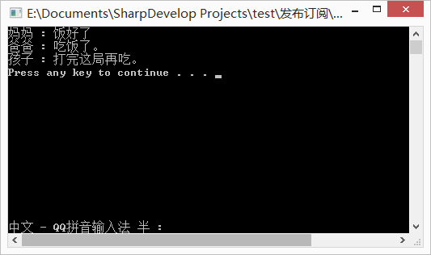

发布者定义一系列事件，并提供一个注册方法；
订阅者向发布者注册自己的事件处理逻辑，供一个可被回调的方法，也就是事件处理程序；当发布者的事件被触发的时候，订阅者将通过回调函数得到发布者通知，而订阅者所注册的回调函数，也就是事件处理逻辑的所有方法都会被执行
参考：https://blog.csdn.net/weixin_38486884/article/details/82853508
https://www.cnblogs.com/mq0036/p/11660978.html
从一个简单的例子，来说明一下这种事件消息传递的机制！
有一家三口，妈妈负责做饭，爸爸和孩子负责吃。。。将这三个人，想象成三个类。
妈妈有一个方法，叫做“做饭”。有一个事件，叫做“开饭”。做完饭后，调用开饭事件，发布开饭消息。
爸爸和孩子分别有一个方法，叫做“吃饭”。
将爸爸和孩子的“吃饭”方法，注册到妈妈的“开饭”事件。也就是，订阅妈妈的开饭消息。让妈妈做完饭开饭时，发布吃饭消息时，告诉爸爸和孩子一声。
这种机制就是C#中的，订阅发布。下面用代码实现：

```Plain Text
class Program    {        public static void Main(string[] args)        {            //实例化对象            Mom mom = new Mom();            Dad dad = new Dad();            Child child = new Child();                        //将爸爸和孩子的Eat方法注册到妈妈的Eat事件            //订阅妈妈开饭的消息            mom.Eat += dad.Eat;            mom.Eat += child.Eat;                        //调用妈妈的Cook事件            mom.Cook();                        Console.Write("Press any key to continue . . . ");            Console.ReadKey(true);        }    }        public class Mom    {        //定义Eat事件，用于发布吃饭消息        public event Action Eat;                public void Cook()        {            Console.WriteLine("妈妈 : 饭好了");            //饭好了，发布吃饭消息            Eat?.Invoke();        }    }        public class Dad    {        public void Eat()        {            //爸爸去吃饭            Console.WriteLine("爸爸 : 吃饭了。");        }    }        public class Child    {        public void Eat()        {            //熊孩子LOL呢，打完再吃            Console.WriteLine("孩子 : 打完这局再吃。");        }    }
```


运行结果：




当爷爷奶奶来做客了怎么办呢？和爸爸孩子一样，写个Eat方法，同样注册到妈妈的开饭事件就好了。