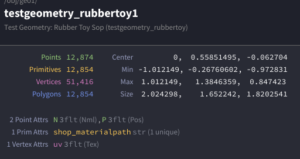

当fbx模型导入到Houdini的时候，会产生最基本的四个Class（或者说来自于fbx本身就是这四个Class）：
我们在这里就拿RubberToy举例。




## 基本几何组件


Points（点） 是最基础的几何元素，每个点在3D空间中有一个位置坐标(x,y,z)。点可以独立存在，也可以作为其他几何元素的组成部分。
Vertices（顶点） 是连接点和图元的桥梁。一个顶点引用一个特定的点，但同一个点可以被多个顶点引用。顶点主要用于定义图元中点的顺序和连接关系。
Primitives（图元） 是由顶点组成的几何形状，比如多边形、曲线、体积等。每个图元包含一系列顶点，这些顶点定义了图元的形状和拓扑结构。
对于Polygons（多边形），一般情况下我们可以就认为是Primitives（即面）。在最后我再讨论一下Polygons和Primitives的不同之处。

## 属性系统


Houdini使用强大的属性系统来存储数据。属性可以附加到不同的几何组件上：
Point属性 存储在点上，比如位置(P)、颜色(Cd)、法线(N)等。这些属性会在点之间进行插值。
Vertex属性 存储在顶点上，常用于UV坐标、顶点颜色等需要在同一个点的不同面上有不同值的情况。
Primitive属性 存储在图元上，比如材质ID、面的类型等。整个图元共享同一个属性值。
Detail属性 是全局属性，存储在整个几何体上，比如总的点数量、时间信息等。
我用一个简单的例子来解释这三者的区别：

## 想象一个立方体


Points（点） 就像是立方体的8个角。每个角在空间中有一个固定的坐标位置，比如(0,0,0)、(1,0,0)等等。
Primitives（图元） 就是立方体的6个面。每个面都是一个四边形，需要4个点来定义。比如底面可能由点1、2、3、4组成。
Vertices（顶点） 是连接点和面的"引用"。因为同一个点（比如立方体的一个角）会被3个不同的面共享，所以需要3个不同的顶点来分别引用这个点。

## 关键区别


想象立方体的一个角点，这个角点的坐标是固定的（比如原点），但是：

## 为什么需要这样设计？


比如你想给立方体贴纹理，同一个角点在不同面上的UV坐标是不同的：
如果没有顶点这个中间层，就无法实现同一个点在不同面上有不同的属性值。
简单说：点定义位置，图元(Primitives)定义形状，顶点让同一个点在不同图元中可以有不同属性。
这就引申到了对于Vertices的表示方式。还是拿我们之前的立方体。简单来说，我们可以这么理解：
一个Point连接着三个面
Vertices存在的最大意义就是可以对每一个面进行单独的控制（比如Temp，比如TTL，比如Gravity）。因为如果单独为Point赋值，那么每一个被链接的面都会被赋予同一个颜色。

## Vertices的双重身份


Vertices有两个编号可选。分别是全局编号和复合标识。
全局编号：每个vertex有一个全局唯一的编号（@vtxnum），从0开始递增。
复合标识：vertex同时可以用<primnum>:<vertex_in_prim>的格式来标识，也就是”面编号+顶点编号“，表示"某个图元中的第几个顶点"。
在Houdini中，vertex有一个复合标识系统：

## Vertex的双重标识


全局编号：每个vertex有一个全局唯一的编号（@vtxnum），从0开始递增。
复合标识：vertex同时可以用<primnum>:<vertex_in_prim>的格式来标识，表示"某个图元中的第几个顶点"。
假设有在一个一个四边形（quad）：

## VEX


```
// 获取图元中的顶点数量primvertexcount(0, @primnum)// 获取图元中第i个顶点的全局编号primvertex(0, @primnum, i)// 获取顶点在其所属图元中的局部编号primvertexindex(0, @vtxnum)
```


## 实际应用


```
// 在primitive wrangle中遍历当前图元的所有顶点int vtx_count = primvertexcount(0, @primnum);for(int i = 0; i < vtx_count; i++) {    int vtx = primvertex(0, @primnum, i);  // 获取第i个顶点的全局编号    // 现在可以操作这个顶点    setvertexattrib(0, "Cd", vtx, {1,0,0});//归零color}
```


所以vertex既有全局的线性编号，也有基于图元的层次化标识，这让在不同上下文中引用顶点变得很灵活。
在VEX中有多种方式来操作和引用vertex，这里是主要的写法：
从图元获取顶点：

```
// 获取当前图元的第0个顶点int vtx = primvertex(0, @primnum, 0);// 获取图元的所有顶点int vtx_count = primvertexcount(0, @primnum);for(int i = 0; i < vtx_count; i++) {    int vtx = primvertex(0, @primnum, i);}
```


从点获取顶点：

```
// 获取点的第一个顶点int vtx = pointvertex(0, @ptnum);// 获取点的所有顶点int vtx_array[] = pointvertices(0, @ptnum);
```


## 获取和设置Vertex属性


读取vertex属性：

```
// 直接在vertex wrangle中vector uv = @uv;vector color = @Cd;// 从其他地方读取特定vertex的属性vector uv = vertex(0, "uv", vtx_num);vector color = vertex(0, "Cd", vtx_num);
```


设置vertex属性：

```
// 在vertex wrangle中直接设置@uv = {0.5, 0.5};@Cd = {1, 0, 0};// 从其他地方设置特定vertex的属性setvertexattrib(0, "uv", vtx_num, {0.5, 0.5});setvertexattrib(0, "Cd", vtx_num, {1, 0, 0});
```


## Vertex与Point/Primitive的转换


```
// vertex到pointint pt = vertexpoint(0, @vtxnum);// vertex到primitiveint prim = vertexprim(0, @vtxnum);// vertex在primitive中的局部索引int local_idx = primvertexindex(0, @vtxnum);
```


## 实际应用例子


为每个面的顶点设置不同UV：

```
// 在primitive wrangle中int vtx_count = primvertexcount(0, @primnum);for(int i = 0; i < vtx_count; i++) {    int vtx = primvertex(0, @primnum, i);    vector uv = {float(i)/vtx_count, 0.5};    setvertexattrib(0, "uv", vtx, uv);}
```


创建硬边效果：

```
// 在vertex wrangle中，根据所属面设置颜色int prim = vertexprim(0, @vtxnum);@Cd = rand(prim);  // 同一面的所有顶点颜色相同
```


这些方法让你能够在VEX中灵活地操作vertex属性，实现各种复杂的几何处理效果。
但是说实话，在一般情况下，Point和Vertex（Vertices）其实是差不多的东西。但Houdini会在颜色处理中处理这些比较微小的差异：
Point Cd：颜色在面之间平滑插值
Vertex Cd：可以产生硬边界
比如说我们如果创建一个立方体，给其中一个角点设置红色：
所以说，在简单模型上看起来差别不大，但vertex Cd的灵活性在于能打破point的颜色约束，实现更复杂的着色需求。大部分时候point Cd就够用了。

## Houdini的Polygons和Primitives之间有什么不同？


虽然说在日常的使用中，可以看到在大部分的情况下，Houdini就是将Primitives等价于Polygons；选择的时候，选中了面则会提醒你这是Primitives；比如说PolyExtrude，PolyBevel这种，直接将Primitive等价于Polygons。所以在一般的口头交流中，这几乎是等价的，并且通常不会产生歧义。

### 为什么不一定完全精确？


从Houdini的底层几何结构来看，“Primitive”是一个更广泛、更基础的类别（Class），而“Polygon”只是这个类别下的一个具体类型（Type）。将它们等同，就像说“轿车等同于车辆”一样，虽然轿车是最常见的车辆，但车辆还包括卡车、公交车、摩托车等。
Primitive（基元）是Houdini几何体的基本组成单位之一，它定义了点是如何被连接和解释的。
Houdini支持多种Primitive类型，远不止多边形一种。主要包括：

#### 为什么区分这两者至关重要？


在进行程序化操作和高级开发时，精确区分Primitive的类型是必需的。
程序化判断：在使用VEX或Python时，你经常需要判断一个基元的具体类型，然后执行不同的逻辑。例如，你不能对一个Volume基元执行PolyExtrude操作。通过primintrinsic函数在VEX中可以获取基元的typename，从而判断它是"Poly"、"Volume"还是"Packed"等。

```
// 在Wrangle节点中判断基元类型string prim_type = primintrinsic(0, "typename", @primnum);if (prim_type == "Poly") {    // 执行针对多边形的操作    v@Cd = {1, 0, 0}; // 设为红色} else if (prim_type == "Volume") {    // 执行针对体积的操作    v@Cd = {0, 0, 1}; // 设为蓝色}
```
