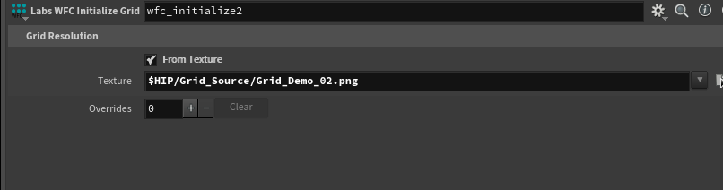

一般来说，Houdini在拖入纹理的时候会直接调取绝对路径(C://Users//......)
如果把这个玩意导出到hda的时候，Unity/UE读取的时候就会报错。因为它本身没有访问这些外部文件的权限。
在 Houdini 中使用纹理路径时，当前是用的类似于：

```Plain Text
$JOB/Desktop/works/Houdini/GIt_Houdini_ProjectFiles/Wave_Function_Collapse_Tiles/Grid_Source/Grid_Demo_$F2.png
```


这种路径，实际上还是绝对路径（虽然带了 $JOB），这样在导出为 HDA（Houdini Digital Asset）或者跨项目/跨平台时容易出现纹理丢失问题。

## 推荐的做法：使用相对路径


### 1. 放置纹理于项目目录下


假设你的项目结构大致如下：

```Plain Text
GIt_Houdini_ProjectFiles/  |-- Wave_Function_Collapse_Tiles/      |-- Grid_Source/          |-- Grid_Demo_01.png      |-- houdini_project.hip      |-- my_hda.hda
```


### 2. 设置 $HIP 或 $JOB


### 3. 使用相对路径（推荐）


写法一：$HIP 相对路径

```Plain Text
$HIP/Wave_Function_Collapse_Tiles/Grid_Source/Grid_Demo_$F2.png
```


写法二：$JOB 相对路径

```Plain Text
$JOB/Wave_Function_Collapse_Tiles/Grid_Source/Grid_Demo_$F2.png
```


写法三：纯相对路径

```Plain Text
Grid_Source/Grid_Demo_$F2.png
```


### 4. HDA打包贴图（可选）


## 实际建议


### 示例：相对路径的写法


如果你的 HDA 和贴图都在同一目录下：

```
./Grid_Demo_$F2.png
```


如果贴图在 HDA 的子目录 textures 下：

```
./textures/Grid_Demo_$F2.png
```


或者

```
textures/Grid_Demo_$F2.png
```


## 总结



