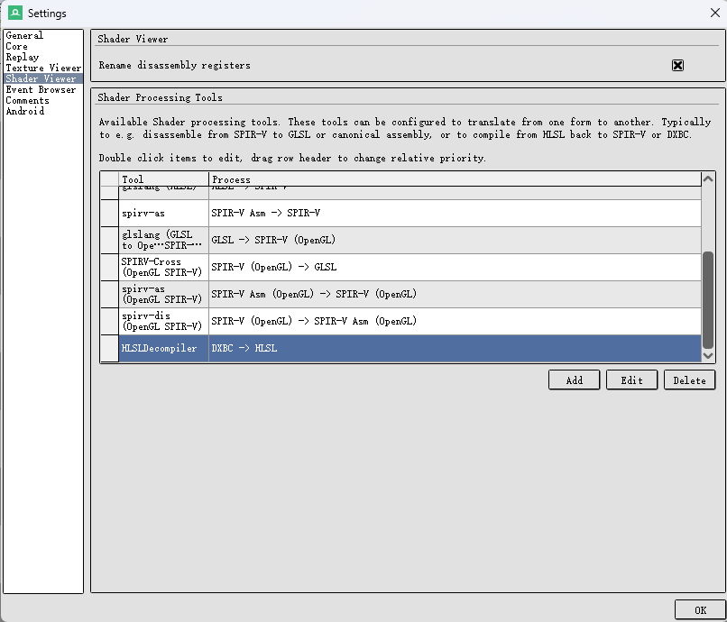
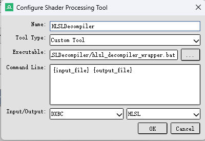
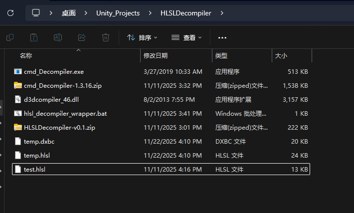

> 有了这个插件以后就可以在基于DirectX的rdc文件进行实时调试了, 对于分析着色器结构很有帮助. renderdoc虽然可以在view阶段看到Frag部分的着色器但是不能实时编辑看到效果. 如果有了这个插件, 编辑Frag部分就能在Texture Viewer中实时看到效果.

原文, 其实讲的已经很详细了, 我就不赘述了. 有一点要注意, 如下: https://zhuanlan.zhihu.com/p/649925129
插件基于的原地址是mod常用的3Dmigoto: https://github.com/bo3b/3Dmigoto/releases
在编辑RenderDoc的ShaderViewer中的Command时, 注意在RenderDoc中填写Command Line {input_file} {output_file}的时候中间的空格, 不然会报错!

附: 可用的资源(其实就是只有原版能用)

如果依赖有问题的话可以尝试用Dependencies这个项目进行依赖分析. 我猜大概率是缺少了dx3d的dll导致的依赖错误.
hlsl_decompiler_wrapper.bat(1 KB)
我用的是官方的版本, 不是那个fork的版本.