# StableDiffusion分享


## 什么是Stable Diffusion


Stable Diffusion 是一款免费、开源的 AI 图像生成器。于 2022 年 8 月推出，应用于 AI 软件，用户可以随意输入自己想要的内容，然后系统就会自动生成非常优秀的艺术渲染作品。
Stable Diffusion 的生成系统由现有艺术作品组成的巨大数据库训练而成，能够快速生成与提示信息有所关联的新奇图像。

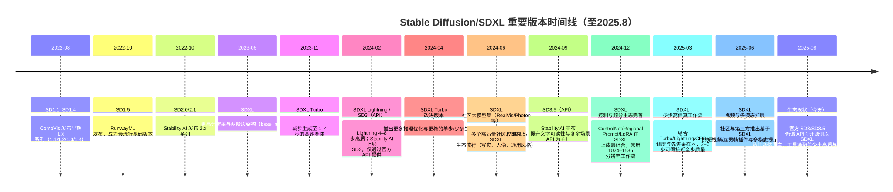


## SD 的各个版本对比


目前使用的较多的是 SD1.5 和 SDXL，其中 SD1.5 凭借其较低的硬件要求、更快的生成速度、成熟的社区支持以及在特定领域的优势,仍然保持着相当的受欢迎度。

| 特性 | SD v1.x (1.4/1.5) | SD v2.x (2.0/2.1) | SDXL v1.0 | SDXL Turbo | SDXL Lightning | SD3（API） | SD3.5（API） | Flux |
| --- | --- | --- | --- | --- | --- | --- | --- | --- |
| 发布时间 | 2022年8月–10月 | 2022年11月–12月 | 2023年7月 | 2023年11月 | 2024年2月 | 2024年2月 | 2024年9月 | 2024年中起（持续迭代） |
| 基础功能 | 基本 LDM 图像生成 | 质量显著提升 | Base+Refiner 两段优化 | 极少步高速（1–4 步） | 4–8 步高质、低延迟 | 新一代扩散，文本对齐强，仅 API | 在 SD3 基础上进一步增强文本与复杂场景 | 强化写实与文本排版，高分辨率生成，商用导向 |
| 模型规模 | 基础规模 | 略增 | U‑Net/骨干扩大≈3× | 与 SDXL 相当 | 与 SDXL 相当（蒸馏/量化友好） | 更大更深（未开放权重） | 进一步增大与优化（未开放权重） | 多规格（基础/Pro/商用版本），权重多为闭源或受限 |
| 训练分辨率 | 512×512 | 512×512 | 1024×1024 | 1024×1024（少步蒸馏） | 1024×1024（蒸馏） | 高分辨率覆盖，文本渲染优化 | 同左，文本/版式更稳 | 高分辨率友好（常用 ≥1024），版式与文字区域专门优化 |
| 特色功能 | — | ×4 超分、修复绘制、深度模型 | 更好的提示词匹配；两阶段细化 | 单步/少步稳定 | 少步但保真度更高 | 强文字、徽标、复杂布局 | 最强文本与复杂场景（API） | 出色的文字/徽标、产品图与排版；对写实/商业场景优化 |
| 风格特点 | 艺术性强、偏欧美 | 通用性更强 | 质量与细节均衡 | 偏实时/交互 | 少步高质、画面干净 | 写实度高、文本可读性强 | 复杂场景与文本最强 | 商业与产品级写实风格、文本与图标清晰 |
| 硬件要求 | 较低 | 中等 | 较高（建议≥8GB） | 中等偏低 | 中等 | 云端 API | 云端 API | 视版本而定；多数通过云端/商用服务，少量受限模型可本地推理 |
| 模型大小 | 较小 | 中等 | Base/Refiner 各≈7GB | 近似 SDXL | 近似 SDXL | 未公开 | 未公开 | 未公开或受许可限制 |
| 生态与可得性 | 完整开源，LoRA/ControlNet 极成熟 | 开源，社区重心转向 1.5/SDXL | 开源主力，插件/流程最丰富 | 常见开源推理权重 | 广泛工作流支持 | 仅官方 API | 仅官方 API | 多为闭源/商用 API 或受限权重，围绕品牌/产品图与文本生成的生态增长快 |


简要说明

## 稳定扩散去噪声


参考资料:


【大白话01】一文理清 Diffusion Model 扩散模型 | 原理图解+公式推导_哔哩哔哩_bilibili
https://www.youtube.com/watch?v=1CIpzeNxIhU
https://www.youtube.com/watch?v=iv-5mZ_9CPY

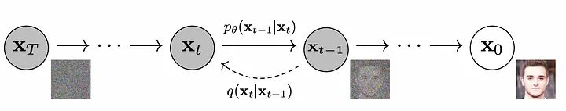


### 几个概念


### Step 1: Text-to-Image Initialization


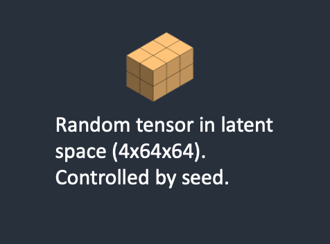


Stable Diffusion 首先在潜在空间中生成一个随机张量。这个张量由随机数生成器的种子 Seed 决定，它代表了图像在潜在形式下的表示，尽管在这个阶段它看起来像是噪声。

### Step 2: Noise Prediction


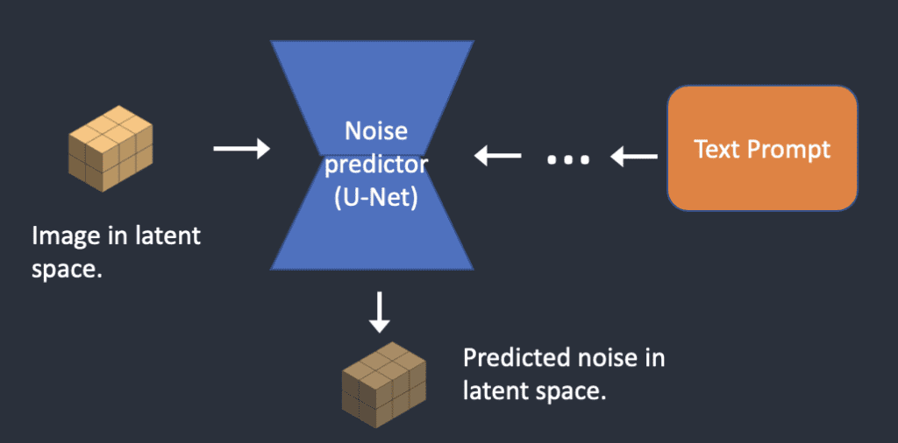


噪声预测器 U-Net 输入这个潜在的有噪声的图像和提供的文本提示。然后，它也在潜在空间中预测噪声。

### Step 3: Noise Subtraction


具体来说，Stable Diffusion 的正向扩散过程会在潜在图像上不断添加噪声，使其变成完全随机的张量。而逆向扩散过程则是通过 Noise Subtraction 来逐步去除噪声，将噪声图转换为有意义的图像。

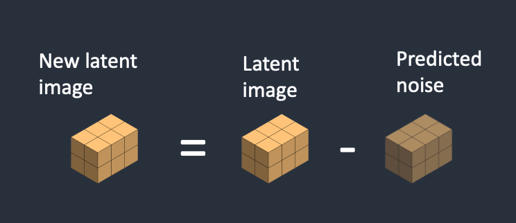


在逆向扩散中，Stable Diffusion 使用了一个专门训练的噪声预测器（U-Net）来预测每一步添加的噪声。然后，将预测的噪声从当前的潜在图像中减去，得到一个新的潜在图像。步骤 2 和 3 会重复进行预先确定的采样步数 steps，通常约为 20 次迭代。

### Step 4: Decoding


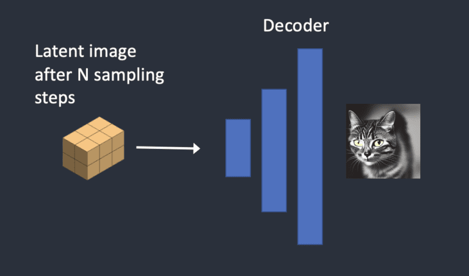


最后一步涉及 VAE 解码器，它将潜在图像转换回像素空间，生成最终的 AI 生成图像。

## SD 参数


为了让用户更好的使用 Stable Diffusion，有一些开源项目的 UI 项目帮助人来更容易的上手使用，常见的有 A1111 也叫 stable-diffusion-webui，还有 comfyui。
comfyui 可以自定义工作流，可玩性更高，后面以 comfyui 为例介绍常用参数。

### 基础文生图工作流


工作流是由一个一个节点进行连接工作的。


拖入上面的图到comfyui即可（如果没有被压缩的话）

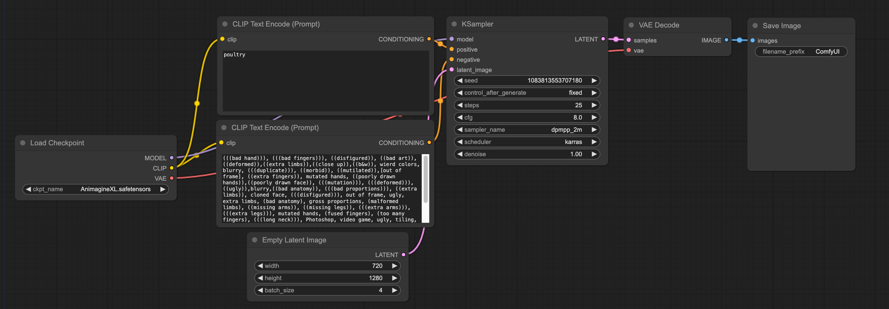


### 模型


模型是 SD 的核心，SD 的文件常见格式有 safetensors/ckpt。模型决定了生成图的风格、类型，比如有的模型是生成真人的，有的是生成二次元的。
模型市场：https://civitai.com/models
一个模型由三部分组成:

### Prompt/Negative Prompt


Prompt 是用户输入的文本描述，用来指导 Stable Diffusion 生成符合描述的图像。它可以包含以下几个方面的信息:
Negative prompt 用于指定你不希望在生成的图像中出现的元素或特征。它帮助模型避免生成某些不需要的内容，从而提高输出质量。常见的用途包括:
使用 negative prompt 可以帮助你更精确地控制生成结果，提高图像的质量和相关性。
Clip Text Encode 的节点输入是模型的 CLIP。

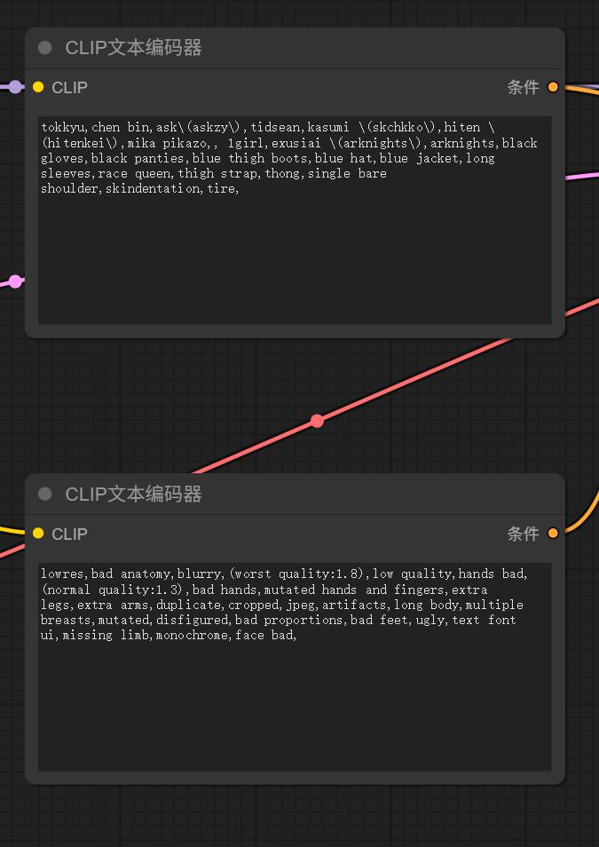


### Image Width/Height


初始图节点决定了生成图的 width 和 height，以及要生成的数量。
在文生图中，是一个空白的 Latent Image。
在图生图则需要加载图片作为初始 Latent。

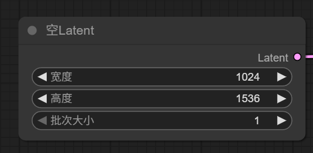


### Sampler


Sampler 是整个算法的核心。

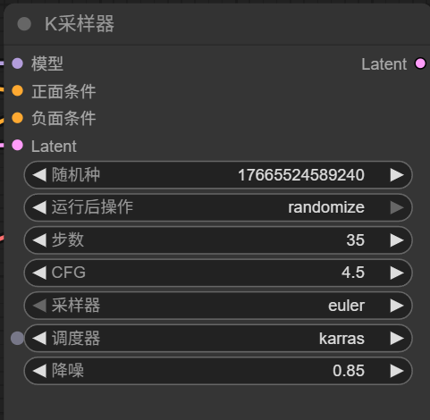


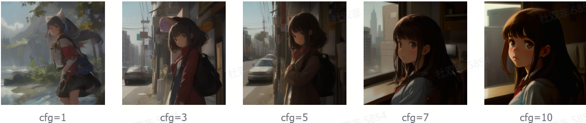


### Sampler/Scheduler


Sampler（采样器）:
采样器的主要作用是:
不同的采样器采用不同的算法和方法来执行这个过程，如 Euler、Heun、DDIM 等。采样器的选择会影响生成速度和图像质量。


例如：
Scheduler（调度器）:
调度器的主要作用是:
调度器通常与采样器配对使用。某些采样器可能更适合特定类型的调度器。

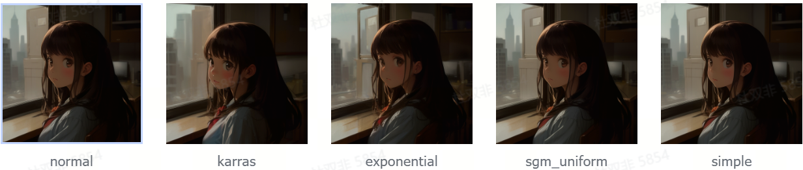


例如：

### Lora


Lora (Low-Rank Adaptation) 是 Stable Diffusion 中一种高效的模型微调技术，是微软研究员引入的一项新技术。
LORA 是一种在消耗更少内存的情况下，加速大型模型训练的训练方法，在 stable diffusion 中它允许使用低阶适应技术来快速微调扩散模型。简而言之，LoRA 训练模型可以更轻松地针对不同概念（例如角色或将定风格）进行模型训练。这些经过训练的模型可以被导出并供其他人使用。
LORA 模型是小型的 stable diffusion 模型，对 checkpoint 模型 cross-attention layers (交叉注意力层）进行了较小的更改，但是它的体积只有 checkpoint 的 1/100 到 1/10，文件大小一般在 2-500MB 之间。
主要有以下特点和使用建议:


例如：

### HiresFix


Hires fix 是 Stable Diffusion 中一个用于生成高质量高分辨率图像的重要功能。Hires fix 允许用户在保持图像整体构图的同时生成高分辨率图像。它通过先生成低分辨率图像，然后进行放大和细节增强来实现这一目标。
工作原理:
Hires fix 的工作流程如下:
优势:


例如：

### Refiner


Refiner 是 Stable Diffusion v1.6.0 版本引入的新功能，旨在提高生成图像的整体质量和细节。它通过在基础模型生成图像后，使用专门的细化模型进行进一步处理来实现这一目标。
Refiner 的工作流程如下:

### ControlNet


ControlNet 是 Stable Diffusion 的一个重要扩展功能，它可以让用户更精确地控制图像生成过程。
ControlNet 允许用户通过提供参考图像或条件来引导 Stable Diffusion 的图像生成过程。它可以控制生成图像的姿势、构图、轮廓等细节。
例如：

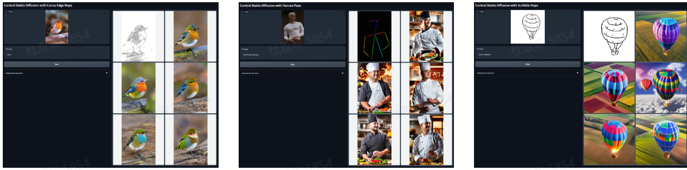


canny openpose scribbles

## 工程建设动态资源池调度


### 模型切换问题


StableDiffusion 是基于模型文件来做图像生成，模型是 SD 的核心，文生图必然依赖模型。不同的模型适用于不同的场景，例如画人物时使用真人模型，画动漫时使用二次元模型等。
模型文件很大，比如 SD1.5 的模型文件大概是 2G，SDXL 的模型文件大小是 6G 甚至更大。
大文件的加载往往是一个比较费时间的操作。webui 使用模型文件的大体逻辑如下，假设要加载的模型为 ModelA:



其中将 ModelA 加载到内存是一个很耗时的动作，为了保证线上的性能，需要尽可能减少模型切换。

### 分 PSM 管理模型


为了减少模型切换的成本消耗问题，采用的实现方案是分模型创建 PSM 服务，即一个 PSM 服务只提供一种模型文件，通过 PSM 和模型的映射关系，由上层 Proxy 跟进模型进行请求分发。



这种模式存在利用率的问题：

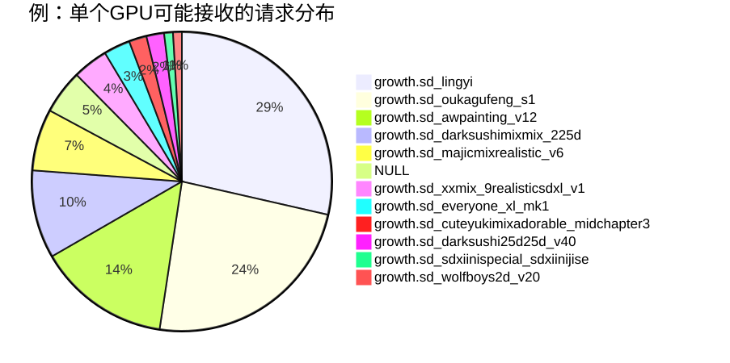


为了提高机器的利用率，需要进一步对资源进行调度优化。只有根据负载做合理分配，才能达到优化资源使用、最大化吞吐率、最小化响应时间、同时避免过载的目的。

### 资源池调度


由于模型切换成本高（不然模型实时加载，按空闲分配就可以），我们需要对机器按需分配来提高机器的利用率，即请求量大的模型多分配点机器，请求量小的少分配机器或者不分配机器。
我们的方案是根据模型流量比例来自动调节对应的机器比例，要保证模型切换的成本和流量分布的平衡。



通过定时任务进行调度，每 3 分钟轮询一次，每次调度都会根据当前排队的模型进行按流量比例分配。同时，在服务启动时，调度器会随机分配一个模型，以确保服务启动时可用。

### 模型和机器映射


维护模型和机器的映射关系，提供给 proxy 要访问的机器列表。同时会对机器进行探活，若实例失效需要通知调度器及时进行重新调度。

### Proxy


Proxy 根据请求中的模型名称，获取机器列表，然后过频控和推优逻辑选择合适的机器，然后转发请求。

### 交互过程：调度器负责根据实际流量对机器进行模型调度，以满足请求量大的模型分配更多实例的需求




### 在线请求的处理流程如下


### 冷启动问题


冷启动: 模型如果没有在内存中，第一次文生图的时候会把模型加载到内存再执行，这个加载过程比较慢，基本在分钟级别。



之前的方案是使用了懒汉模式，即在调度过程只是分配模型，模型的加载过程发生在切换之后的第一次文生图请求中，这就会导致第一次的请求的耗时会变得很长。
为了解决这个问题，升级成饿汉模式：在调度过程就把模型加载上（进行一次最小成本的文生图请求），在文生图请求到来之前保证加载好。最小成本的文生图请求：宽高 16，steps=1，denoise=0, prompt="a person"，生图过程可以保证在 0.01s 以内完成。
由于 comfyui 是单任务运行模式，在加载模型阶段接受到新的请求会排队，依然会造成请求的加长。为了解决这个问题，我们采用了一系列的举措。

### 服务负载评估


在线转发我们需要评估服务的负载，将服务转发到负载降低的机器可以保证请求可以更快的返回。
SD 的负载需要考虑：
所以我们提出了用 ETA 来作为服务的负载指标，ETA 作为预估返回时间可以评估机器的负载。
ETA = 队列预估执行时间 + 当前请求的预估时间
影响执行时间的因素有很多：
因为我们模型搭配的工作流相对固定，为了简化评估过程，我们只考虑模型切换的时间成本和执行时间成本。
在机器上会记录每次请求的收益。
高峰期的成功率从 80%提升至 99%，这意味着我们的系统在高流量和高负载的情况下，能够更加稳定地运行，为用户提供更加可靠的服务。

## Comfyui


当前的文生图使用了 webui 作为后端服务，webui 的问题是在于使用 GNU AGPL 开源许可证，有一定的法务风险。

```markdown
GNU Affero 通用公共许可证（GNU Affero General Public License，简称 AGPL）是一种自由软件许可证，旨在确保软件的自由使用、修改和分发，同时特别针对通过网络提供服务的情况加强了开源要求。### 核心原则：强 CopyleftAGPL 基于著名的 GNU 通用公共许可证（GPL），继承了其“Copyleft”（著佐权）的核心理念。这意味着：*   **自由使用与修改**：任何人都可以自由地运行、研究、修改软件。*   **分发要求**：当您分发软件的副本（无论是原始版本还是修改后的版本）时，**必须**在相同的 AGPL 许可证下提供完整的、对应的源代码。### AGPL 的关键创新：针对网络服务AGPL 与标准 GPL 最重要的区别在于它**弥补了所谓的“网络应用漏洞”或“SaaS 漏洞”**。*   **标准 GPL 的局限**：如果一家公司使用了一个基于 GPL 的软件来运行一个网络服务（例如一个网站或 API），他们可以对软件进行修改以满足自己的需求，但只要他们不向客户分发软件的二进制副本，他们就没有义务向公众发布其修改后的源代码。*   **AGPL 的解决方案**：AGPL 明确规定，**即使您没有分发软件，而是仅仅通过网络向用户提供服务，也视为一种“分发”行为**。因此，如果您修改了 AGPL 软件并将其用于公开的网络服务，您有法律义务向所有使用该服务的用户提供修改后的源代码。### 主要特点1.  **强制开源**：任何基于 AGPL 软件的修改版本或衍生作品，在被公开使用（尤其是通过网络）时，都必须以 AGPL 许可证开源。2.  **保护社区**：旨在鼓励对网络服务软件的改进也能回馈给开源社区，促进协作和创新。3.  **传染性强**：AGPL 是一种“强传染性”许可证。如果您的专有软件与 AGPL 代码进行了深度集成（例如，通过动态链接或紧密的进程间通信），可能会被认定为“衍生作品”，从而要求您的整个软件也必须在 AGPL 下开源。这使得 AGPL 对商业闭源软件来说风险较高。4.  **与 GPL 的关系**：AGPLv3 与 GPLv3 高度兼容。您可以将 GPLv3 的代码与 AGPLv3 的代码结合，但结合后的作品必须以 AGPLv3 发布。### 适用场景AGPL 非常适合以下类型的项目：*   **网络应用程序**：如 Web 应用、SaaS 平台、API 服务等，开发者希望确保任何使用该软件提供服务的人都能贡献回他们的改进。*   **希望最大化社区贡献的项目**：项目维护者希望所有基于其软件的改进都能公开，避免被私有化。### 对开发者的启示*   **使用 AGPL 软件需谨慎**：如果您在商业项目中考虑使用 AGPL 许可的组件，请务必进行彻底的法律审查。评估您的使用方式是否构成“衍生作品”以及是否会触发开源义务。*   **选择许可证**：如果您是开源项目作者，选择 AGPL 意味着您非常重视代码的开放性和社区的共享。如果您希望更宽松的采用（例如允许闭源集成），可能会选择 MIT、Apache 2.0 或 LGPL。总而言之，AGPL 是一个强有力的开源许可证，它通过要求网络服务的提供者也必须开源其修改，来确保软件自由在云计算和 SaaS 时代的延续。
```


而 comfyui 使用的 GNU-GPL 协议，区别在于使用 AGPL 的如按键提供网络服务，就必须公开源代码。所以使用 comfyui 更加安全。
另外相对于 webui，comfyui 支持工作流，可玩性更高，上限也更高。
综合上面两个原因，需要在文生图流程中支持 comfyui，并且将线上的 webui 请求都转发到 comfyui，逐步去除对 webui 的依赖。

### 动态工作流


为了对齐 webui 的能力，我们需要对 comfyui 的工作流做一个动态支持，比如需要 lora 的时候，工作流就加载 lora 并执行相关逻辑，不需要的时候就不加载 lora 的相关节点。目前对齐 webui 的能力有：

### 性能对比


针对已有特性做了 comfyui 和 webui 的性能对比。
使用同一台机器：8核 32G，显卡 A30 24G 显存，Cuda118
可以看到在大部分场景，comfyui 速度更快，最快可以快 20%