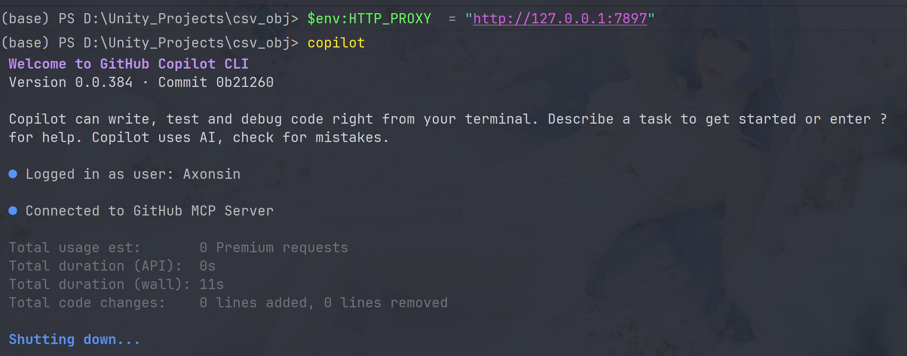
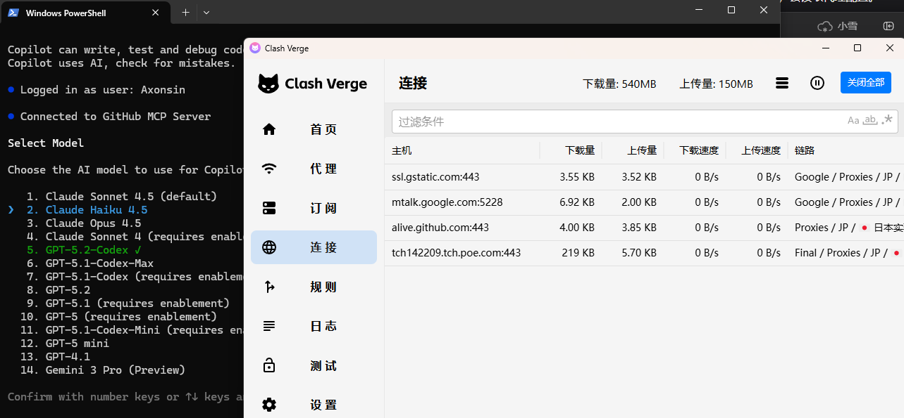

虽然代理软件有虚拟网卡功能, 但有时候我会使用copilot进行异步处理(比如有时候我想打游戏, 然后copilot在后面修bug); 那游戏肯定不能用TUN模式啊, 卡的批爆; 得用游戏加速器才行;
由nodejs管理的包能不能有一个全局的通用参数呢? 正好有其他项目会用nodejs, 如果自己配备了环境那滚包也不需要每次都开TUN来滚.
(插一句话, cli来自于nodejs的npm管理; 但是copilot这个插件和copilot cli不是一个东西; copilot插件在Jetbrains IDE中可以在设置里直接指定某个插件是否要使用代理; 在VS Code中指定copilot的代理则可以参阅https://docs.github.com/en/copilot/how-tos/configure-personal-settings/configure-network-settings)
正好现在新版的nodejs已经有很方便的指定代理了. 在旧版本的 Node.js 中， fetch 和 http.request 不会自动读取系统的 HTTP_PROXY 环境变量。如果想用代理，必须手动引入 undici 的 ProxyAgent 或者使用 https-proxy-agent 等第三方库.
但是Node.js 在 v24.5.0 之后引入了内置代理支持。只要开启一个“开关”，Node.js 的底层网络栈（Networking Stack）就会自动识别并使用你定义的代理服务器。
而copilot cli也加入到了nodejs新版proxy的原生支持, 详情在这个issue: https://github.com/github/copilot-cli/issues/41#issuecomment-3362444262

## 那么如何启用?


#### 第一步：设置开启开关


设置环境变量 NODE_USE_ENV_PROXY=1 或者在启动程序时使用命令行参数 --use-env-proxy。

#### 第二步：配置代理地址


设置标准的代理环境变量：

#### 例子


```bash
# 1. 设置开启原生代理支持export NODE_USE_ENV_PROXY=1# 2. 设置你的本地代理地址（例如 Clash 或其他服务）export HTTP_PROXY=http://127.0.0.1:7890export HTTPS_PROXY=http://127.0.0.1:7890# 3. 运行你的 Node.js 程序node app.js
```


```powershell
$env:NODE_USE_ENV_PROXY="1"$env:HTTP_PROXY="http://127.0.0.1:7897"$env:HTTPS_PROXY="http://127.0.0.1:7890"node app.js
```


这是环境贡献命令, 具体操作如下, 要在每次调用copilot之前指定一下env:




少截图了一个指令, 首先要$env:NODE_USE_ENV_PROXY="1"
或者直接拿这两个脚本来设置也可以. (记得要用管理员模式打开, 右键-管理员或者powershell-使用管理员运行), 这里设置的是127.0.0.1:7897
setup-nodejs-proxy.bat(1 KB)
或者pwsh版本: https://drive.google.com/file/d/13HiOt_imq6UIcI2cZG5VmpM-BFkUga6t/view?usp=drive_link
然后使用下面这个脚本进行测试, 测试nodejs能不能打开google.
test-proxy.js(3 KB)
然后就可以愉快的进行异步处理了




## 引用
