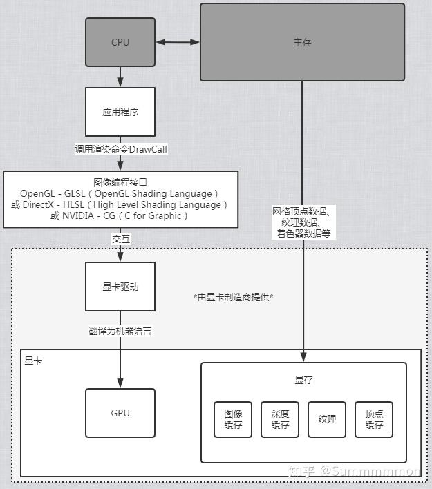
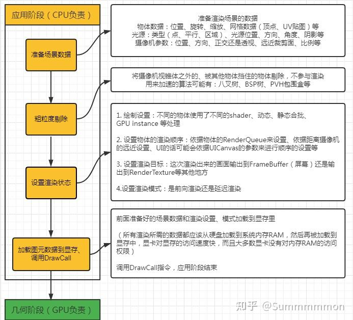
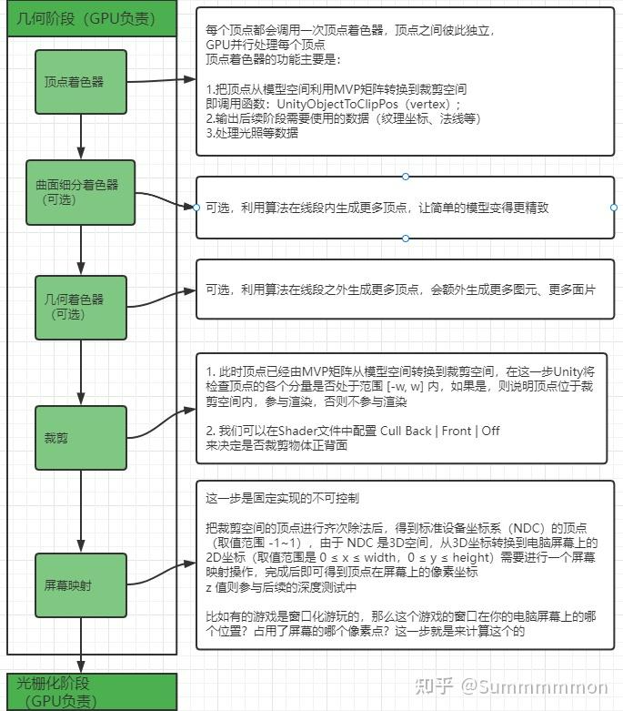
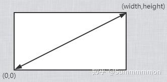
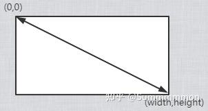
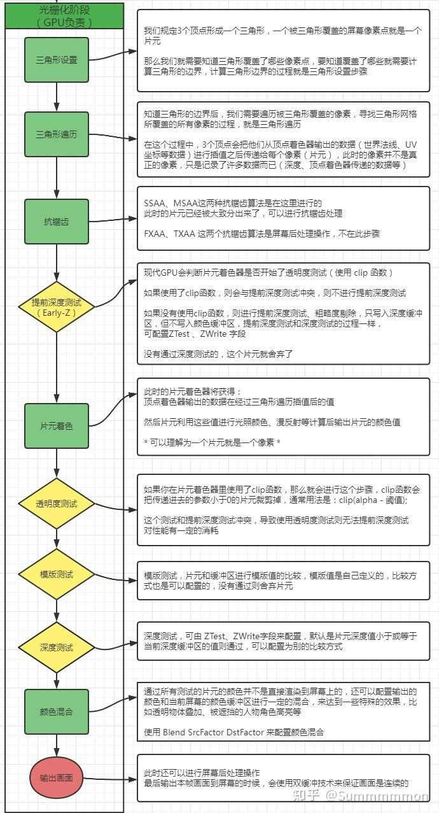
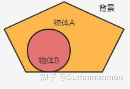
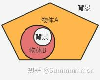

渲染的基本结构
游戏里的渲染流水线（渲染管线）分为几个阶段，不同的文献里可能有不同的分法，但都大同小异，大概可以分为应用阶段、几何阶段、光栅化阶段。

## 应用阶段


应用阶段的主要职责是输出渲染所需的几何信息（渲染图元，可以是点、线等）和渲染设置给GPU，并调用DrawCall指令开启渲染：




## 几何阶段


几何阶段主要负责将三维的模型顶点坐标转换为屏幕空间的二维顶点坐标，输出各顶点的深度值等信息到光栅化阶段：




顶点着色器中，顶点着色器输出的顶点数据输出后的数据将会马上被组装成图元（如三角形、线段等），我们也称之为图元组装阶段（当然也有一种观点认为，图元装配应该属于光栅化阶段的三角形设置部分）。把顶点从模型空间转换到裁剪空间的过程，这里使用MVP矩阵完成这个操作，完成后的顶点只是转换到了裁剪空间(Cliip Space)里，还不是屏幕空间(Screen Space)，这一步只是为后面的裁剪步骤做准备。
顶点转换到裁剪坐标系(Clip Space)后，在屏幕映射步骤里会由硬件做透视除法（齐次除法），最后得到归一化的设备坐标（Normalized Device Coordinates， NDC），这个坐标是归一化的，xy 的取值范围是 -1~1，OpenGL中 z的取值范围应该是 -1~1 ，DirectX 中 z 的取值范围是 0~1。
NDC空间坐标最后会进行映射运算得到二维的电脑屏幕的坐标。要注意：OpenGL的屏幕坐标原点左下角：




而DirectX的屏幕坐标原点是左上角：




Unity 选择了OpenGL 的规范，微软的许多窗口都是用左上角为原点的坐标系统，因为这样和我们的阅读方式：从左到右、从上到下的习惯是匹配的。

## 光栅化阶段


光栅化步骤主要负责：每个渲染图元（点、线、面）中的哪些像素应该被绘制在屏幕上，也需要对上一个阶段得到的逐顶点数据进行插值赋值给每个像素，再逐像素处理光照。三角形在设置后会随后生成片元，通过遍历三角形覆盖了那些像素，随后会生成片元。fragment是光栅化阶段生成的候选像素，包含颜色、深度、纹理坐标等属性。在确定片元序列，后就会开始进行片元着色（fragment shader），并开始通过各种测试。




### 有关透明度测试和提前深度测试(Early Z)


如果你在片元代码里调用了 clip 函数，那么就是开启了透明度测试，不过 clip 函数传递进参数的可以不是颜色的透明度，只要是一个 float 值就行。
提前深度测试可以把被不透明物体遮挡的片元提前舍弃掉，提高渲染的效率，但我们都知道一个片元如果通过了深度测试，默认情况下他是会向深度缓冲区写入自己的深度的，试想一下：如果开启了透明度测试的物体 B 在另一个物体 A 之前，假设物体 B 先渲染，并且假设进行了提前深度测试：




由于物体B第一个渲染，他发现深度缓冲里没有值，所以通过了提前深度测试并写入了自己的深度值，这导致后面的物体 A 在进行深度测试的时候，无法通过测试，抛弃了这部分的片元。如果物体B像一个正常的不透明物体那样渲染这没什么问题，但是问题是现在的物体B会进行透明度测试，如果物体B的一部分没有通过透明度测试，被裁剪，那么将会出现错误的现象：




因此提前深度测试和透明度测试是互相冲突的，当你开启了透明度测试，也就意味着这个片元不能进行提前深度测试。由于提前深度测试对渲染性能有所提升，所以说透明度测试会导致渲染性能下降。
屏幕后处理技术是指当这一帧的画面渲染完毕的时候，在输出到电脑屏幕之前，我们可以对这个画面进行一些特殊的处理，比如泛光效果等，值得注意的是虽然此时处理的图元是一个完整的长方形的二维的图画（可以理解为一个png）但是其中每个像素点都是记录了一些信息的，比如深度等。

> https://zhuanlan.zhihu.com/p/435326086


# 有关于渲染管线中涉及到的空间


一个物体从模型数据到最终屏幕像素，需要经过一系列空间变换。这些空间变换是3D渲染的基础，也是Shader开发常考的知识点。
下面详细梳理一下完整的空间变换流程和各空间坐标的计算方式：

## 1. 主要的空间坐标体系


按渲染流程顺序，一个物体的坐标会依次经过：

## 2. 各空间之间的变换矩阵


每一步坐标变换，都需要一个变换矩阵：

| 空间 | 变换矩阵 | 作用 |
| --- | --- | --- |
| 模型空间 → 世界空间 | 模型矩阵 (M) | 物体在世界中的位置、旋转、缩放 |
| 世界空间 → 视图空间/观察空间 | 视图矩阵 (V) | 摄像机的变换（相机逆矩阵） |
| 观察空间 → 裁剪空间 | 投影矩阵 (P) | 透视投影/正交投影成视锥体 |
| 裁剪空间 → NDC | 齐次除法（/w） | x/w, y/w, z/w |
| NDC → 屏幕空间 | 屏幕映射 | 视口变换（[-1,1]到[0,width/height]） |


### 总变换公式


```latex
模型空间坐标 → 世界空间:     p_world = M * p_model世界空间 → 观察空间:        p_view = V * p_world观察空间 → 裁剪空间:        p_clip = P * p_view裁剪空间 → NDC:            p_ndc = p_clip.xyz / p_clip.wNDC → 屏幕空间:             p_screen = （p_ndc.xy + 1）* 0.5 * 屏幕尺寸
```


## 3. Unity中的矩阵名称说明


## 4. Shader中的具体使用举例


### 顶点着色器常见流程


```
// 顶点模型空间float4 pos_model = v.vertex;// 变到世界空间float4 pos_world = mul(unity_ObjectToWorld, pos_model);// 变到观察空间float4 pos_view = mul(UNITY_MATRIX_V, pos_world);// 变到裁剪空间float4 pos_clip = mul(UNITY_MATRIX_P, pos_view);// 或者直接一步到裁剪空间float4 pos_clip = mul(UNITY_MATRIX_MVP, pos_model);// 输出到光栅化o.pos = pos_clip;
```


## 5. 坐标空间的用途总结


> 所以在渲染管线中，一个物体从模型空间，经过世界空间、观察空间、裁剪空间、NDC空间，最终被光栅化到屏幕空间。每一步都通过特定的变换矩阵进行转换。
