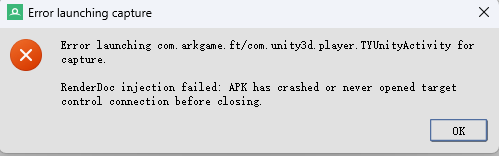
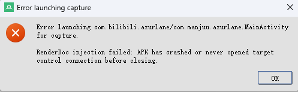

疑似还需要:







- ro.force.debuggable=1 ← 关键属性
- ro.debuggable=1
- ro.secure=0
- ro.adb.secure=0
这里直接用用magisk resetprop就行, 主要是骗过系统层
要找一下安卓13有没有这个wrap.sh

```Plain Text
1. EGL扩展支持确认  从 /system/lib64/libEGL.so 中提取到的扩展字符串：  EGL_ANDROID_GLES_layers EGL_ANGLE_platform_angle EGL_EXT_client_extensions EGL_KHR_platform_android  关键发现：  - ✓ EGL_ANDROID_GLES_layers - 支持！这是用于GLES层注入的核心扩展  - ✓ EGL_EXT_client_extensions - 支持！允许在没有显示连接的情况下查询扩展  2. 设备信息  - 型号: TB322FC  - 主板: sun  - GPU: Adreno (Qualcomm)  - Android版本: 15 (API 35)  - ro.debuggable: 1  3. RenderDoc层已部署  /data/local/tmp/rdoc/  ├── libVkLayer_GLES_RenderDoc.so (26.5 MB)  └── wrap.sh  wrap.sh的内容：  #!/system/bin/sh  export renderdoc__replay__marker=1  # chain to asan's wrap if needed  if [ -f asan.sh ]; then    ./asan.sh "$@"  else    exec "$@"  fi
```


是没有错的, 但是我在开发者选项中启用了GPU调试层和验证可调试应用的字节码(允许ART验证)

```bash
(base) PS C:\Users\Admin> adb shellTB322FC:/ # getprop ro.debuggable1TB322FC:/ # am force-stop com.arkgame.ftTB322FC:/ # setprop debug.renderengine.backend vulkanTB322FC:/ # setprop wrap.com.arkgame.ft RENDERDOC_DEBUG_LOG_FILE=/sdcard/rdoc.logTB322FC:/ # setprop dalvik.vm.dex2oat-flags --debuggableTB322FC:/ # pm clear com.arkgame.ftSuccessTB322FC:/ # getprop | grep wrap[debug.sys.wrapper.hook.lldcpro]: [0][debug.wrapper.hook.top.activity]: [org.renderdoc.renderdoccmd.arm64.Loader][wrap.com.arkgame.ft]: [RENDERDOC_DEBUG_LOG_FILE=/sdcard/rdoc.log]TB322FC:/ # settings put global art_verifier_verify_debuggable 0TB322FC:/ # setprop debug.renderengine.backend vulkanTB322FC:/ # setprop debug.hwui.renderer openglTB322FC:/ #
```


这一步决定了renderdoc能否注入进程

```powershell
TB322FC:/ # getprop | grep wrap[debug.sys.wrapper.hook.lldcpro]: [0][debug.wrapper.hook.top.activity]: [org.renderdoc.renderdoccmd.arm64.Loader][wrap.com.arkgame.ft]: [RENDERDOC_DEBUG_LOG_FILE=/sdcard/rdoc.log]// 比如下面这样也可以实现由wrapper接管setprop wrap.com.arkgame.ft ""[wrap.com.arkgame.ft]: []
```


## 问题描述


在使用 RenderDoc 对 Android 应用 com.arkgame.ft 进行截帧时遇到以下错误：

```
Error launching com.arkgame.ft/com.unity3d.player.TYUnityActivity for capture.RenderDoc injection failed: Timeout was reached waiting for app to start.
```


## 环境信息


## 根本原因分析


### 1. 应用不具备 debuggable 标志


通过 dumpsys package 检查发现应用的 flags 中不包含 DEBUGGABLE 标志：

```
flags=[ HAS_CODE ALLOW_CLEAR_USER_DATA ALLOW_BACKUP ]
```


这意味着这是一个 Release 版本的应用，而 RenderDoc 默认需要注入到可调试的应用进程中。

### 2. Android 14+ 的安全限制


应用的 targetSdk=35 (Android 14)，该版本引入了更严格的调试和注入限制：

### 3. RenderDoc 注入机制


RenderDoc 通过以下方式在 Android 上工作：

## 解决方案实施


### 步骤 1: 停止目标应用


```bash
adb shell "su -c 'am force-stop com.arkgame.ft'"
```


原因: 确保应用完全停止，新的系统属性设置才能在应用重启时生效。

### 步骤 2: 禁用 ART 可调试验证


```bash
adb shell "su -c 'settings put global art_verifier_verify_debuggable 0'"
```


原因:

### 步骤 3: 设置图形渲染后端


```bash
adb shell "su -c 'setprop debug.renderengine.backend vulkan'"
```


原因:

### 步骤 4: 启用 RenderDoc 调试日志


```bash
adb shell "su -c 'setprop wrap.com.arkgame.ft RENDERDOC_DEBUG_LOG_FILE=/sdcard/rdoc.log'"
```


原因:

### 步骤 5: 设置 Dalvik/ART 可调试标志


```bash
adb shell "su -c 'setprop dalvik.vm.dex2oat-flags --debuggable'"
```


原因:

### 步骤 6: 清除应用数据（可选）


```bash
adb shell "su -c 'pm clear com.arkgame.ft'"
```


原因:

## 技术原理深入解析


### Android Wrap 属性机制


Android 提供了 wrap.<package_name> 系统属性，允许：
RenderDoc 利用这个机制注入其捕获库到目标应用进程。

### ART 调试验证流程


```
应用启动  ↓ART 检查 AndroidManifest.xml 中的 debuggable 标志  ↓验证 art_verifier_verify_debuggable 设置  ↓决定是否允许调试器附加
```


通过设置 art_verifier_verify_debuggable=0，我们跳过了第二步验证。

### DEX2OAT 编译过程


```
DEX 字节码  ↓dex2oat (带 --debuggable 标志)  ↓OAT/ODEX 文件 (包含调试符号)  ↓应用运行时可被调试工具识别
```


## 验证步骤


### 1. 检查系统属性是否设置成功


```bash
adb shell "getprop | grep wrap"
```


应该看到：

```
[wrap.com.arkgame.ft]: [RENDERDOC_DEBUG_LOG_FILE=/sdcard/rdoc.log]
```


### 2. 查看 RenderDoc 日志（如果需要）


```bash
adb shell "cat /sdcard/rdoc.log"
```


### 3. 在 RenderDoc 中重新连接


## 常见问题与解决方案


### Q1: 设置后仍然失败


解决方案:

```bash
# 重启 ADBD 服务adb kill-server && adb start-server# 重启设备的 adbd（需要 root）adb shell "su -c 'setprop ctl.restart adbd'"
```


### Q2: 应用崩溃或无法启动


解决方案:

```bash
# 恢复默认设置adb shell "su -c 'settings delete global art_verifier_verify_debuggable'"adb shell "su -c 'setprop dalvik.vm.dex2oat-flags \"\"'"adb shell "su -c 'setprop wrap.com.arkgame.ft \"\"'"
```


### Q3: RenderDoc 版本兼容性


### Q4: 使用 "Inject into Process" 替代方案


如果 "Launch Application" 仍然失败：

## 安全与注意事项


### ⚠️ Root 权限要求


所有 su -c 命令都需要设备已 root，并且：

### ⚠️ 生产环境警告


这些设置会降低系统安全性：

### ⚠️ 应用数据丢失


pm clear 命令会清除：

## 恢复默认配置


调试完成后，执行以下命令恢复系统设置：

```bash
# 恢复 ART 验证adb shell "su -c 'settings delete global art_verifier_verify_debuggable'"# 清除 wrap 属性adb shell "su -c 'setprop wrap.com.arkgame.ft \"\"'"# 清除 dex2oat 标志adb shell "su -c 'setprop dalvik.vm.dex2oat-flags \"\"'"# 恢复图形后端（可选）adb shell "su -c 'setprop debug.renderengine.backend \"\"'"# 停止应用adb shell "su -c 'am force-stop com.arkgame.ft'"
```


## 总结


RenderDoc 在 Android 上对非 debuggable 应用的截帧需要：
这个解决方案利用了 Android 的调试基础设施，在保持应用原有行为的同时，允许 RenderDoc 进行图形调试和帧捕获。

## 参考资源


文档创建时间: 2025-12-24
问题状态: ✅ 已解决
适用版本: Android 7.1+ (API 25+), RenderDoc 1.24+
copilot-session-3988ecf5-f2dc-47e0-985b-159fd84d9114.md(10 KB)