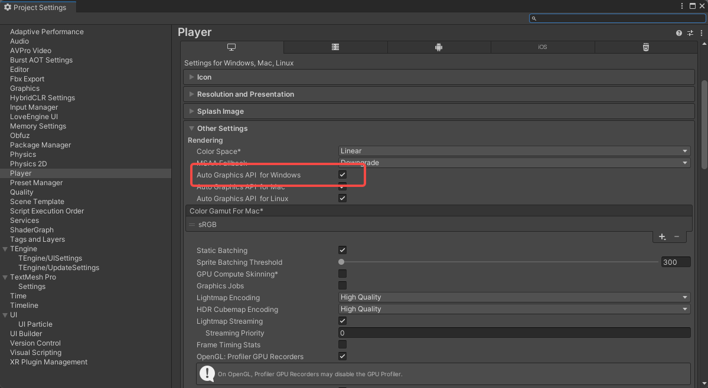

默认情况下, Unity使用的后端是DirectX (D3D11&12). 但是有时候, 有需要使用切换整个后端api来测试renderfeature和compute shader的可用性.

在这里即可直接调换渲染api. 整个渲染管线都会被Opengl改变; 关了以后手动指定为OpenGL即可, 将DirectX和Vulkan给删掉就好. 

当然还有最后一个和我的世界同款的后缀命令: 为后缀添加 -force-gles 就可以强制以gles api启动了!