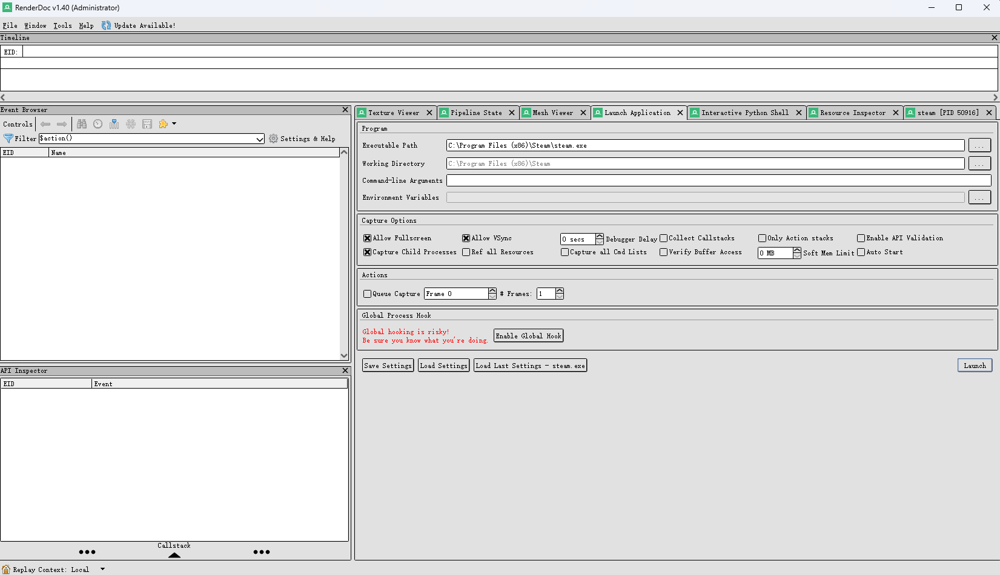
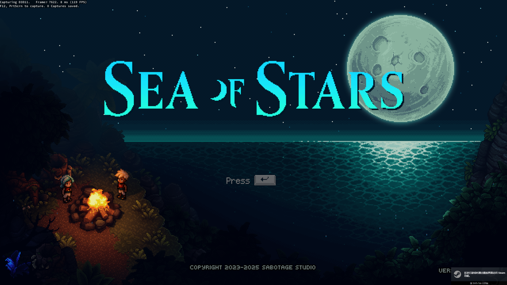

https://zhuanlan.zhihu.com/p/534821939
Steam在开启RenderDoc之后无法启动，此时我们需要开启globalhook。详情请参见上面的知乎专栏。
RenderDoc 截取的帧文件（.rdc 文件）的存放位置有以下几种情况：
这些文件通常以 [应用程序名称]_[日期]_[时间].rdc 的格式命名，例如 MyGame_2024_07_29_10_30_05.rdc。
总结来说：
建议养成习惯，在捕获到需要的帧后，立即将其另存为到你指定的项目文件夹中，这样可以避免临时文件被清理或混淆。

## 2025.11.11更新

Steam最近可能更新了一下启动的方式, 直接从exe或者用global hook已经不凑效了.
以前的方式是: 找出对应的游戏exe执行路径, 用RenderDoc直接Launch. 然后这个游戏的exe会直接指向Steam进行版本校验, 版本校验通过后就可以正常启动这个游戏(就是知乎里网页的那些说法)
最近我有需要对Steam的一些游戏进行截帧, 我研究了一下, Steam换了一个验证方式: 如果尝试直接从游戏路径的exe打开, 游戏一开始会正常运行, 左上角也有RenderDoc Capturing的标记, 但是马上就会闪退. 随后跳转到steam进行验证, 验证完毕之后直接再开一个新的进程实例.似乎是因为pid不一致所以在第二次启动的时候, RenderDoc就不可以正常抓帧了. 即" 先能注入→立刻退出→Steam重新拉起干净进程”
这个情况似乎叫做二跳?我不知道G胖是不是故意这么搞的, 但是还是有解决办法的, 就是改为直接启动Steam, 用子进程注入识别(在Capture Options中勾选这个选项)到通过Steam启动的游戏:

直接选中Steam.exe的执行路径(不是快捷方式), 然后勾选"捕获子进程". 接着直接点击启动 (注意, 启动之前不要留有任何steam的后台, 要进任务管理器强行杀掉所有有关steam的子进程, 直接退出steam有时候不会退出子进程).
启动之后,Steam第一次会黑屏闪退. 这时候选择"在禁用浏览器沙盒的情况下尝试重新启动Steam".
启动之后就可以正常在Steam页面内启动游戏了(注意,不像之前或者知乎上说的选择游戏的路径了,这次直接在Steam商店GUI中打开即可). 如果还是不行, 可以直接从右下角的Steam徽标 右键启动就好.

> 然后截帧保存的路径仍然在之前这篇文章开头说的那个Local那里的文件保存路径, 因为RenderDoc没变

最后附上一张成功的图片