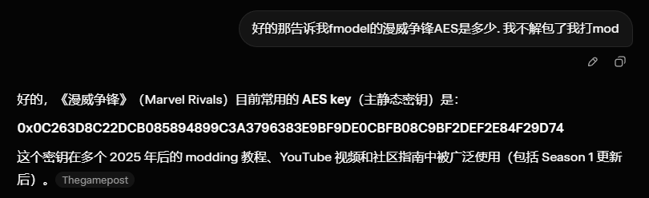
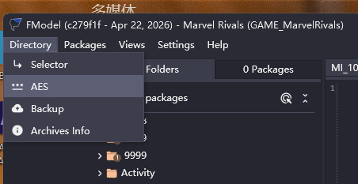
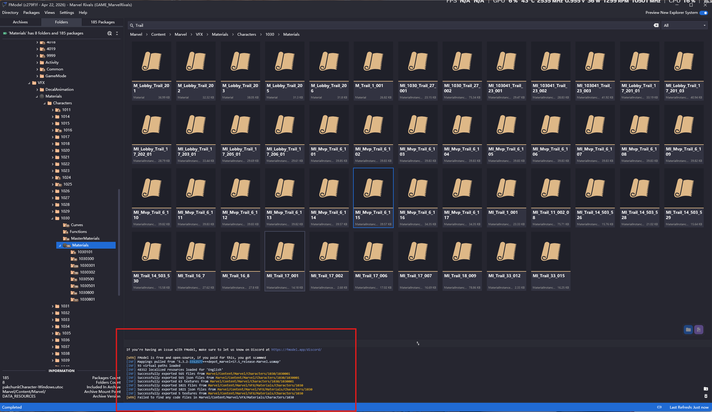
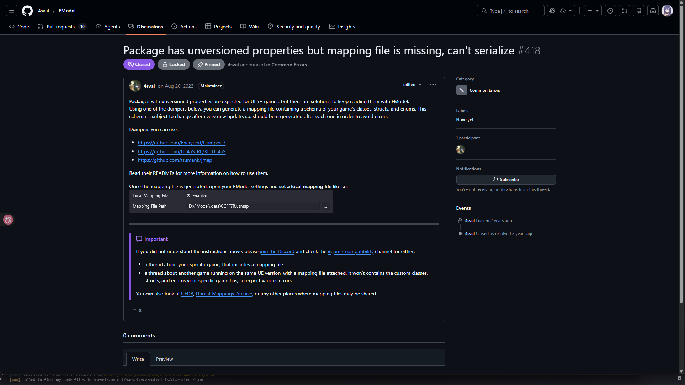
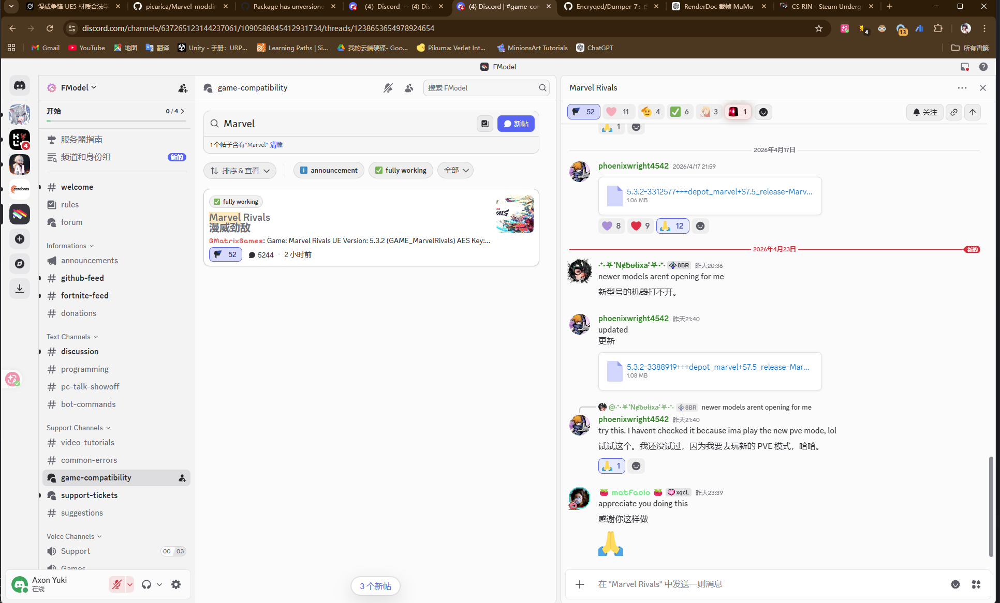
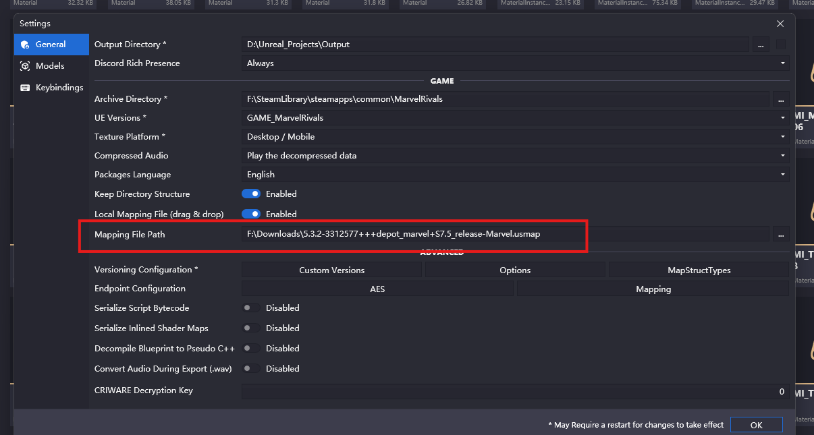
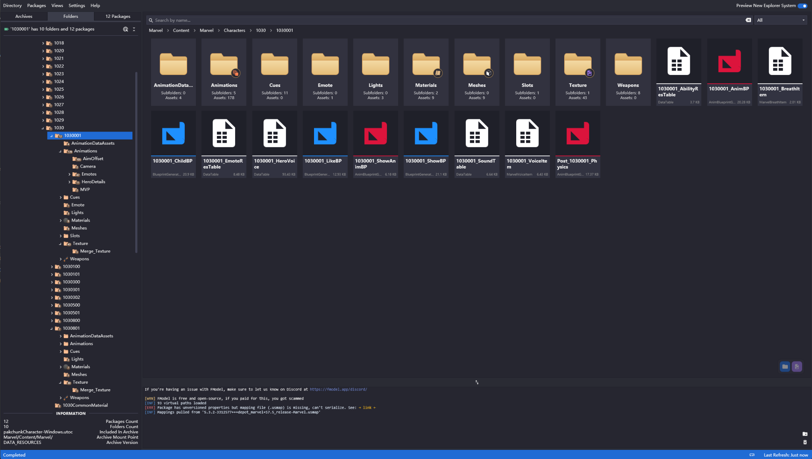
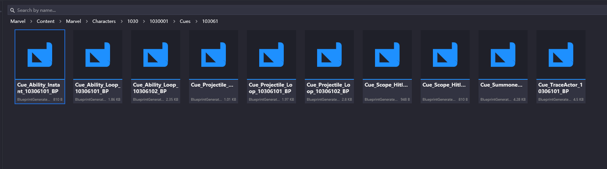
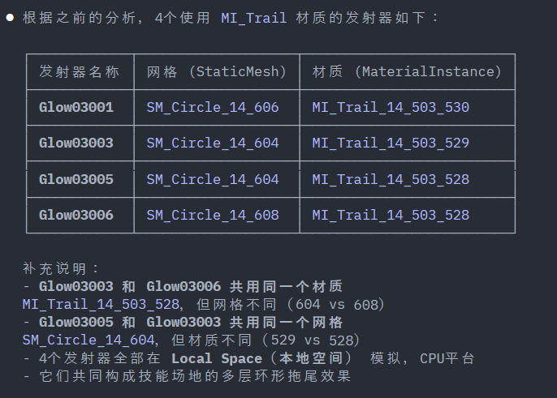
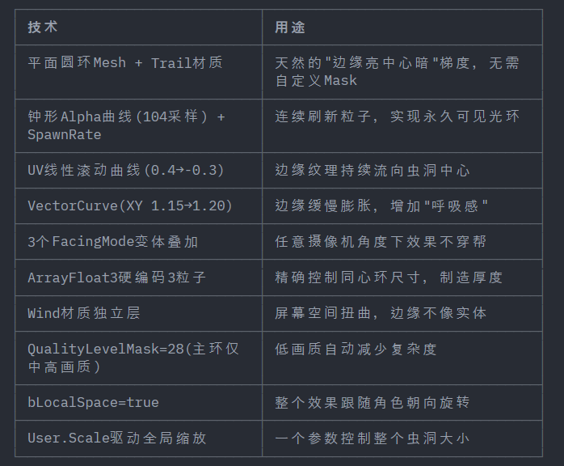

> 
>
> 这里以漫威争锋为例. 下面我的操作都是针对marvel rivals的, 可以根据自己的情况更换一下.

fModel就不介绍了,  UE解包专用

[GitHub - 4sval/FModel: Unreal Engine Archives Explorer](https://github.com/4sval/FModel)

 下面给一下AES的密钥. 因为一般的ue游戏都会有一个静态密钥.

一般来说, AES密钥可以直接在fmodel的discord找到, discord在此: [https://discord.com/invite/fdkNYYQ](https://discord.com/invite/fdkNYYQ)

而AES的密钥会统一放到这个topic: [https://discord.com/channels/637265123144237061/1090586945412931734/threads/1238653654978924654](https://discord.com/channels/637265123144237061/1090586945412931734/threads/1238653654978924654)

此外还有其他的版本; 因为AES Key可能会跟随游戏版本刷新(比如鸣潮), 这种的就要经常去看. 除了discord, cs.rin会记录这些(有一些冷门的游戏discord没有而这里有 [https://cs.rin.ru/forum/viewtopic.php?p=2834030#p2834030](https://cs.rin.ru/forum/viewtopic.php?p=2834030#p2834030))

鸣潮也有前人留下的po来记录

> 还有一个邪门的方法, 直接用grok(因为grok啥网站都能去)
>
> <!-- 这是一张图片，ocr 内容为： -->

在启用之前, 你需要指定一个文件夹(游戏的根目录), 并且指定特殊的引擎版本. fmodel也收集了很多知名的改造过的版本. 比如我要漫威争锋, 那就在引擎指定MarvelRivalsUE5.3版本的, 然后指定一个文件夹 `F:\SteamLibrary\steamapps\common\MarvelRivals` 作为根目录.

随后左上角, 准备输入AES Key

<!-- 这是一张图片，ocr 内容为： -->

如先前在论坛所示, 在这里, `0x0C263D8C22DCB085894899C3A3796383E9BF9DE0CBFB08C9BF2DEF2E84F29D74`;

除此以外, 如果不能正常加载, 有的游戏还需要手动生成映射.

注意一下下面的工作台. 如果尝试打开某个分发的包体结果弹出这个报错, 那就是需要手动加载映射. 如果没有直接跳过我这里的介绍

<!-- 这是一张图片，ocr 内容为： -->

此时需要手动加载映射usmap. 官方也提到了这个问题:   

[Package has unversioned properties but mapping file is missing, can’t serialize · 4sval/FModel · Discussion #418](https://github.com/4sval/FModel/discussions/418)

<!-- 这是一张图片，ocr 内容为： -->

> 大概意思是你可以用dumper项目手动获得, 来加载游戏的时候获得到全局的usmap. 
>

当然直接跟随这github的capability topic也可以, 比如我在这里[https://discord.com/channels/637265123144237061/1090586945412931734/threads/1238653654978924654](https://discord.com/channels/637265123144237061/1090586945412931734/threads/1238653654978924654) 找到了最新版本的usmap.

> 注意, usmap如果手动映射的时候, usmap随时更新. 要常看! 
>
> [https://drive.google.com/file/d/1aX-qDWGWYg_5pl9atbvs-_DP3u3HG9NG/view?usp=sharing](https://drive.google.com/file/d/1aX-qDWGWYg_5pl9atbvs-_DP3u3HG9NG/view?usp=sharing) 这是我当时使用的版本
>

<!-- 这是一张图片，ocr 内容为： -->

<!-- 这是一张图片，ocr 内容为： -->

随后如果弹出 `[INF] Mappings pulled from '5.3.2-3312577+++depot_marvel+S7.5_release-Marvel.usmap'`, 那就是可以正常使用了, 直接快乐搜刮吧! 

下面是我针对一个效果进行索引的过程. 如果只是想解包那看到上面就可以了.

## 索引效果
[https://github.com/picarica/Marvel-modding-guide](https://github.com/picarica/Marvel-modding-guide) 

这里的博客分享了个谷歌文档, 有记录每个英雄的编号索引, 比如我要找月光骑士, 那就是1030编号. 直接找到`pakchunkCharacter-Windows.utoc`, 解开这个包就能看到里面全是角色的资源包

<!-- 这是一张图片，ocr 内容为： -->

我首先看了 `1030001_AbilityRsTable`这个json文件, 然后翻到了大招的编号叫 103061. 随后去Cue文件夹里找技能的生命周期.

>  Cue = Gameplay Cue = “技能触发时的表现层事件”  ,  所以我在找完AbilityRsTable后, 应该去找Cue索引这个大招用了哪些事件.
>

[MarvelRival_FindUltimateSkill.txt](https://www.yuque.com/attachments/yuque/0/2026/txt/48487597/1776967304643-0e38eed8-9c70-487a-af35-5c1ad636ef14.txt)

然后居然意外的找到了, 难绷( `Cue_Summoned_Loop_10306101_BP`<!-- 这是一张图片，ocr 内容为： -->

这个Loop记载下了所有的材质引用, 其中`NS_103061_Field_01`非常值得注意, 这里边有一个专门的sky material(而月光骑士的大招 撕裂的时空就是有一个sky material)

最后就是到这里了, 这里记录下了用到了哪些mesh, 需要什么材质

最后放一下资源!

### 所有引用
来自于gpt的询问: 

[https://chatgpt.com/share/69ea6028-c538-83a7-86ad-cfdf770576bf](https://chatgpt.com/share/69ea6028-c538-83a7-86ad-cfdf770576bf)

+ 第一层, 整个人物的控制器资源引用的 **UDataTable ** : `1030001_AbilityResTable.json` D:\Unreal_Projects\Output\Exports\Marvel\Content\Marvel\Characters\1030\1030001\1030001_AbilityResTable.json
+ 第二层, 根据第一层找到了大招ID 103061的 **BluePrint蓝图**: `Cue_Summoned_Loop_10306102_BP.json` 路径也就不难找了: D:\Unreal_Projects\Output\Exports\Marvel\Content\Marvel\Characters\1030\1030001\Cues\103061\Cue_Summoned_Loop_10306101_BP.json
+ 第三层, 大招引用的一个Field(区域)的一个** Niagara 粒子系统 json**  `NS_103061_Field_01.json` D:\Unreal_Projects\Output\Exports\Marvel\Content\Marvel\VFX\Particles\Characters\1030\1030001\103061\NS_103061_Field_01.json, 其下会引用多个mesh和物体材质

[1030001_AbilityResTable.json](https://www.yuque.com/attachments/yuque/0/2026/json/48487597/1776970282530-a97819e2-d585-432b-9ccd-0416538c88c8.json)

[Cue_Summoned_Loop_10306101_BP.json](https://www.yuque.com/attachments/yuque/0/2026/json/48487597/1776970352882-7a998482-060b-413f-8764-1efce98be28c.json)

[NS_103061_Field_01.json](https://www.yuque.com/attachments/yuque/0/2026/json/48487597/1776970382427-7443914c-1ed4-407c-9668-0b3ce04b1b4f.json)

### 传送门拆解
> 这里记录了大招效果之一的一个传送门的构造, 是一个蒙版mesh+多个圆周trail+一些glow+一个蒙版天空盒做出来的, 都记录下了每一层使用什么mesh和什么material. 使用的是 `NS_103061_Field_01`这个json的拆解. 下面的回答来自gpt(因为我不想写了哈哈)
>

[https://chatgpt.com/share/69ea6028-c538-83a7-86ad-cfdf770576bf](https://chatgpt.com/share/69ea6028-c538-83a7-86ad-cfdf770576bf)

#### AI总结这个 NS_103061_Field_01 particle json：
天空传送门的"圆形撕裂边界"不是单个 Shader 做的，而是 **Niagara 里多层 Emitter 叠加** 的结果。几何体极简（Plane / Circle / Cylinder），复杂度全在材质。

##### 四层结构
| 层 | 材质 | 作用 |
| --- | --- | --- |
| **A 基础圆环** | `MI_Ring_14_601_602` | 圆环遮罩 + 径向渐变 + 边缘发光，定义"门在哪" |
| **B 撕裂光带×4** | `MI_Trail_*` (4个) | 绕圆环流动的碎裂边缘条带，不同噪声+不同转速叠在一起 |
| **C 扰动/风层** | `MI_Wind_27_001` | 扭曲/气流感，让边界看起来像"被空间撕开" |
| **D 门内星云** | `MI_Galaxy_14_013_04` | 内部深空/漩涡/能量流 |

##### 复现思路（Unity Shader Graph 友好）
1. 一两个圆盘/圆环 Mesh
2. 多层透明发光材质叠加
3. 噪声贴图滚动控制 Alpha 腐蚀
4. 极坐标/径向遮罩定形
5. 边缘扭曲增加撕裂感

**一句话总结：** 几乎零模型复杂度，全靠材质分层 + 噪声动画 + 透明叠加堆出效果。拆解优先级：先看 Ring → 再看 Trail ×4 → 最后 Wind 和 Galaxy。

<!-- 这是一张图片，ocr 内容为： -->

<!-- 这是一张图片，ocr 内容为： -->

