## 壹 可信的光影和空间关系

现实物理世界中，光与影伴生存在，但在动漫工业里，不一定要严格地呈现物理真实，普遍的做法是，保证在相机视角下的完美为前提，用概括和抽象的方法，重新定义项目自己的表达要素。H62就遵循这个原则，具体体现在如下的两个方面：

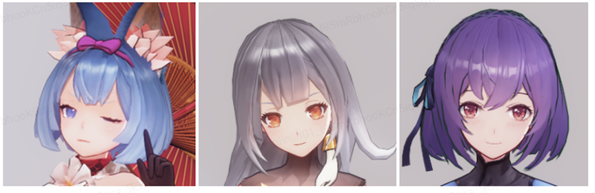

H62 的地板是平的，因此可以使用视觉精度最高的平面阴影。H62 在计算中只使用 L1 的世界空间坐标，作为相似三角形的共用顶点。
并且这个坐标的选取，一要让阴影有好看的形状，二要和所处的场景中的主光源产生的阴影相匹配，达成一种角色置身于空间中的可信。

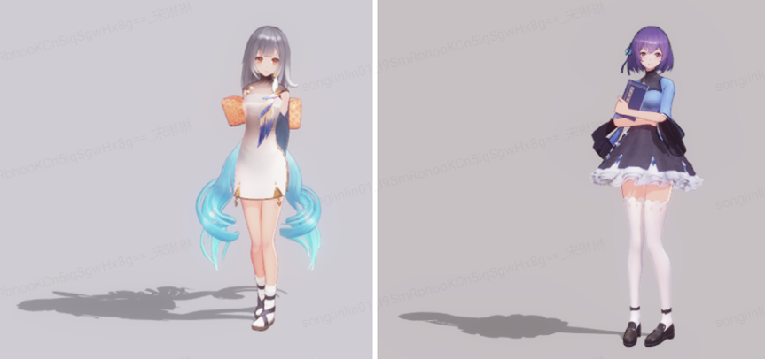

角色的自阴影，在计算中只使用 L2 的方向向量。设置的原则是，让形成的自阴影作为大结构的空间关系绘制补充（相对于小结构的 AO 而言），在 H62 中，这个效果常用来表达动漫中绝对领域的渲染。

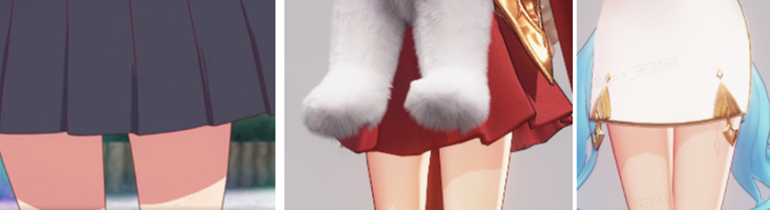

## 贰 重新梳理的表达层次

### 1）平的秘密

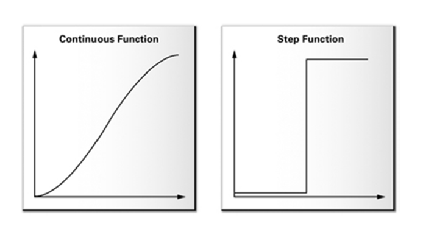

用一种通用的说法来解释，卡通渲染中变平的秘密就是让 NdotL 的值变化足够平缓，减弱人脑对物体 3D 感的判断。
但是不管如何来减弱以及包装分段函数式光影，只要这种陡变的光影过渡效果出现在角色的身上，就不可避免地会被划归到赛璐璐渲染风格中。

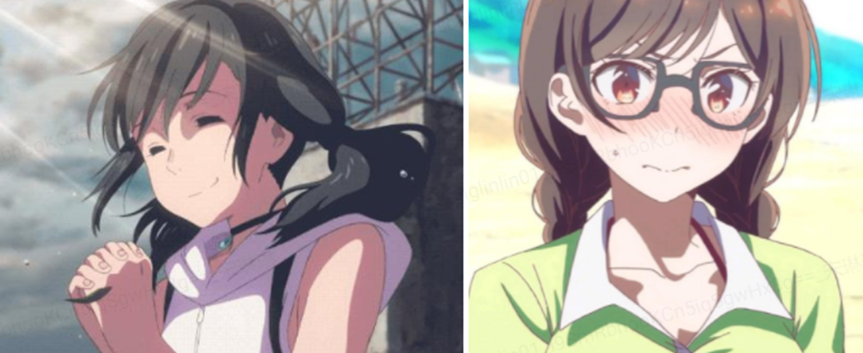

因此，为了还原 H62 原画呈现的日系插画风格，在确认渲染方案之初，采用的方法，是第一节所说的用观察向量替代光照向量用于计算。

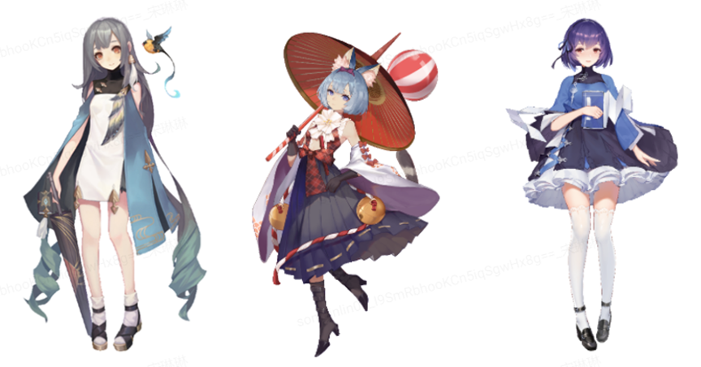

### 2）丢失的结构要素补回

但是，采用 V==L 的方案以后，H62 丢掉了 NdotL 式的光影对于脸部结构的描绘。因此，我们需要用其他的要素，来把缺失的脸部结构的描绘补充完善。
首先是皮肤的次表面散射效果，次表面散射效果在实现上是关于曲率的函数，也就相当于描绘了脸部法线变化速率。

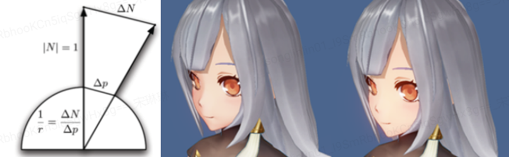

同时，次表面散射也是借鉴自写实渲染方案，用来传达生命活力重要因子。
方案的具体实施，并不是单纯对写实渲染的方案进行简化，而是基于艺术的核心传达目的而进行的重新定义和组合，客观存在的数据集合，并不会因为我们划分子集的方法而变化，艺术是唯心的，方法是唯物的。

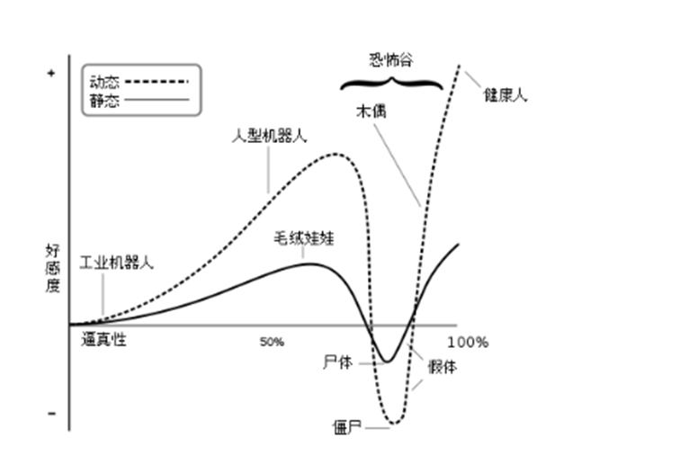

由图可以模糊定义，“七分真”也是好感度的极值点之一。
次表面散射部分，我们采用三层染色的方式来制作。

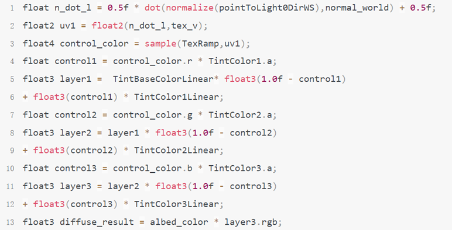

核心的想法是用三层 mask 来控制三种颜色在皮肤上进行染色。控制三层染色的 ramp 图如下图所示：

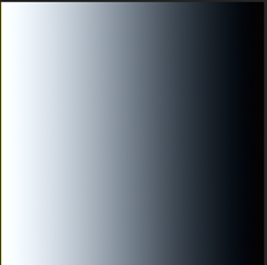

其中 tintcolor3 是由 R 通道控制，tintcolor2 是由 G 通道控制，tintcolor1 是由 B 通道控制。可以看出，tintcolor3 是范围最大的红色，依此类推。此种方法旨在拟合一束白光打在无限大的皮肤平面上的各个通道的能量消散速度。

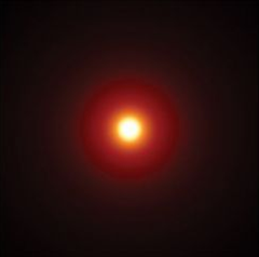

由观察可以得出，红色衰减的比较慢，而蓝色和绿色衰减的比较快，并且绿色衰减的速度要大于蓝色。而在最后，各个通道衰减的速度又趋近于 0，因此，在最后，由于能量的消散，又趋于黑色。

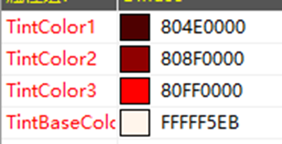

我们通过对三层的基础颜色的设置，以及 ramp 图，来模拟上述结果。
可以看到有 3S 和没 3S 的皮肤的差异。

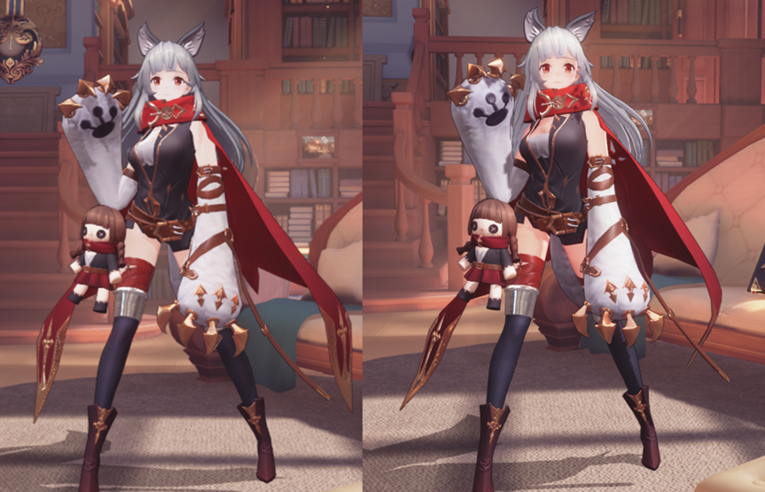

以上的方案，本质上是在 NX 引擎中，基于艺术风格表达的需求，实现了一套自定义的，便于美术理解（？）的 Diffusion Profile。打了个问号的意思是，我觉得我当时做的不好。整套系统 7 个自由度，却不是完全正交，项目里美术很难靠掌握背后的原理，来调节合适的参数，基本上是靠感觉，来进行自纠错。
然后是，由 1D Ramp 定义的单向轮廓光，即相当于定义了一盏虚拟的光源，永远在镜头的右边照到角色身上。

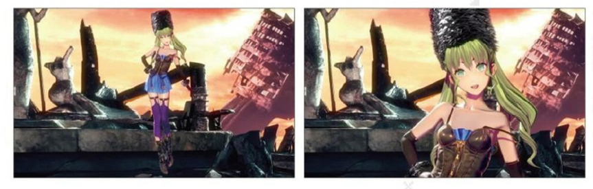

参考《嗜血代码》的方案“遇事不决，齐次坐标”，加了一个蒙版来控制轮廓光的范围。

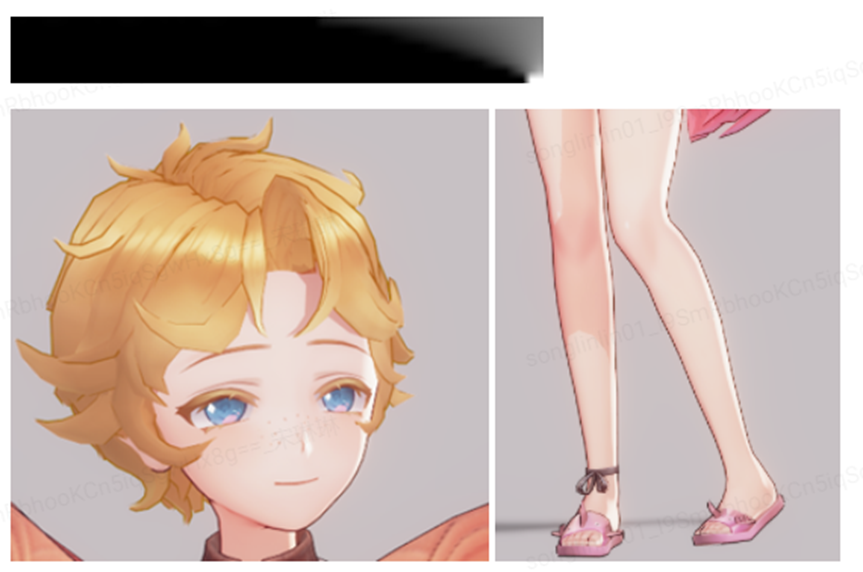

这个单向轮廓光在 H62 中，也是对于皮肤的菲涅尔的表达。因为皮肤材质没有定义粗糙度，可以通过调节轮廓光的强度，来暗示皮肤的光滑程度。并且由于用 ramp 图固定了轮廓光的范围，可以避免常见的搞光算法导致的油腻效果。

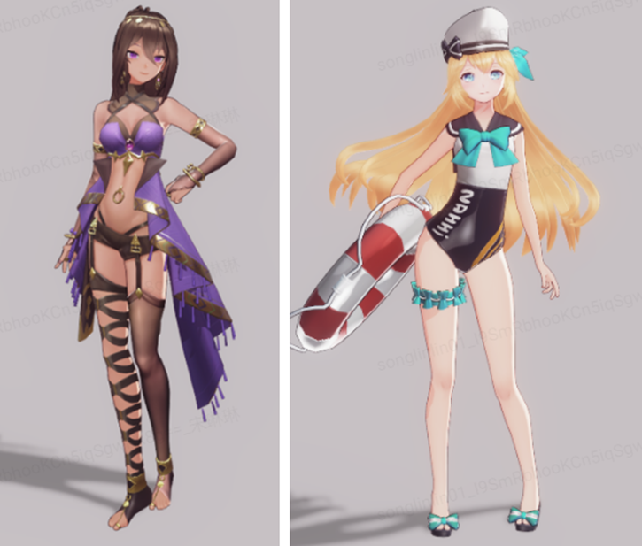

### 3）以生命活力为目标的渲染

Bloom 在卡通渲染中是比较容易出效果的，但是也不能滥用，防止过度饱和而遮盖了细腻的光照细节。
H62 用多 pass 的方式，只给予头发和皮肤额外的 bloom 放大系数调整，其他材质维持标准化的光感。
这里也是基于艺术认知来做的 Trick，让角色本体和穿戴，产生微妙的光感差异，向用户传达角色具有生命活力的心理暗示。

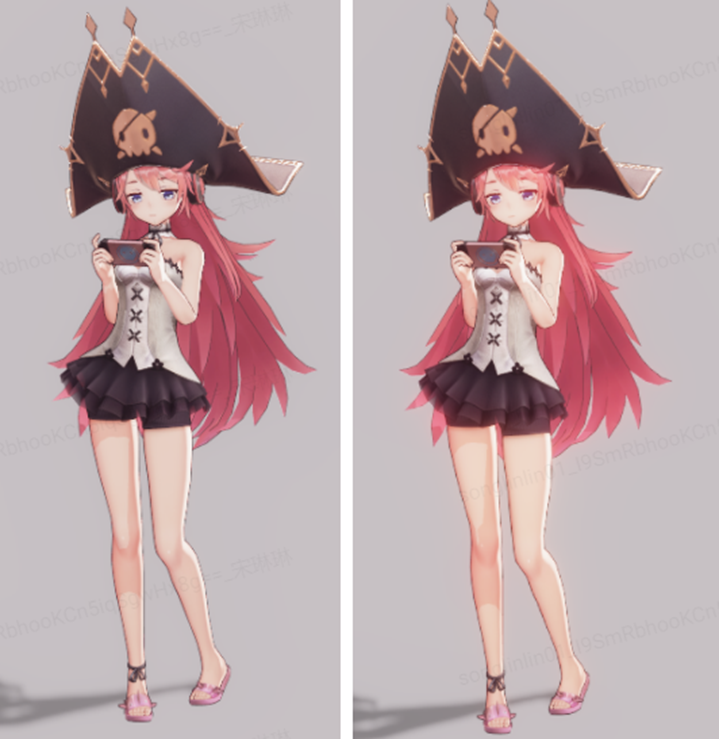

LUT（Look Up Table）是主美工具，制作方法是对当前效果截图，在 PS 中用工具调整到效果满意以后，将改动拖到标准 LUT 上形成新的 LUT。

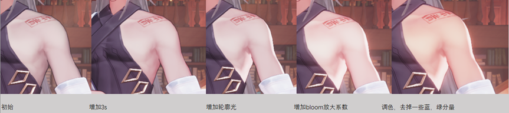

值得注意的地方是：LUT 一旦确认，轻易不要更改，否则需要大量时间，对场景以及场景特效进行联调。这样折腾了两次以后，修改为 LUT 只对角色起作用。
眼球也是一个复杂的多层结构。其中虹膜，角膜，巩膜三个结构是我们能观测到的最主要的部分。而 在他们之间的空间，可以看作是灌满了液体的结构。虹膜部分对眼睛呈现的颜色贡献最大，巩膜部分贡献了眼白部分，角膜贡献的是反射和搞光效果。而中间的液体由于折射，呈现的是一种类似视差贴图的效果。
漫画家在绘制漫画风格的眼睛的时候，往往会简化这些写实结构。

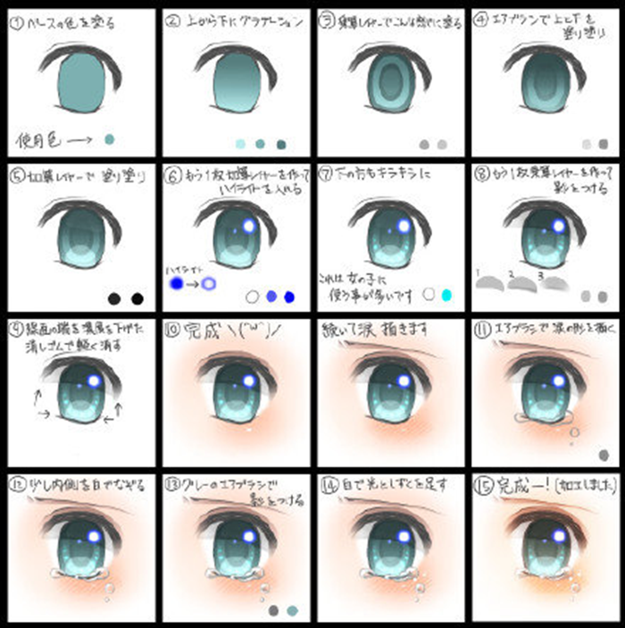

由此可以定义，H62 在渲染层面需要在表达的内容包括，巩膜的次表面散射效果（3S），虹膜卡通手绘的颜色和细节，角膜上的透射和反射，以及玻璃体的折射效果。
巩膜就是我们俗称的眼白，我们从观测结果的角度来分析，可以暂定眼白的边缘是呈现和皮肤基本一致的 3S 特性。

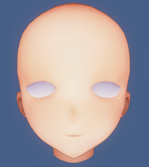

于是我们在制作中把眼白和眼睛的其他结构拆开，而和头部模型合并，在同批次进行渲染。
如下图所示，眼白的渲染基本满足了我们预设的要求，比如边缘呈现血液的红润倾向。
虹膜是我们看到的眼睛的主要效果，也是最能体现眼睛二次元的部分。
这部分大部分参照的二次元漫画眼睛的绘制方法。然后从风格表达以及低配时的保底效果考虑，手绘部分环境反射结果到颜色贴图上。
我们看到的眼睛的光泽和搞光，主要来自于角膜和内部的液体构成的这个类玻璃体。所以角膜部分，我们按照正常的玻璃材质进行渲染就可以了。除了玻璃本身的透明以及光泽效果，我们还增加了一个模仿 MMD 风格的动态搞光效果，增加二次元的感觉。

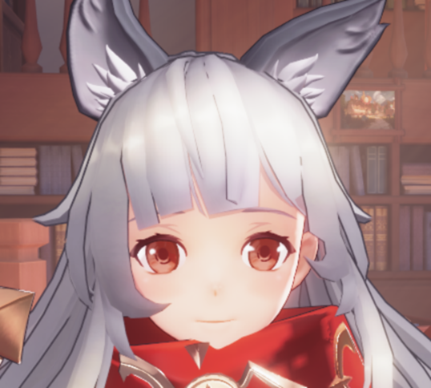

通过光影表达头型的饱满

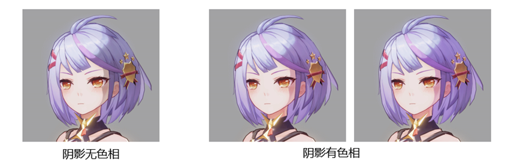

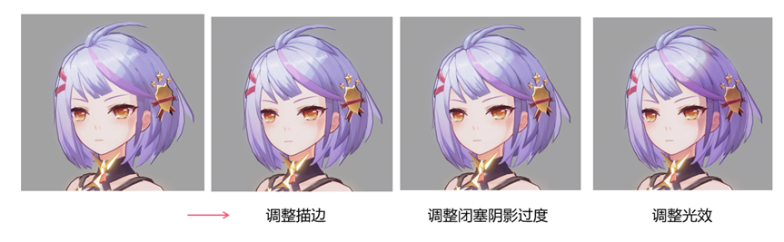

通过对非生命体和生命体（头发这里归于非生命体）的阴影色相的冷，暖配置，来增加美术细节以及进一步暗示脸和身体的生命活力

## 贰+ 方案改进和工作流调整

H62 现在的表达层次是次表面散射，1DRamp 轮廓光，模型阴影片，缺点是没有法线（NdotL）相关的动态光影信息。
目前卡通渲染中，为了实现风格化 & 高精度动态光影效果，主要有两个验证过的工作流：
一个是罪恶装备的工作流，以法线修改工具为核心，实现光影的定制化；

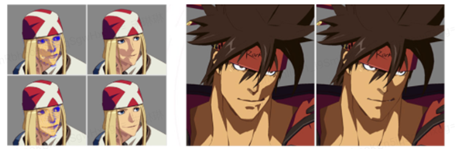

另一个是原神的工作流，通过采样重要性手绘关键帧，并用 SDF 融合，生成的风格化 ramp，来计算光影。

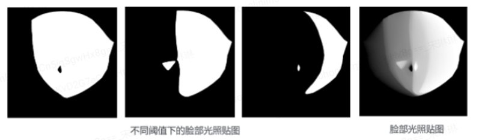

比较下来，原神的工作流，阴影精度更高，并且没有修改原始模型的法线，不会影响其他在计算中使 用法线的渲染效果，更符合自由视角观察结果（罪恶装备没有自由视角的需求，并且手动调整顶点法线是非线性工作流，这对运营期项目很不友好。）
但是 H62 角色众多（100+），每一个角色脸型，UV 都不一样，故每一个角色的脸部光照贴图的关键帧都需要耗费大量的精力去绘制，并且要得到较好的效果，需要进行多次修改，直接使用原神的方案会导致美术的工作量巨大。

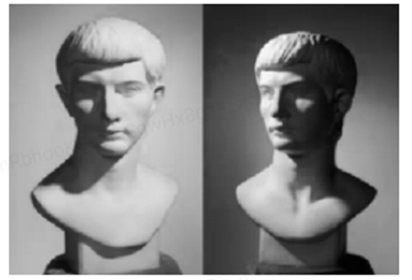

因此，我对原神的手绘 Ramp 效果进行分析，来思考原神这样手绘的道理，例如眼下三角光，我们认为是为了表达苹果肌亮面，而三角形则是风格化的表达（影视打光里的伦勃朗光的抽象）。
PS：因为这个三角光是伦勃朗光的抽象，不同的角色，不同的模型，如果都用同一个 Ramp 硬套，是很生硬的，对于不匹配的脸型，几乎等于是在重构脸部的体积。这也是大家觉得违和感，以及不美观的来源，因为三角光没有出现在基于我们的普遍认知里应该出现的位置。制作自动生产工具，就是为了解决这个问题。
我们可以用算法把这个光亮区域改成接近三角形。可以根据需要，改成任何想表达的形状，例如表达男性硬朗的梯形。

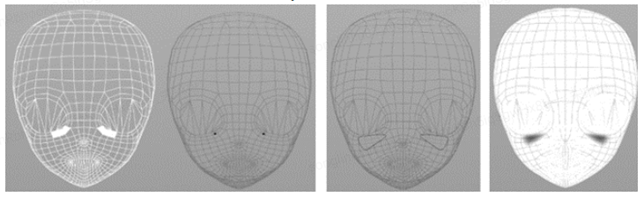

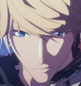

更改过渡值更加硬朗的阴影
结合两种方案的优点，以及巧妙避开各自方案的缺点，是开发这个工具的核心思想。
工具首先对模型进行曲面细分，极大的增加模型的面数，以此让光影的调整更加精细。这一步相当于自动解决了罪恶装备的调整法线法，对布线的高要求。

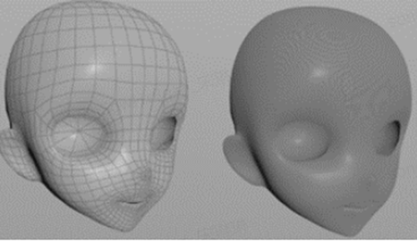

然后对脸部模型进行分析，自动计算出苹果肌和鼻子位置。

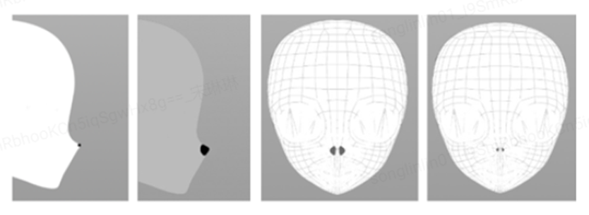

并计算光照和面部模型信息，实时地自动修改面部法线，使得阴影曲线与脸型贴合，并且用算法微调，使光照阴影更接近于手绘的风格。

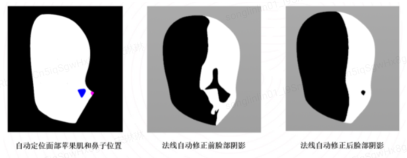

接下来自动改变光照角度，对关键帧进行采样，可以自动生成关键帧选取角度下的光照图，并存入缓存中。解决了美术需要手绘大量关键帧和不断修改阴影曲线的问题。

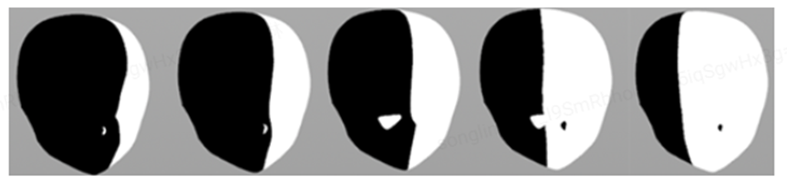

最后用缓存中的关键帧采样结果，进行 SDF 融合，通过设置关键帧权重，对重要光影效果过渡进行节奏上的控制，使好看的光影效果在光照变化中形状保有更持久一些。

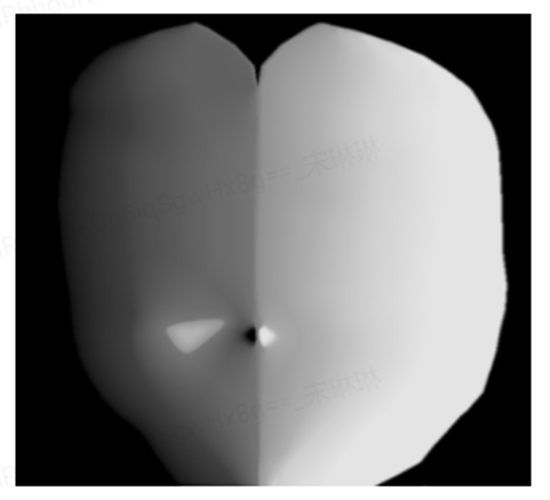

效果对比

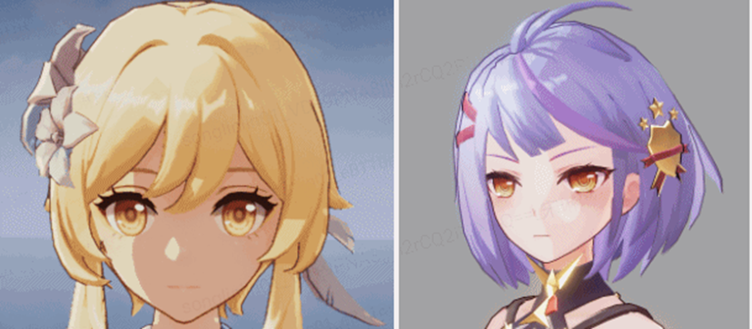

效率对比

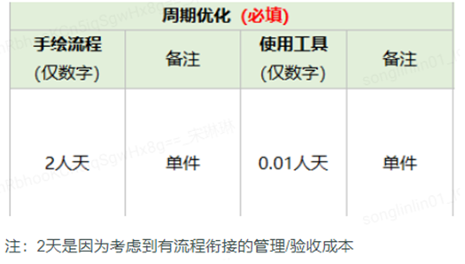

## 叁 PBR 与 NPR 融合

关于 PBR 和 NPR 的效果融合，最近几年越来越多的游戏开始尝试，并且做出了很好的效果。

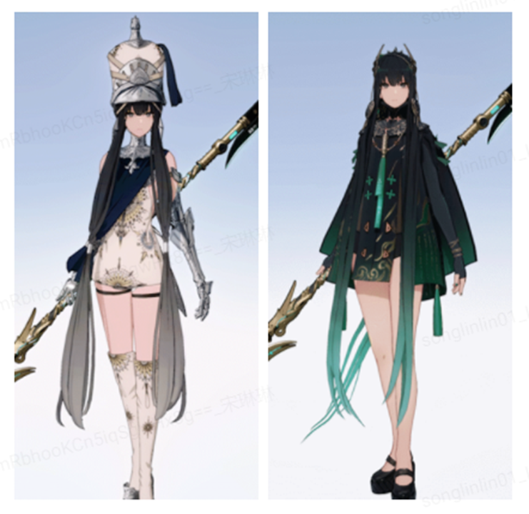

关于风格融合，有两个切入点。
首先是美术角度，在设计上要在角色的身上尽量控制使用 PBR 材质的比例。这样总体上给人观感上就没有那么写实。
其次就是技术角度上的调整。目前 H62 主要是通过权重对计算结果进行融合（七分真原则）。计算流程示意图如下：

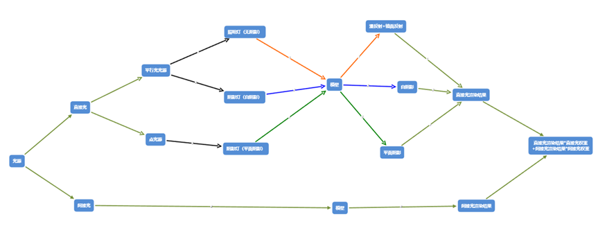

这种 NPR 和 PBR 的结合，在丝袜材质上体现的最为明显。

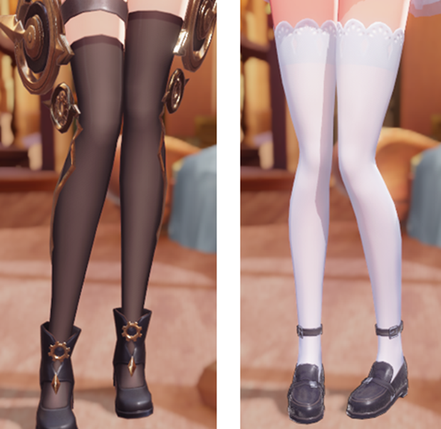

金属部分的风格化，目前也是用调整光照权重来实现的，这个方法和原神用 ramp 的方法在风格化思路上是一致的。
但目前因为 H62 的材质分 ID 的规则，还无法直接搬运原神的方法。

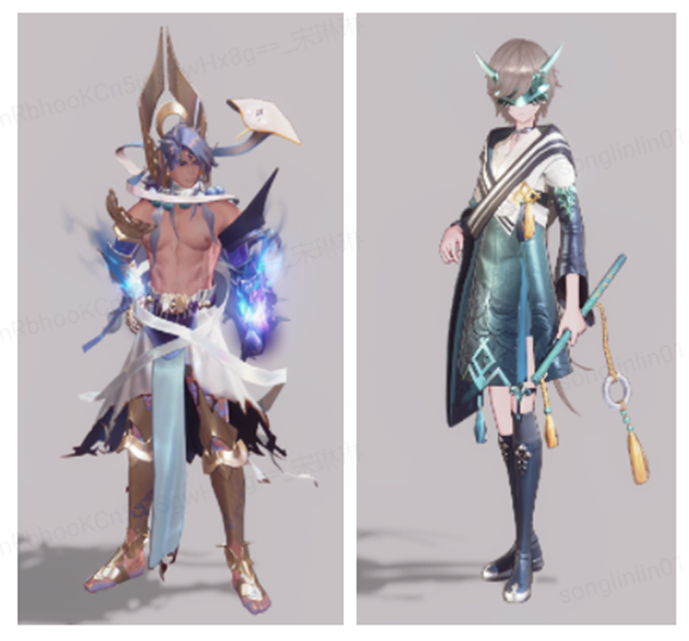

使用自发光材质，和使用 NPR 材质在感受上类似，会给人一种平面的感觉，也会让渲染的结果看起来更二次元。

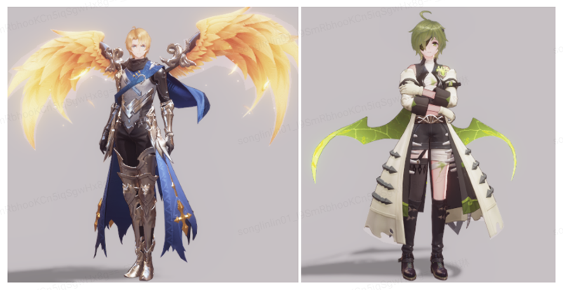

## 叁+ 手绘也要遵守规则

H62 对手绘的使用有比较严格的规范，（特别是 PBR 材质上的手绘）但总体上如果画的很好看，我不会主动去纠正，甚至会帮模型顶住来自图程的吐槽。

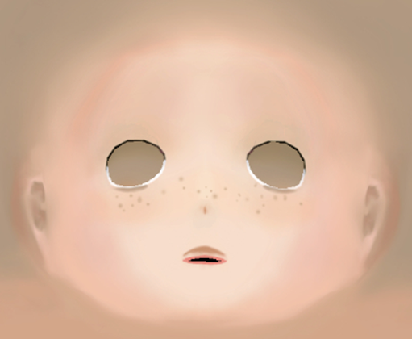

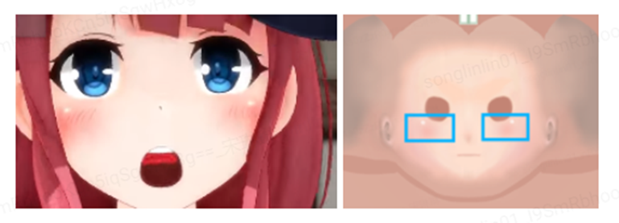

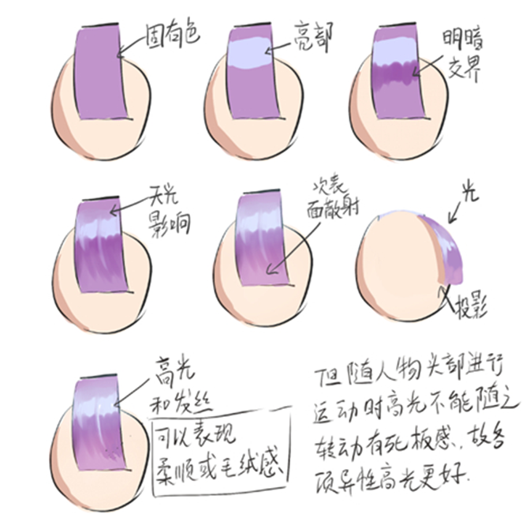

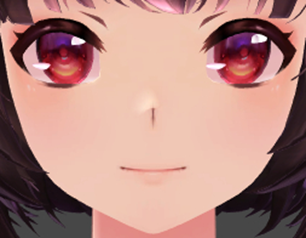

## 肆 还有什么可以卷的呢

### 1）可交互触感（狗头）

方案参考《堡垒之夜》枢轴动画 + 曲线 + 骨骼关联 = 广义蒙皮。

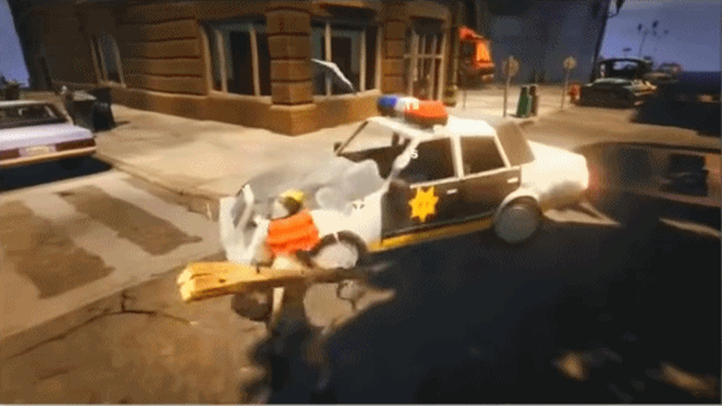

目前 UE4，有两版工具 PivotPainter 1.0 和 PivotPainter 2.0，材质函数如下：

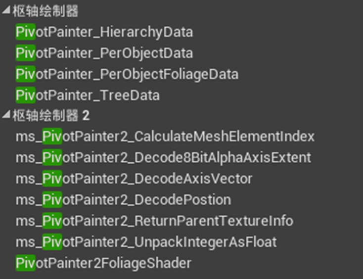

看命名就能猜个大概用途了，想详细的了解，可以去官方文档上学习。
目前在 3Dmax 中有配套的 script，Houdini 官方也在 GitHub 上提供了对应的 HDA。综合考虑下来，对于复杂的顶点动画需求，还是在 Houdini 中能做到更高的自由度，抬高此流程的效果上限。

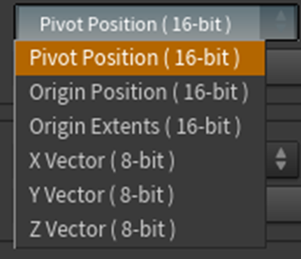

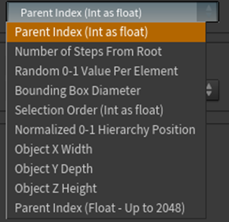

因此选 Houdini。
1.0 工具可以存储的信息要略少一点，只能固定存储轴坐标，轴向，随机数，和动画蒙版（存储在 UV2 和 UV3，以及顶点色和顶点透明通道中）。
2.0 的工具会生成两张纹理，可以选择的信息包括：
实际体验下来：
1.0 和 2.0 各有优势。
1.0 的优势在于可以省去采样贴图，更加节省性能，但做东西不够灵活，也因为 UV 数量的关系，某些手机不支持。另外因为使用顶点色，不支持使用动态合批进行优化。
2.0 需要采样两张贴图，性能消耗要大于 1.0（远小于 VAT），但相对 1.0 的优势是在实现 shader 动画的过程中，十分灵活，可以烘焙到纹理上的信息可选种类很多，比如可以根据动画设计，来考虑 shader 中需要使用的轴坐标，轴动画向量，选取子模型的顺序（也就是播放顶点动画的顺序），层级的 ID（如果动画中需要的话）。
再加上 2.0 的可用材质函数也更多，因此选 PivotPainter 2.0 工作流。
跑了一下流程：
根据需求的这个效果，判定需要导出的信息有：

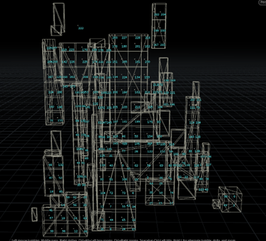

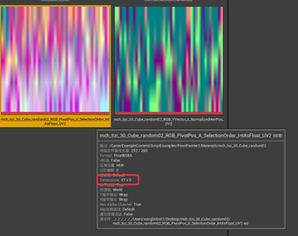

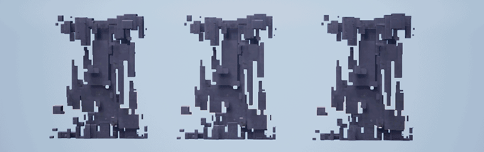

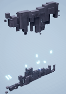

此外，触碰时还可以和表情系统进行关联（臆想中的好感度玩法）。

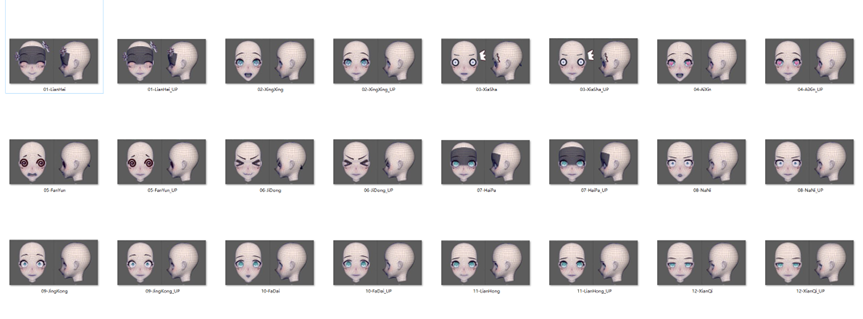

### 2）双向 SDF

这里我们要明白一点，SDF 本身已经是一个可选方案，双向 SDF 更是一个可选方案中的可选方案 =.=。
我们的努力不是让某种渲染方案成为标准，而是预估美术表达内容和方法的演进趋势，提前准备。
如果说横向 SDF 是表达的角色动态光影，纵向 SDF 在动漫中更多的是表达情绪以及性格。

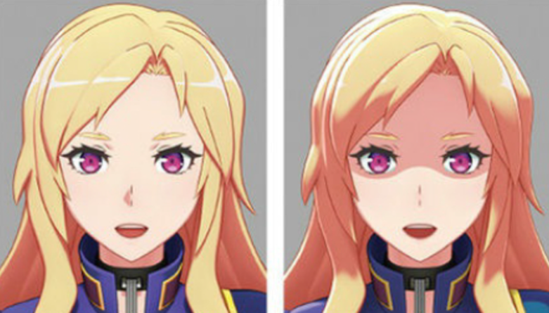

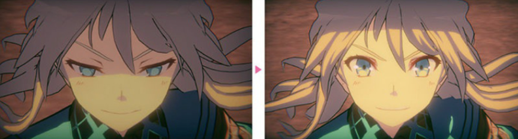

同时双向 SDF 也能匹配更多的光照情况，比如俯照，仰照，点光源。
难度主要在于，纵向光在鼻子的投影不是递增的，没有办法用 SDF 的方式进行拟合。

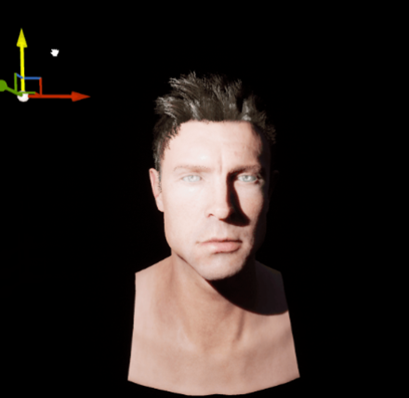

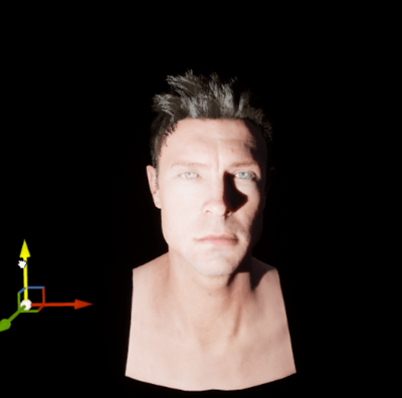

参考如下，时间关系不细说了。

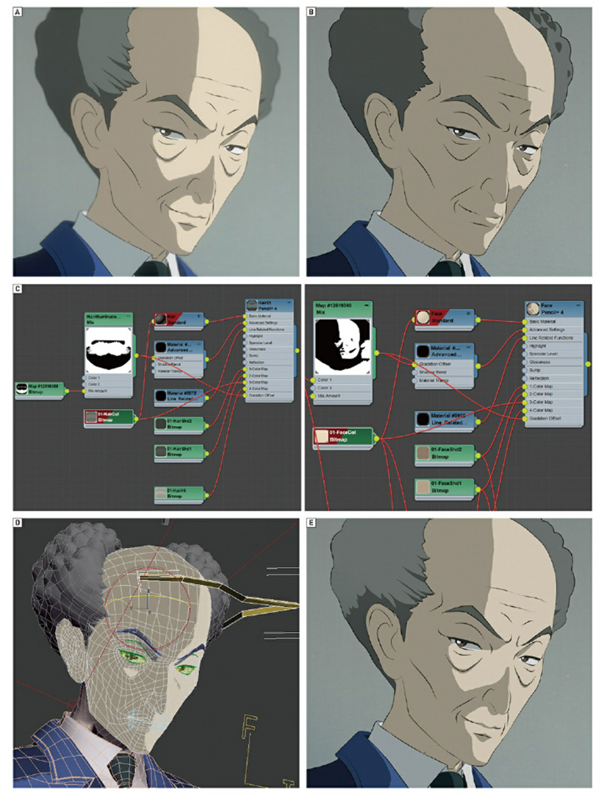

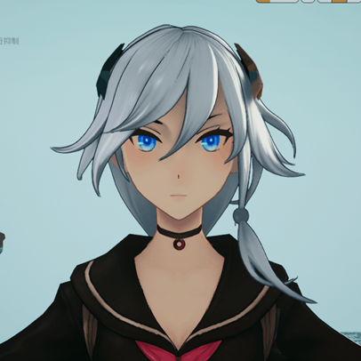

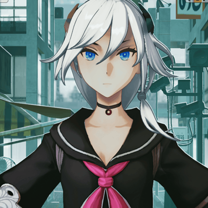

### 3）其他待续。。

H62：幻书启世录 U1 黑潮之上