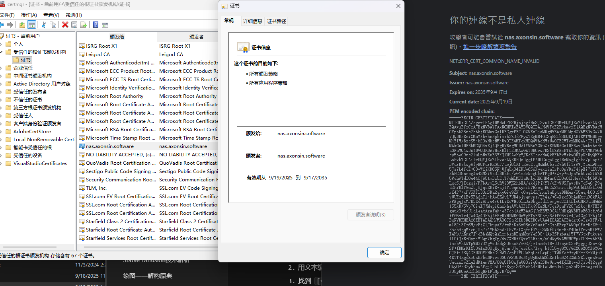
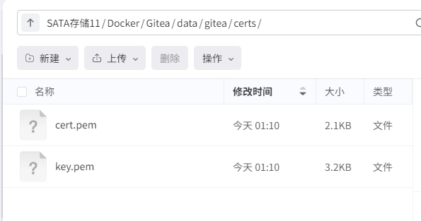

> 前言：这是我在看http的坏处偶然看到的。http会直接使用明文传输，容易受到中间人攻击而且容易被人扒底裤。所以修改为https就被提上了日程。当时想了两个办法，一个是用nginx配合lets encrypt来自动化续签证书/Gitea使用ACAM实现证书全自动托管，一个是CloudFlare自动转发。但是折腾了一番发现80和443都被封掉了，第一个方法几乎不可行；我的域名也不是CF买的（不能完全托管，不是橙色的小云图标）。最后想着反正就我自己用了，为什么不直接自签名一套证书然后丢进gitea呢（


将的 NAS Docker 中部署的 Gitea 从 HTTP 切换到 HTTPS，并使用在电脑上生成的自签名证书，这是一个非常常见的需求。整个过程可以分为以下几个关键步骤。

### 总体流程概览


### 步骤一：在电脑上生成自签名证书


需要在电脑上安装 OpenSSL。Windows 10/11 通常可以通过 WSL (Windows Subsystem for Linux) 或 Git Bash 自带 OpenSSL。macOS 和 Linux 系统则通常会预装。
Windows下载编译包：https://slproweb.com/products/Win32OpenSSL.html




明明和导入证书里的域名一模一样但还还是会包CommonName不匹配

```bash
openssl req -x509 -newkey rsa:4096 -keyout key.pem -out cert.pem -days 3650 -nodes -subj "/CN=nas.axonsin.software" -addext "subjectAltName=DNS:nas.axonsin.software"
```


执行完毕后，您会在当前目录下找到两个文件：

### 步骤二：将证书上传到 NAS 并放置到指定位置





### 步骤三：修改 Docker 配置以挂载证书目录


为了让 Gitea 容器能读取到您上传的证书，您需要将 NAS 上的证书目录挂载到容器内部。
Gitea 容器内的数据目录通常是 /data。我们可以将 NAS 上的证书目录挂载到容器内的 /data/gitea/certs。
您需要根据您当初部署 Gitea 的方式（docker run 或 docker-compose）来修改。

### 步骤四：修改 Gitea 配置文件 app.ini


```
[server]# 将协议从 http 修改为 httpsPROTOCOL         = https# 域名必须与您生成证书时填写的 Common Name 一致DOMAIN           = 192.168.1.100 # ROOT_URL 必须更新为 https 协议，并包含正确的域名和端口ROOT_URL         = https://192.168.1.100:10443/# Gitea 监听的 HTTP 端口（在容器内部）HTTP_PORT        = 3000# 禁用内置的 SSH 服务，如果您通过其他方式管理 SSHDISABLE_SSH      = false# SSH 服务的监听端口SSH_PORT         = 22# 证书文件在容器内的路径CERT_FILE        = /data/gitea/certs/cert.pem# 私钥文件在容器内的路径KEY_FILE         = /data/gitea/certs/key.pem
```


关键修改点解释：

### 步骤五：重启 Gitea 容器


保存 app.ini 文件后，需要重启 Gitea 容器来加载新的配置。

```bash
docker restart gitea
```


或者，如果您使用 Docker Compose：

```bash
docker-compose restart
```


现在，您应该可以通过 https://<您的NAS_IP>:<您映射的HTTPS端口> (例如 https://192.168.1.100:10443) 来访问您的 Gitea 实例了。

### 步骤六：处理客户端信任问题


由于您使用的是自签名证书，浏览器和 Git 客户端默认不会信任它。
1. 浏览器访问
当您第一次通过 HTTPS 访问 Gitea 时，浏览器会显示一个 "您的连接不是私密连接" 或 "不安全" 的警告。
2. Git 客户端操作 (例如 git clone)
当您尝试从配置了 HTTPS 的 Gitea 服务器 clone 或 push 仓库时，Git 客户端会报错，提示 "SSL certificate problem: self signed certificate"。
您有两种解决方法：

```bash
git config --global http.sslVerify false
```


```bash
# 将路径替换为您实际存放 cert.pem 的路径git config --global http.sslCAInfo "C:/Users/YourUser/certs/gitea.pem"
```


注意：在 Windows 上，路径分隔符请使用 /。
完成以上所有步骤后，您的 Gitea 就成功地从 HTTP 切换到了使用自签名证书的 HTTPS 协议，并且您的 Git 客户端也能正常操作了。