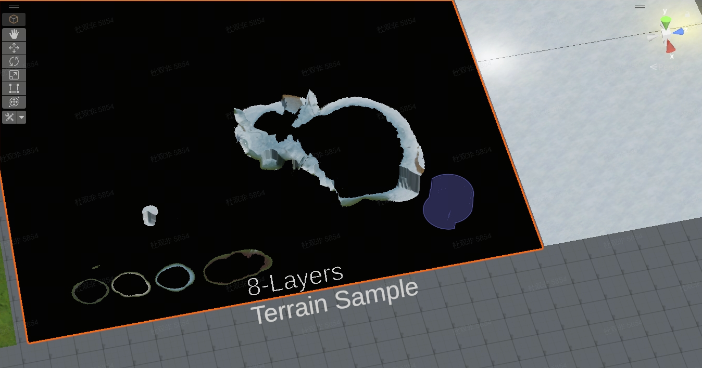
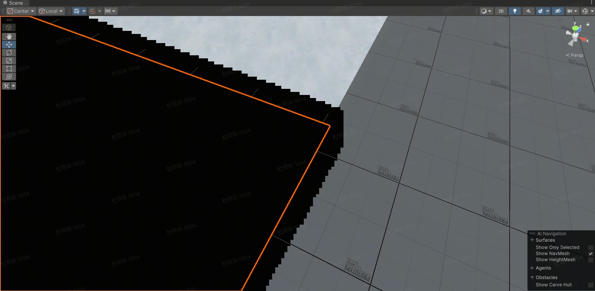
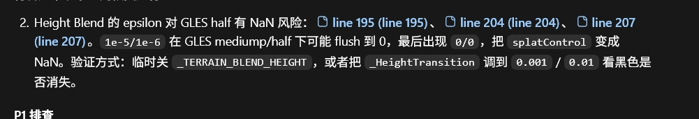
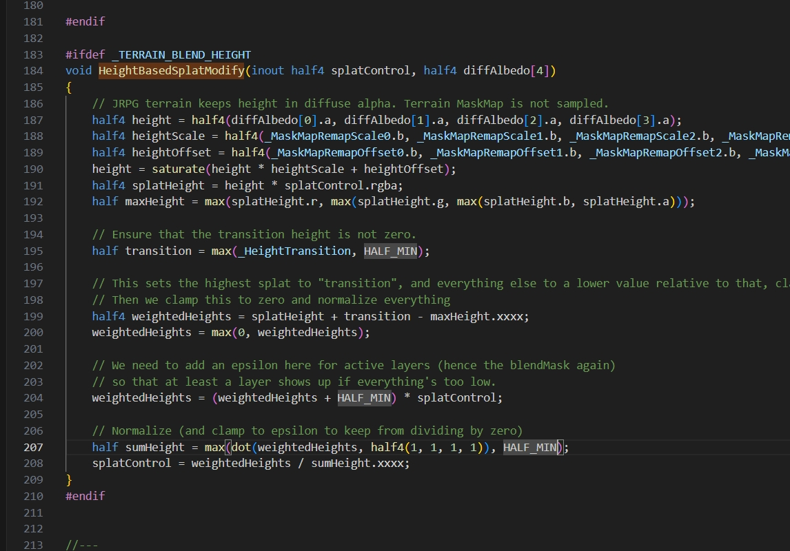
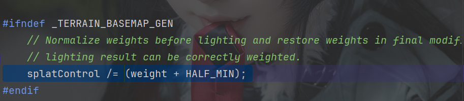
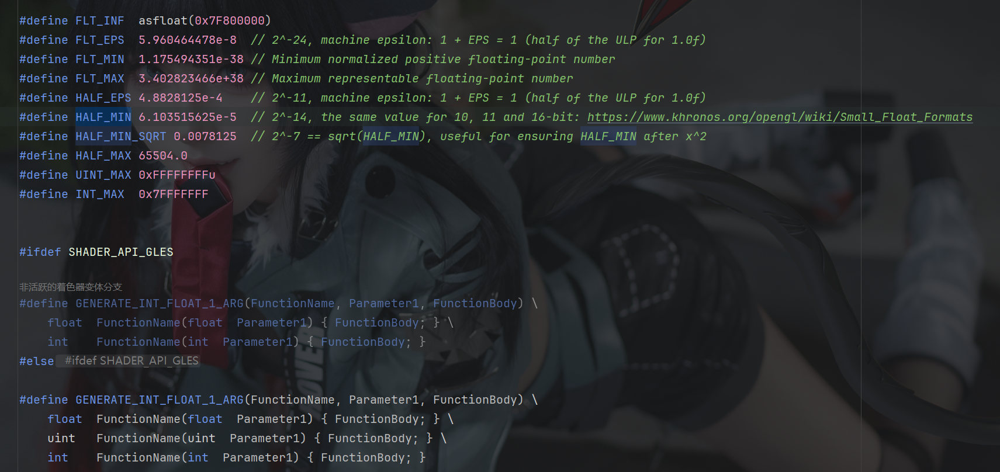
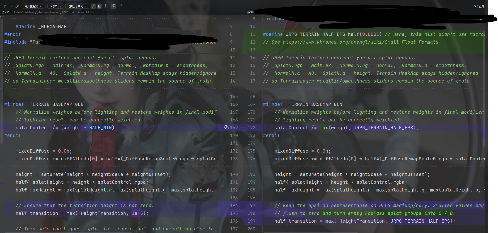
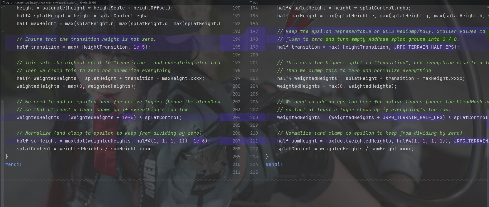

# 起因

在做地形的最后的兼容测试的时候, 发现在DirectX11和12上的表现都没有问题; 而在GLES3.2的时候, 整个地形却被搞成黑色的了. what can i say?



随后仔细排查了一下; 发现整个地图会随bloom的开启和强度扩大黑色的范围; Bloom的原理就是直接取scenecolor的亮度和阈值比较进行进行高斯核采样或者kawase Blur; Anyway, 和亮度挂钩了那大概率就是最后的color的亮度不太对了



这种扩大边缘加上一堆锯齿感,  感觉就是出现了个NaN的结果了; 然后就开始大调查, 查lit计算的hlsl



# 排查



总而言之就是因为精度问题, 不同的API对于一个超小数字的处理方法而导致在计算中, 哪里有一个除法直接除0了导致出来了一个无穷大的结果. 如上所示.

那么是哪里有问题呢? 当然是除法; 因为除法/0就是NaN. 然后在Unity源码找到了这一段逻辑: 

这里在把 `splatControl` 的四个权重归一化（Normalization），使它们的总和变成 1。

### `HALF_MIN` 是干什么的？

如果某个像素四个通道都是 0：

```
splatControl = float4(0,0,0,0);
weight = 0;
```

直接执行：

```
splatControl /= weight;
```

就会发生除零，得到 `NaN` 或 `Inf`。

因此代码写成：

```
splatControl /= (weight + HALF_MIN);
```

其中 `HALF_MIN` 是一个极小的正数，相当于：

```
float safeWeight = max(weight, 0.00006);
```

这样即使 `weight == 0`，也不会除零。

然后! 这里就有一个很关键的问题了. 这个bug(也就是说在加到第五层的时候才会出现).  但是第五层, 一旦切到第四层的时候就消失了(即不会变黑NaN), 并且在创建新地形的时候仍然不会触发这个Bug. 目前看来最有可能的就是上方自除的时候因为掉精度导致的NaN问题.

然后这个宏是可以跳转的: 这个宏在 `Packages/com.unity.render-pipelines.core/ShaderLibrary/Macros.hlsl`里头., 见下方的图



合着Unity你下边自己做了个IF GLES的分支, 结果没有把最小精度的数字宏换进去是吧?! 

这里的定义还好心给了个链接, 让我看看: https://www.khronos.org/opengl/wiki/Small_Float_Formats

## 修改后恢复NaN正常的处理

覆盖掉原来的对Half最小值的定义宏, 直接自己定义一个最小数字就好, 

```c++
#define 666_TERRAIN_HALF_EPS half(0.0001)
```

相较于宏里边的1e-6, 这里直接取了个0.0001; 大得多, 但是又不至于让效果比较明显的出现出来, 仍然保持的"MIN"的意思. 然后就是换代码计算了.

最后展示一下变换好之后的唯一修改的代码块的diff:





剩下的都是addpass的源码, ctrl f替换文本把宏全部替换一下就i好了

有关这个问题我问了一下AI, AI的回答是:

- 平台差异：在不同的GPU驱动上，对于这种极小的`half`值处理方式可能不同。在某些OpenGL ES 3的实现上，`max`操作可能无法正确处理这个接近精度极限的值，从而产生了`NaN`（Not a Number）。

Emmm...也许吧 反正就是一个GL的精度不够导致的计算出了问题导致的, 下辈子注意