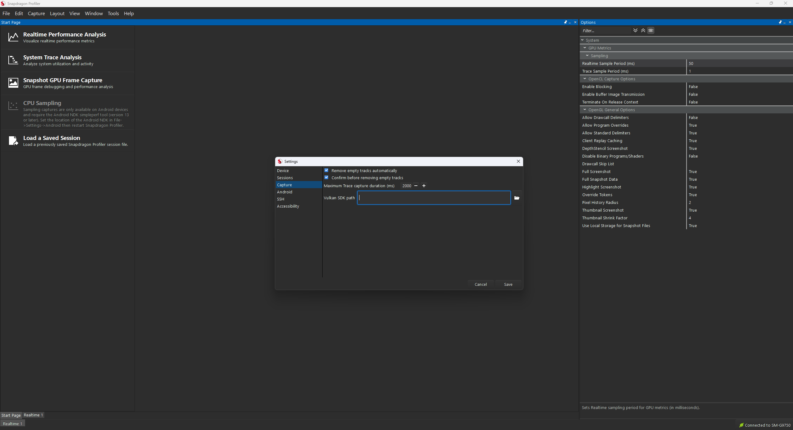
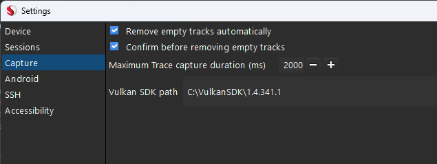
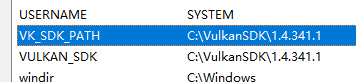
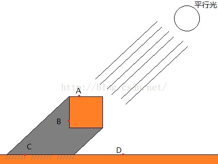

这里会放置一些有关概念解答，方便快速上手。

## 渲染基础流程图





标准光照模型的各个区域详解





当使用#include "UnityCG.cginc".时，库之间的关系式（其中unityCG就已经包含了BRDF标准光照函数）




### What is pragma?like #pragma vertex


pragma源于希腊语，指的是一个动作，或者接下来需要做的事情。在许多语言中用于表示编译器发出的特殊指令。

## ShadowMap（阴影Map）


Shadow Map技术是一种用于生成实时阴影的常用方法，它通过预先计算并存储光源视角下的深度信息，然后在运行时比较这些信息来决定像素是否处于阴影中。本文将详细解析Shadow Map的原理、实现过程以及优缺点，并提供一些实践经验和建议。
一、Shadow Map的基本原理
Shadow Map的基本原理基于一个简单的观察：如果光源和目标点之间的连线没有任何物体遮挡，则目标点没有在阴影中；反之，如果这条连线有物体遮挡，则目标点处在阴影中。因此，我们可以通过计算并比较每个像素与光源之间的距离来判断它是否在阴影中。
Shadow Map的实现主要包括以下步骤：
二、Shadow Map的实践与优化
虽然Shadow Map的原理相对简单，但在实际应用中却需要注意许多细节。以下是一些实践经验和建议：




## Mipmap


mipmap 一词是 MIP map 的缩写。字母 MIP 代表拉丁短语 multum in parvo，翻译过来就是小空间里的众多。它是 Lance Williams 在首次描述 mipmapping 技术时创造的。

## 类分类


### _MainTex_ST和_MainTex的区别


> 屏幕后处理就是把整个屏幕看成是一个四边形，然后整个屏幕的内容都已经渲染在一张纹理贴图上面了（左图代码中的_MianTex），然后再传入这张图片的每一个像素点的uv坐标（左图代码中的input.uv），就能够对屏幕四边形进行采样并渲染在场景里。


> The _ST suffix stands for Scale and Translation, or something like that. Why isn't _TO used, referring to Tiling and Offset? Because Unity has always used _ST, and backwards compatibility mandates it stays that way, even if the terminology might have changed.


#### 扩展：使用TRANSFORM_TEX进行简化：


```cpp
o.uv = TRANSFORM_TEX(v.texcoord, _MainTex);//等价于o.uv = v.texcoord * _MainTex_ST.xy + _MainTex_ST.zw;
```


顶点的UV快速使用TRANSFORM_TEX进行重新对齐。指定纹理组进行变换缩放，使纹理能正确在物体的表面进行显示。

### sampler 2D（获取2D坐标采样器）


一般用于MainTex的获取，sampler2D 属性是一种在图形着色语言（如 OpenGL ES Shading Language, GLSL）中使用的类型，它代表了一个纹理采样器对象。这个对象用于在片元着色器（Fragment Shader）中对一个二维纹理进行采样。具体来说，sampler2D 可以用来读取存储在纹理中的颜色信息，并且可以在渲染过程中根据片段的位置或其他属性来获取相应的纹理颜色。
sampler2D 变量通常会与纹理坐标（通常是 vec2 类型）一起使用，这些坐标指定了纹理图像上的位置。当着色器执行时，它可以根据这些坐标从纹理中查找并插值颜色值。
在 Unity 的 ShaderLab 或其他图形API中，sampler2D 可能会被用来定义如何以及从哪里采样纹理数据，包括纹理过滤方式、地址模式（如重复、夹紧等）以及其他纹理状态

### SV_POSITION和POSITION的区别


SV_POSTION前的SV代表System Value,代指系统确定值。输出裁剪空间下的顶点坐标数据，给光栅化使用，必须要写的数据。
一旦被作为vertex shader的输出语义，那么这个最终的顶点位置就被固定了(不能tensellate，不能再被后续改变它的空间位置？)，已经成为了转换裁剪世界的坐标，是可以直接用来进入光栅化处理的坐标，如果作为fragment shader的输入语义那么和POSITION是一样的，代表着每个像素点在屏幕上的位置（这个说法其实并不准确，事实是fragment 在 view space空间中的位置，但直观的感受是如括号之前所述一般）

> we're trying to output the position of the vertex. We have to indicate this by attaching the SV_POSITION semantic to our method. SV stands for system value, and POSITION for the final vertex position.The fragment program requires semantics as well. In this case, we have to indicate where the final color should be written to. We use SV_TARGET, which is the default shader target. This is the frame buffer, which contains the image that we are generating.


“SV_TARGET”与“SV_POSTION” - 知乎 (zhihu.com)

### Unity中如何定义_WorldSpaceLightPos0


这是一个来自于UnityShaderVariables的函数，含有四个分量，同时也是齐次坐标系。
在Unity Shader中，_WorldSpaceLightPos0是一个定义灯光位置的变量。这个变量包含了当前光源的位置或光线的方向（如果是定向光）。它有四个分量，这些是齐次坐标。对于定向光，第四个分量是0。

#### 1. _WorldSpaceLightPos0的定义


#### 2. 齐次坐标解释


#### 3. 应用场景


通过这种方式，Unity能够灵活地处理不同类型的光照模型，并允许开发者通过Shader编程实现复杂的视觉效果。

## 前向渲染是什么？


前向渲染（Forward Rendering）
它的实现最贴合我们的思维逻辑，当我们渲染模型时，只需要关心画模型然后直接处理光照，让它自己去做深度测试，最后深度测试过的都显示在屏幕上。
1、对要渲染的物体进行遍历渲染出shadowmap
2、再遍历一遍上面要渲染的物体，根据shadowmap对每一个物体的像素进行光照计算
优点：
很明显，就是简单，并且可以针对每个物体指定它的材质，因为每个物体都是独立渲染的。
缺点
1、由于依赖深度测试，如果物体是乱序的，大量的物体深度测试和光照计算判断，可能会出现大量的像素光照计算都是浪费的。（大量的drawcall）
2、不能支持光源数量较多的情况。所以我们一般有两种做法来处理多光源的情况，一种是一遍渲染多个光源，所有光照运算都在一个着色器中进行。另一种是多遍渲染多个光源，意思就是每多一盏灯，就多渲染一次模型，所以性能消耗也比较大。
延迟渲染（Deferred Rendering）
它的做法是在第一遍渲染模型的时候，不进行光照计算，直接将位置、法线深度、颜色等存到G-Buffer（Geometry-buffer,专门用于进行法线，顶点坐标等物体数据储存的缓冲区。过高的buffer会占用大量的显存和带宽。）。很多人第一次接触G-Buffer这个名词都是一头雾水，其实就是创建多张和屏幕一样大的纹理，然后每张纹理的像素值分别用来存上面提到的这些数据。也就是说一次渲染，需要输出多张纹理，这跟前向渲染是不同的， 前向渲染只渲染到一张纹理上，这张纹理最终会渲染在屏幕上。而延迟渲染这多张纹理都不是最终结果，可以理解为只是用几张贴图存储一堆中间数据。
第二遍再根据G-Buffer的数据，进行光照计算，写入帧缓冲区。
优点
处理完G-Buffer之后，其实每盏灯光就可以通过一个Drawcall的消耗去执行光照计算。第一遍处理完的G-Buffer是深度测试过的，不像前向渲染一样，有那么多光照计算的浪费。
缺点
1、最终的光照计算方式只能是一种，也就是其他文章提到的只允许一个材质，因为最终计算的时候只剩下一堆数据，不知道它们分别是谁的，所以只能无差别对待。而前向渲染可以每个模型一种计算方式。
2、不允许使用透明物件，因为最终G-Buffer只剩一个像素了，无法进行混合。不过可以在第二遍渲染完之后，用前向渲染的方式渲染透明物体。
3、不支持抗锯齿，意味着不能用MSAA（多重采样抗锯齿），不过可以用FXAA（快速近似抗锯齿）进行后期处理
4、有些硬件不支持MRT(Multiple Render Targets 多重纹理目标)，也就是输出到多张纹理上实现G-Buffer的功能
5、G-Buffer需要比较大的带宽，有些硬件没不具备这个能力
6、由于光照计算本身性能消耗也不低，延迟渲染的光照计算其实等同于在做一次全屏的后处理，后处理其实对手机来说过于昂贵。而如果只有一盏灯的话，其实前向渲染省了这次额外的渲染。所以移动设备上延迟渲染的性能会比前向渲染的性能要差一些。


forwardbase和一些光照如全局渲染环境光的实现：


## Zwrite


这是一个出现在subshader中的全局声明。负责声明在渲染中是否需要更新深度缓冲区。ZWrite有两种状态：On（启用）和Off（禁用）。当ZWrite被设置为On时，片段的深度值将被写入深度缓冲区；当设置为Off时，则不会写入。
对于不透明对象，通常需要启用ZWrite以确保正确的深度排序和遮挡关系。对于半透明对象或某些特殊效果，可能需要禁用ZWrite以避免深度写入错误导致的渲染问题。
对于渲染管线中的解释：当ZWrite为On时，渲染管线会在光栅化阶段将片段的深度值写入深度缓冲区，这有助于实现正确的深度测试和排序。如果ZWrite设置为Off，则渲染管线不会更新深度缓冲区内容。这可能导致不正确的深度排序和潜在的渲染问题，如物体之间的遮挡关系出错。

## Texcoord


Texcoord==texture coordinate 纹理坐标系的简写。这里指代的是物体储存的纹理系。可供shader使用的纹理坐标系有0-7，共有8个。

## Shader LOD


指的是Shader Level of detail的缩写。作为unity的一个自带控件属性，合理根据玩家距离调整LOD的大小可以有利于性能优化。

## 改变天空盒操作


## shader直接光照计算概念


直接光照计算中的DFG——DFG指的是Cook-Torrance BRDF模型中的三项：法线分布项（D）、几何项（G）和菲涅尔项（F）。
法线分布项（D）描述了由于物体表面微观结构的粗糙度导致的光线散射情况。它是根据微表面理论来模拟不同粗糙度的表面上，光线如何被散射到各个方向。几何项（G）考虑了遮挡效应和多次反射的影响，即光线在到达观察者之前可能被表面其他部分遮挡的程度。菲涅尔项（F）则描述了光线在不同角度入射时反射率的变化，这是由法国物理学家奥古斯丁·让·菲涅尔提出的理论。结合了这三个概念后，可以让PBR渲染中具有更真实的效果。

## RayTracing


### DXR


DXR 是 DirectX Raytracing 的缩写，是 Microsoft 在 DirectX 12 中引入的一种光线追踪技术扩展。它允许开发者在游戏和实时渲染中使用硬件加速的光线追踪技术，从而生成更加真实的光影效果。DXR 是现代实时光线追踪的核心技术之一，它得益于图形硬件（如 NVIDIA RTX 系列显卡）的专用光线追踪单元（RT Cores）进行加速。
https://dev.epicgames.com/documentation/zh-cn/unreal-engine/refraction-using-pixel-normal-offset-in-unreal-engine
