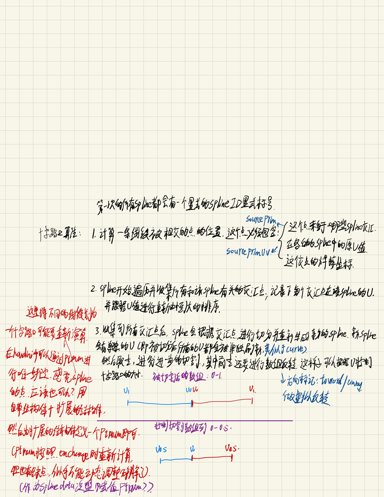
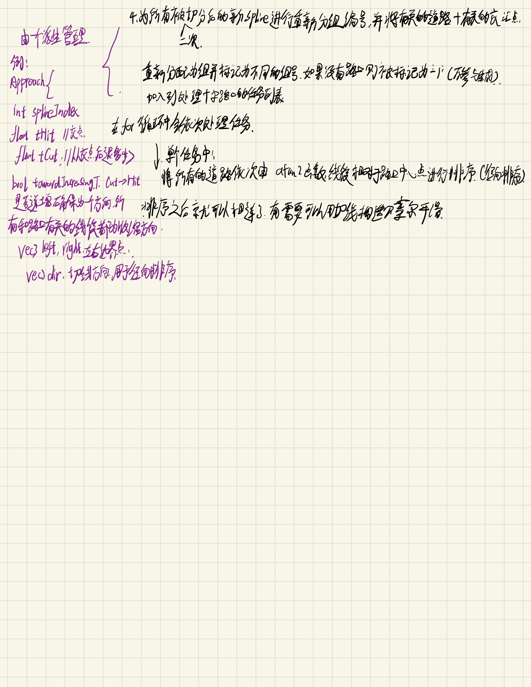
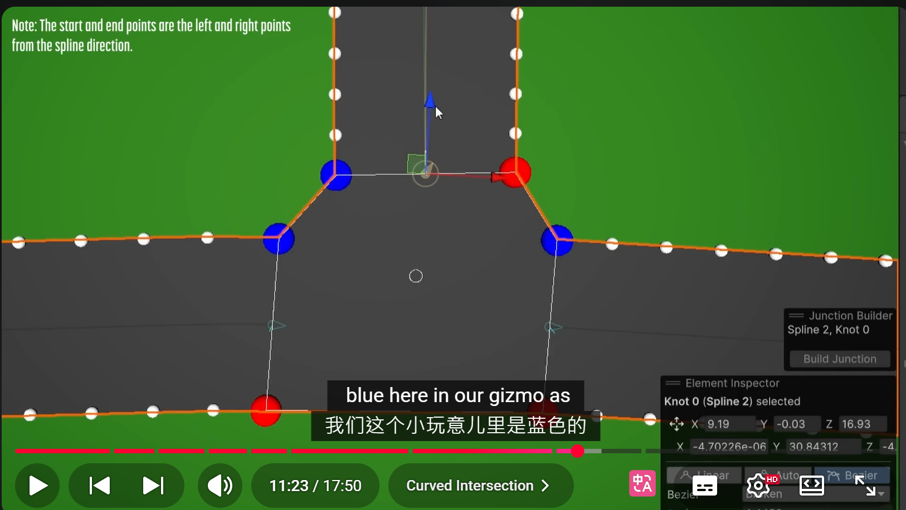

# 思路初探

大概是三个路径, 两个主流的, 一个略微不主流的;

## 对应这三个思路, 找到的参考资料:

目前打算使用Unity自带的Spline包, 而不是自己画一个Spline. 这里有一些以前没有官方的Spline Package的实现, 但是对于Unity支持都是老版本(最晚的也是2018了):

## 其他: Houdini的全自定义实现

虽然没有

# 进一步: 有关于道路生成算法和半自动城市生成

# 十字路口(交界)实现

最简单的: houdini直接用boolean取交界, 然后划分一个group. 这个group就是十字路口了; 如果要添加曲线可以使用extrude+smoothness.(卧槽轮椅啊)
然而这是Unity, 所以要像另外的办法来实现
我的思路: 先遍历出Spine的交界点, 随后根据Spine包的Width方法调取出各自Spline的宽度; 获取出以交界(各自Spine的那个交界点), 需要向前后扩张多少距离内的交界点被划分为十字路口; 还有一个平滑值, 控制十字路口的贝塞尔曲线的平滑度; 这个值越大, 以交界中心为原点扩张, 被标记为十字路口的点就越大; 这样从两个Spline道路的"绝对交界", 从两个Spline交界的冗余的面积就更多; Spline的方向可以直接读取结构体的Spline Index获取.

## 大概思路笔记:

这个笔记是最详细的, 如果不想看后面的碎碎念, 直接看这个笔记来了解我的思路就好

## 实现思路:

有很大程度的部分灵感来源于这个视频: https://youtu.be/mRzGmaHEJiM?si=OrflaMPj_JUZdfin
搜索了大部分的路口的实现, 都是有一个固定的模板, 会配合出路口生成算法生成出合适的路口预制体. 在UE的官方演示黑客帝国中, 也是这么做的.
但是尼玛我要做的应该是像City Skyline那样可以全自动手动规划的PCG工具, 而不是生成算法啊! 找来找去就这又这位博主的视频, 能很详细的讲完全自定义的十字路口是如何生成的了. 大致的思路就是: 算出交汇点, 对spline曲线切边, 重新生成线段; 然后把ptnum根据单个线段的u值反转一下, 让所有的u方向都指向一个路口; 最后按照路口+这些线段, 各自组为一个组, 然后逐一处理, 直接用sweep遍历连接. 详情可以看这个总结: https://notebooklm.google.com/notebook/b7bdca60-d894-429f-966c-badcb3353452

### 在此之上进行的改进

如果按照这位博主的流程生成, 在Houdini中肯定是没有问题的. sweep, 几何拓补, fuse找交点, 过近自动焊接, 这些都有; 但是Unity可没有, 要自己慢慢搓;
还有就是博主的顺序问题. 虽然反转什么的操作确实简单又快, 但是对于可维护性(大嘘)对于纯代码的话还有另一种方式-直接上泛型+扩展属性. 维护一个虚拟的, 在Unity的Spline的数据结构上, 再维护一个被"虚拟"反转的泛型, 然后交给算法判断. 这样不会修改真正的点源数据, 并且同样可以进行切割计算, 和路口生成的算法. 方便后面做更多的计算.
mesh的生成可以使用Unity的Mesh库自行组装; 然后关于路口的交点判断也可以直接进行Spline遍历, 遍历为一个个折线段完毕以后, 就可以愉快的寻找交点了! 如果有三维(y)的要求, 那么直接对比一下y差值就好. 至于十字路口的组装, 这位博主用的是sweep节点来生成. 但是我们并不会重新为点进行排号, 或者说sweep本身就是一个很神奇的节点;
所以对于路口的mesh生成, 反正根据这位博主的思路, 切割段落, 对十字路口挖洞这部分都已经整理好了;
所以接下来就请出https://youtu.be/ZiHH_BvjoGk?si=DErefkb-UVCux7W4 这位博主, 他对于十字路口用的是一个扇形算法; 都有共同之处: 根据atan2对单个十字路口组的线段进行径向排序, 再依次进行连接. 因为在之前, 我们已经手动指定了每条线段的方向都要指向交点中心(详情看上面的评论), 所以径向排序非常好做, 直接某个轴的正方向(在这里我指定的是x轴的正方向), 然后取该组所有线段的xz平面方向的角度, 做简单排序, 扔进一个list即可.
随后根据这个list的顺序, 依次和中心点组成三角面并连接. 在博主之上, 还可以混进去一个贝塞尔的曲线细分连接.

这里是有关于方向排序的重点. 如果不知道每个路口相对于中心点的方向会出现非常丑的拓补.  https://youtu.be/ZiHH_BvjoGk?si=lV-f1kUaz5BfpatW&t=663
当然这个是贝塞尔曲线的求法. 还有其他的办法, 比如基于圆来求解两个点有没有共同圆弧:
https://www.reddit.com/r/Unity3D/comments/82yed1/best_way_to_make_straight_and_curved_roads_and/?utm_source=share&utm_medium=web3x&utm_name=web3xcss&utm_term=1&utm_content=share_button
这个reddit讲了很多有关于两点之间, 道路可以如何处理弧线的部分.